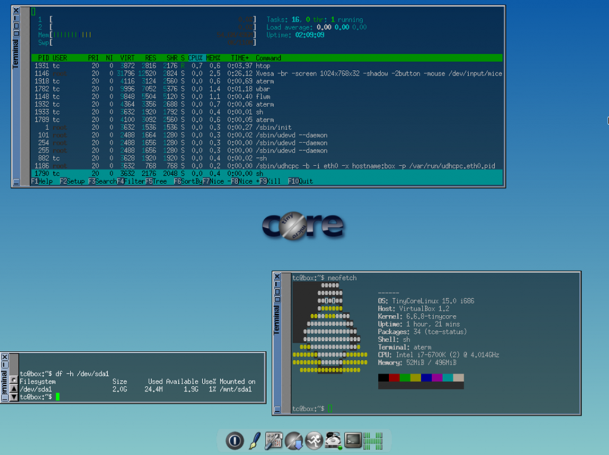
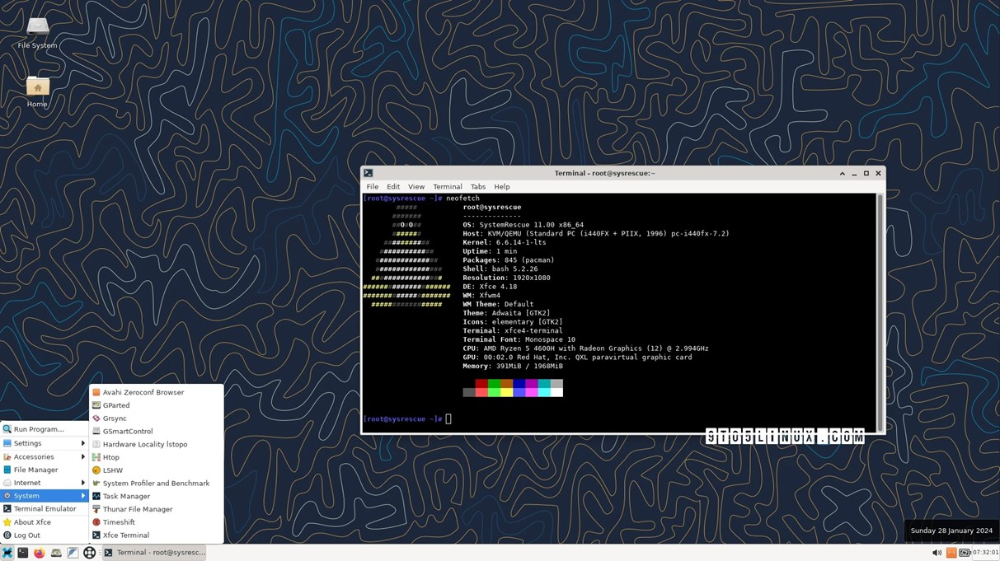
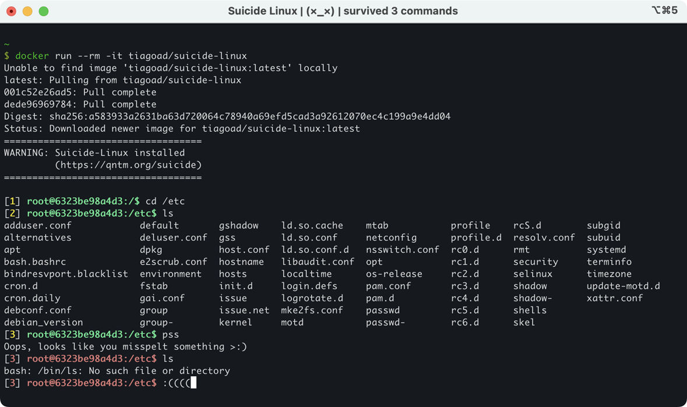
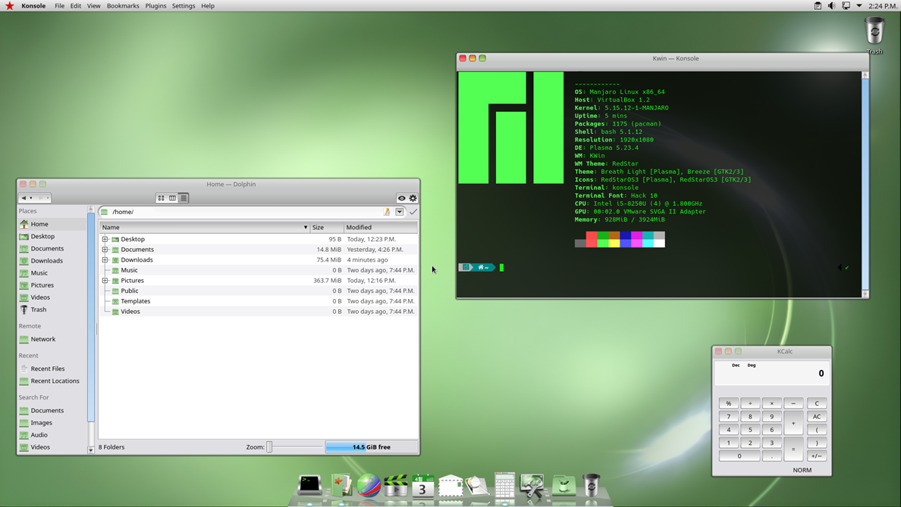
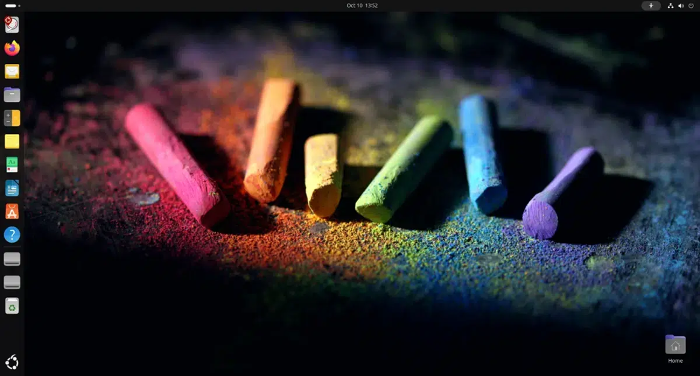

# 5 небанальных дистрибутивов Linux, о которых вы могли не слышать
Привет, Хабр! Это Виктор Сергеев, автор команды спецпроектов МТС Диджитал. Думаю, тут практически нет тех, кто никогда не работал или хотя бы не видел Linux. У всех на слуху Ubuntu, Fedora, Debian, Arch Linux, Linux Mint, а у кого\-то — и Kali Linux, Tails, CentOS, Raspbian. Но есть и другие, еще более редкие дистрибутивы, в том числе разработанные just for fun. О них сегодня и вспомним. Под катом – дистрибутив для старых компов, пакет, удаляющий файлы без предупреждения, и даже ОС для повышения безопасности ИТ\-систем Северной Кореи. Велкам!

## Tiny Core Linux

Минималистичный дистрибутив Linux, впервые выпущенный в 2009 году Робертом Шинглдекером — он участвовал в разработке Damn Small Linux (DSL). Tiny Core — ультралегкая ОС с минимальными требованиями к характеристикам ПК. Дистрибутив ориентирован на пользователей, которым нужна простая и гибкая операционная система для старых компьютеров или устройств с ограниченными аппаратными возможностями.

Размер базовой версии Tiny Core 15\.0 — всего 24 Мб, так что это один из самых маленьких Linux\-дистрибутивов. Он использует ядро Linux, минимальный набор базовых утилит и графический интерфейс FLTK/FLWM. Вся система загружается в оперативную память, так что работать можно быстро даже на слабом оборудовании.

**Требования к системе:**

* **процессор**: x86\-совместимый;
* **оперативная память**: минимум 46 Мб для базовой версии;
* **место на диске**: не требуется для работы в Live\-режиме;
* **носитель**: CD/DVD, USB или жесткий диск для установки;
* **видеокарта**: в целом, любая интегрированная или более мощная.

У Tiny Core модульная структура. Она позволяет пользователю добавлять необходимые ему пакеты и компоненты, тем самым контролируя размер и производительность системы. 

Актуальная версия Tiny Core Linux — 15\.0\. [Релиз вышел](https://www.opensourcefeed.org/tinycore-v15-release/) 26 февраля 2024 года. В новой ОС обновлено ядро Linux до версии 6\.6\.8\. Обновлены и другие ключевые компоненты, такие как glibc — до версии 2\.38 и GCC — до 13\.2\. После установки ОС [занимает](https://www.securitylab.ru/news/546489.php) всего 24 Мб.

## SystemRescue

[SystemRescue](https://www.system-rescue.org/) (SystemRescueCD) — специализированный Linux\-дистрибутив, ориентированный на восстановление и обслуживание операционных систем и данных. Проект анонсирован разработчиком Франсуа Дюпри в 2003 году. Основная задача ОС — предоставление набора инструментов для рекуперации информации, редактирования жестких дисков и выполнения диагностики систем после сбоев.

**Технические характеристики и возможности SystemRescue:**

* размер ISO\-файла — около 700 Мб;
* поддержка загрузки с CD/DVD, USB или через сеть;
* включает такие утилиты, как GParted, файловые менеджеры, средства восстановления GRUB, софт для работы с файловыми системами (ext4, NTFS, FAT32 и другие), сетевые инструменты и текстовые редакторы;
* поддержка современных файловых систем, RAID, LVM, возможность монтирования сетевых ресурсов (NFS, Samba).

SystemRescue работает как в графической среде, так и без нее. [Актуальная версия SystemRescue — 11\.02](https://www.system-rescue.org/Download/), выпущена 29 августа 2024 года. Основана на ядре Linux 6\.6\.14\.

## Suicide Linux

Шуточный дистрибутив Linux. Это даже не полноценная ОС, а пакет для Debian. Основная особенность Suicide Linux заключается в том, что при любой неправильно введенной команде система выполняет команду rm \-rf /, что удаляет все файлы без предупреждения.

Дистрибутив появился как шутка в сообществе Linux и не имеет практической пользы. Служит скорее для того, чтобы показать важность внимательности при работе с терминалом и продемонстрировать, как опасно может быть неправильное использование команд. 

Suicide Linux не предназначен для применения в рабочих и домашних системах. Он редко обновляется, так как его разработчики не уделяют своей шутке много внимания. Тем не менее проект довольно популярен. Чтобы попробовать Suicide Linux, его стоит [запустить через Docker](https://hub.docker.com/r/tiagoad/suicide-linux/) для тестирования в изолированной среде.

## RedStar OS

Национальная операционная система Северной Кореи, разработанная для использования внутри страны. Первая версия выпущена в 2008 году Корейским компьютерным центром и позиционируется как альтернатива западным операционным системам, таким как Windows и macOS. Официально ОС служит для повышения безопасности и контроля ИТ\-систем Северной Кореи.

Дистрибутива нет в общем доступе, поэтому о нем мало что известно. [Требования к ПК](https://en.wikipedia.org/wiki/Red_Star_OS#cite_note-29):

* 800 МГц Intel Pentium III;
* ОЗУ: 256 Мб;
* место на диске: 3 Гб.

**Технические характеристики и особенности:**

* **RedStar OS построена на базе Linux**, но полностью адаптирована под требования и политику Северной Кореи.
* **Интерфейс**: последние версии (начиная с 3\.0\) визуально напоминают macOS, хотя ранние версии больше походили на Windows XP.
* **Безопасность и контроль**: дистрибутив включает множество средств [для слежки и мониторинга](https://www.theregister.com/AMP/2015/07/20/north_korea_red_star_linux_inserts_sneaky_serial_content_tracker/). Например, отслеживание активности пользователя и встроенные инструменты, которые автоматически добавляют метки на все файлы для идентификации источника.
* **Ограниченный доступ в интернет**: используется внутренняя северокорейская сеть, известная как «Кванмен», и это еще больше усиливает изоляцию пользователей от внешнего мира.
* **Программное обеспечение**: RedStar OS включает текстовые редакторы, музыкальные проигрыватели, игры и браузеры, такие как Naenara, предназначенные для работы исключительно в национальной сети.

Актуальная версия этой ОС, насколько известно, Red Star OS 4\.0\. На Хабре есть ее обзор, [но только за 2015 год](https://habr.com/ru/articles/388563/). Если у вас есть новая информация по операционной системе, делитесь в комментариях.

## Edubuntu

Еще один специализированный дистрибутив Linux, основанный на Ubuntu. Предназначен для установки на ПК в образовательных учреждениях. ОС впервые появилась в 2005 году в рамках совместного проекта Canonical Ltd. и сообщества разработчиков Ubuntu. Основная цель проекта — предоставить школам, университетам и другим учебным заведениям Linux с набором предустановленного образовательного программного обеспечения.

Системные требования для Edubuntu схожи с требованиями для обычной версии Ubuntu, так как дистрибутив основан на той же базе. Но из\-за дополнительного предустановленного образовательного ПО Edubuntu может потребовать чуть больше ресурсов для комфортной работы.

**Рекомендуемые системные требования:**

* **процессор**: 2,5 ГГц или более мощный многоядерный процессор;
* **оперативная память**: 8 Гб или больше;
* **место на диске**: 50 Гб свободного пространства;
* **графика**: современная видеокарта с поддержкой 3D\-графики и разрешением 1920 × 1080;
* **подключение к интернету** для загрузки обновлений и программного обеспечения.

Edubuntu использует то же ядро Linux и систему управления пакетами, что и Ubuntu, так что он совместим с широким набором приложений и библиотек. Дистрибутив включает образовательный софт и другие программы, которые могут понадобиться школьникам и студентам — например, GCompris, KDE Edu Suite, Tux Paint. Пользователи могут настроить дистрибутив под свои нужды, в зависимости от потребностей учебного заведения.

[Последняя версия Edubuntu — 24\.10](https://cdimage.ubuntu.com/edubuntu/daily-live/20241007.2/), релиз вышел в октябре 2024 года. Она включает обновления безопасности и небольшие изменения. Например, новое фоновое изображение и функции, связанные с управлением правами доступа и Центром безопасности, аналогичные изменениям в Ubuntu Desktop. Также поддерживаются версии для архитектур amd64 и Raspberry Pi 5\.

*Пока все. Если вы сталкивались с другими необычными версиями Linux, рассказывайте о них в комментариях.*

