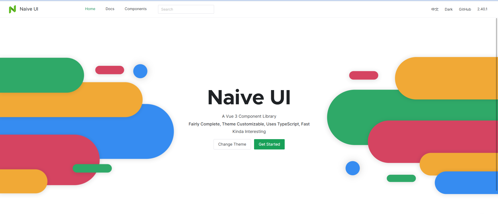
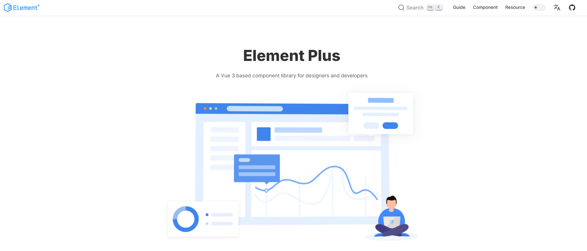
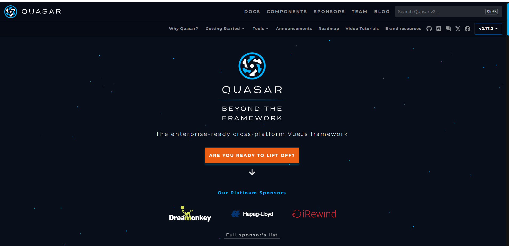
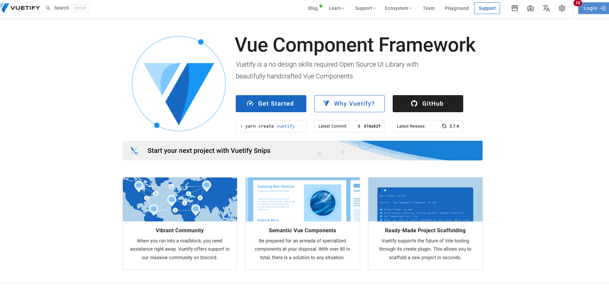
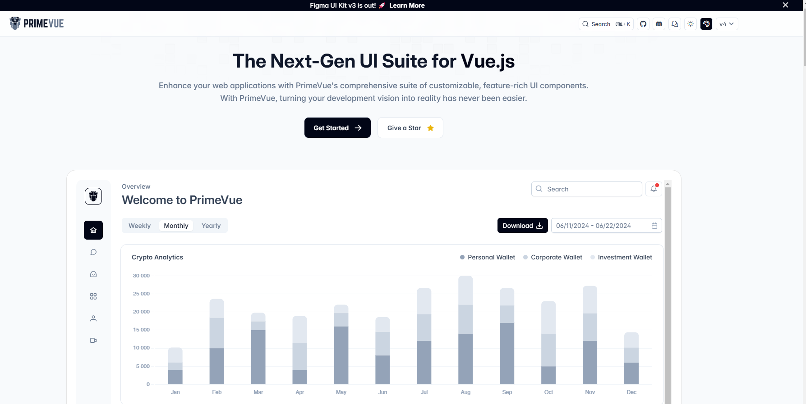
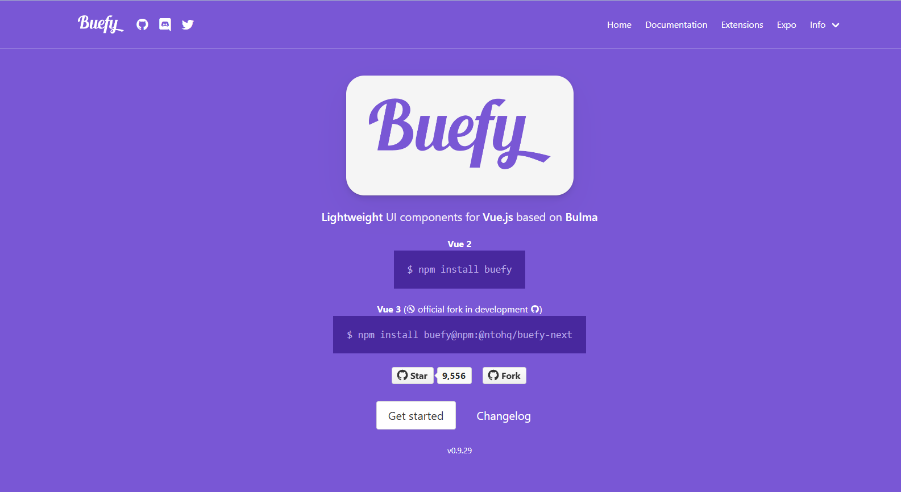

# 7 популярных библиотек Vue 3 UI-компонентов, которые заслуживают внимания
UI\-компоненты — это один из базовых инструментов, необходимых фронтенд\-разработчику для быстрого создания интерфейсов. Они помогают ускорить разработку и упростить поддержку кода. В этой статье представлен обзор нескольких популярных библиотек компонентов для Vue 3\. Библиотеки перечислены в произвольном порядке. 

### Naive UI

* **Команда разработки**: TuSimple
* **Сайт**: [www.naiveui.com/](http://www.naiveui.com/)
* **GitHub**: [github.com/tusen\-ai/naive\-ui/](https://github.com/tusen-ai/naive-ui/)

**Naive UI** — это современная библиотека компонентов для Vue 3 от команды TuSimple. Ее главная цель — предоставить набор простых и интуитивно понятных элементов интерфейса для быстрого создания удобных и эстетичных приложений. 

* **Поддержка TypeScript:** предоставляет разработчикам богатые определения типов, что помогает ловить потенциальные ошибки на стадии кодирования, улучшая эффективность разработки и качество кода.  
**Мощная система тем:** с помощью простых JSON\-конфигураций можно изменять глобальные цвета, шрифты и другие стили, а также создавать темный режим, что значительно снижает нагрузку на фронтенд\-разработчиков.  
**Широкие области применения:** подходит для разработки различных веб\-приложений, будь то создание корпоративных панелей управления, разработка простых личных блогов или создание мобильных сайтов с адаптивным дизайном, для всех этих задач можно найти подходящие компоненты.  
**Простота использования:** четкие API\-интерфейсы и подробная документация делают изучение и использование этой библиотеки очень легким.  
**Адаптивный дизайн:** все компоненты поддерживают адаптивную верстку, подходящую для различных устройств и размеров экранов.

В общем, Naive UI — это мощная и простая в использовании библиотека компонентов для Vue 3, подходящая для разработки проектов любого масштаба и ставшая выбором многих разработчиков для создания современных веб\-приложений.

 **Установка** 


```javascript
# NPM
npm i -D naive-ui
```
#### Element\+

* **Команда разработки**: Eleme
* **Сайт**: [element\-plus.org/](https://element-plus.org/en-US/)
* **GitHub**: [github.com/ElemeFE/element/](https://github.com/ElemeFE/element/)

**Element\+**, также известный как **Element Plus**, — это фронтенд\-фреймворк, построенный на базе **Vue 3\.x**, который включает в себя обширную библиотеку UI\-компонентов, предназначенную для того, чтобы помочь разработчикам быстро создавать современные пользовательские интерфейсы. **Element Plus** является улучшенной версией **Element UI**, который был основан на **Vue 2\.x**, в то время как **Element Plus** использует возможности **Vue 3\.x**. 

* **Богатая библиотека компонентов:** Element Plus предоставляет ряд популярных UI\-компонентов, таких как кнопки, формы, модальные окна, навигация и другие, которые помогают разработчикам быстро создавать современные пользовательские интерфейсы.
* **Простота в использовании:** Дизайнерская концепция Element Plus заключается в простоте, удобстве и эстетике. Он следует принципам Material Design, использует плоский стиль и яркие цветовые сочетания, что обеспечивает пользователю приятный визуальный опыт.
* **Эффективный процесс разработки:** Element Plus инкапсулирует базовые HTML\-компоненты, позволяя пользователям просто вызывать эти компоненты без необходимости изменять стили с помощью CSS.

**Установка**


```javascript
# NPM
npm install element-plus --save

# Yarn
yarn add element-plus

# pnpm
pnpm install element-plus
```
### Quasar

* **Команда разработки**: Quasar Team
* **Сайт**: [quasar.dev](https://quasar.dev/)
* **GitHub**: [github.com/quasarframework/quasar/](https://github.com/quasarframework/quasar/)

**Quasar** — это открытый фронтенд\-фреймворк, основанный на **Vue.js**, который позволяет разработчикам писать код один раз и развертывать приложение на нескольких платформах, таких как веб\-сайт, прогрессивные веб\-приложения (PWA), мобильные приложения и приложения для **Electron**. Дизайнерская концепция **Quasar** заключается в упрощении процесса разработки, повышении производительности и обеспечении высокого качества приложения.

* **Кроссплатформенная разработка:** Quasar позволяет разработчикам писать код один раз и развертывать его на нескольких платформах без проблем, включая веб, мобильные устройства, десктопные приложения и **Electron**. Такая унифицированная разработка упрощает процесс и гарантирует согласованный пользовательский опыт на разных устройствах и в различных средах.
* **Большая библиотека компонентов:** Quasar включает более 70 высокопроизводительных компонентов в стиле **Material Design**, предоставляя разработчикам богатый инструментарий для создания отзывчивых и визуально привлекательных приложений. Эти компоненты полностью настраиваемы, что позволяет разработчикам адаптировать их под конкретные требования дизайна и предпочтения бренда.
* **Полная документация API:** Quasar имеет подробную и структурированную документацию API, что облегчает изучение и использование. Четкая документация упрощает процесс разработки, позволяя разработчикам эффективно использовать возможности и функционал Quasar.
* **Активное сообщество:** Благодаря большому и активному сообществу разработчиков, Quasar способствует сотрудничеству, обмену знаниями и поддержке. Независимо от того, требуется ли помощь, делятся ли множеством идей или вносят вклад в развитие фреймворка, разработчики могут рассчитывать на поддержку и участие сообщества.
* **Открытый исходный код:** Quasar является открытым фреймворком, который можно использовать и модифицировать бесплатно, давая разработчикам возможность свободно внедрять инновации и настраивать свои приложения. Эта открытая модель способствует прозрачности экосистемы Quasar, вовлеченности сообщества и постоянному улучшению.

В общем, Quasar — это мощный фреймворк для фронтенда, который помогает разработчикам быстрее создавать высококачественные приложения, поддерживающие различные платформы и типы приложений.

**Установка**


```javascript
# NPM
npm i -g @quasar/cli
npm init quasar

# Yarn
yarn global add @quasar/cli
yarn create quasar

# pnpm
pnpm add -g @quasar/cli
pnpm create quasar
```
### Vuetify

**Разработчик:** Vuetify (компания)  
**Официальный сайт:** [vuetifyjs.com](https://vuetifyjs.com/)  
**GitHub:** [github.com/vuetifyjs/vuetify](https://github.com/vuetifyjs/vuetify)

 Vuetify включает в себя широкий набор тщательно разработанных UI\-компонентов, макетов и тем, которые идеально интегрируются с принципами **Material Design** от Google. Благодаря этому разработчики, даже не обладая глубокими знаниями в области дизайна, могут создавать профессионально выглядящие, красивые и отзывчивые веб\-приложения. 

* **Обширная библиотека компонентов:** Vuetify включает более 80 предустановленных UI\-компонентов. От базовых элементов, таких как кнопки и формы, до более сложных конструкций, таких как таблицы данных и навигационные панели, Vuetify покрывает широкий спектр UI\-потребностей.
* **Адаптивный дизайн:** Каждый компонент в Vuetify тщательно спроектирован с встроенной адаптивностью. Это гарантирует, что приложения, построенные с использованием Vuetify, сохраняют визуальную целостность на различных устройствах, от ПК до мобильных.
* **Темы:** Vuetify предлагает мощные возможности для настройки тем, что позволяет разработчикам легко кастомизировать визуальную составляющую своих приложений. Будь то создание уникальной темы или использование множества предустановленных опций, Vuetify дает разработчикам инструменты для настройки внешнего вида и стиля приложения в соответствии с предпочтениями или требованиями бренда.
* **Интернационализация:** Благодаря встроенной поддержке интернационализации, Vuetify упрощает процесс создания приложений, ориентированных на глобальную аудиторию. Разработчики могут без усилий внедрить поддержку нескольких языков и локализацию, что обеспечивает доступность и удобство использования приложения по всему миру.
* **Активное сообщество:** Vuetify процветает благодаря своему энергичному и активно участвующему сообществу разработчиков. С большой поддерживающей аудиторией, разработчики могут легко получить доступ к ресурсам, искать помощь и сотрудничать с единомышленниками. Сообщество Vuetify создает среду для постоянного обучения и инноваций.

**Установка**


```javascript
# NPM
npm create vuetify@latest

# Yarn
yarn create vuetify

# pnpm
pnpm create vuetify
```
### Varlet

**Разработчик:** Сообщество **varletjs**  
**Официальный сайт:** [varlet.gitee.io/varlet\-ui](https://varlet.gitee.io/varlet-ui/)  
**GitHub:** [github.com/haoziqaq/varlet](https://github.com/haoziqaq/varlet)

**Varlet** — это библиотека компонентов для мобильных приложений в стиле **Material**, разработанная на базе **Vue3**, полностью интегрированная в экосистему **Vue3**. Она ориентирована на легковесность компонентов, простоту в использовании и минимальные требования для восприятия. **Varlet** включает более 60 высококачественных универсальных компонентов, предназначенных для того, чтобы помочь разработчикам эффективно создавать мобильные приложения.

* **Легковесность:** **Varlet** ориентирован на создание легких компонентов, что упрощает их управление и поддержку для разработчиков.
* **Простота в использовании:** Использование **Varlet** очень простое, что снижает когнитивную нагрузку на разработчиков и позволяет им сосредоточиться на реализации бизнес\-логики.
* **Обширная библиотека компонентов:** **Varlet** предоставляет более 60 высококачественных универсальных компонентов, охватывающих большинство часто используемых элементов интерфейса и взаимодействий, что значительно повышает скорость разработки.
* **Поддержка импорта по мере необходимости:** **Varlet** поддерживает импорт компонентов по мере необходимости, что позволяет выбирать только те компоненты, которые требуются для проекта, тем самым снижая излишнюю нагрузку на приложение и улучшая его производительность.
* **Поддержка интернационализации:** **Varlet** поддерживает интернационализацию, что позволяет использовать его для разработки приложений для различных стран и регионов.

В целом, **Varlet** имеет широкий спектр применения и подходит для разработки мобильных приложений. Если вам нужен мощный, простой в использовании и легковесный компонентный фреймворк для мобильных приложений, **Varlet** может стать отличным выбором.

**Установка**


```javascript
# NPM
npm i @varlet/ui -S

# Yarn
yarn add @varlet/ui

# pnpm
pnpm add @varlet/ui
```
### PrimeVue

**Разработчик:** PrimeTek  
**Официальный сайт:** [primevue.org](https://primevue.org/)  
**GitHub:** [github.com/primefaces/primevue](https://github.com/primefaces/primevue)

**PrimeVue** — это библиотека UI\-компонентов, основанная на **Vue.js**, предоставляющая широкий выбор гибких и современных компонентов. Она предназначена для того, чтобы помочь разработчикам создавать функциональные веб\-приложения. **PrimeVue** включает различные компоненты, такие как элементы форм, таблицы данных, графики, календари и другие. Эти компоненты поддерживают адаптивный дизайн и обеспечивают качественное визуальное отображение на экранах разных размеров и устройствах.

* **Обширная библиотека компонентов:** **PrimeVue** предоставляет разнообразные компоненты, включая кнопки, поля ввода, таблицы данных, графики и другие, которые удовлетворяют различные потребности разработчиков при создании пользовательских интерфейсов.
* **Кастомизация тем:** **PrimeVue** позволяет разработчикам настраивать темы в соответствии с требованиями проекта, что позволяет UI соответствовать конкретным дизайнерским предпочтениям.
* **Гибкость и настраиваемость:** Библиотека компонентов предоставляет высокую гибкость и возможность кастомизации, позволяя разработчикам адаптировать компоненты под специфические потребности проекта.
* **Поддержка сообщества:** У **PrimeVue** есть активное сообщество, где пользователи могут получать поддержку на форумах, задавать вопросы и делиться опытом.
* **Адаптивный дизайн:** **PrimeVue** поддерживает современные принципы адаптивного дизайна, что позволяет приложениям корректно отображаться на устройствах с различными размерами экранов.

**PrimeVue** — это развивающаяся библиотека компонентов для **Vue**, которая предлагает широкий выбор компонентов и гибкие опции кастомизации, подходящие для разработки веб\-приложений любого масштаба. С недавними обновлениями коллекция компонентов значительно расширилась, предоставляя разработчикам больше возможностей для создания современных и адаптивных пользовательских интерфейсов.

**Установка**


```javascript
# NPM
npm install primevue@4.0.0-beta.1

# Yarn
yarn add primevue@4.0.0-beta.1

# pnpm
pnpm add primevue@4.0.0-beta.1
```
### Buefy

**Разработчик:** Рафаэль Берялду   
**Официальный сайт:** [buefy.org](https://buefy.org/)  
**GitHub:** [github.com/buefy/buefy](https://github.com/buefy/buefy)

**Buefy** — это легковесная библиотека UI\-компонентов, основанная на **Vue.js**, которая использует фреймворк и дизайн **Bulma**. **Buefy** предоставляет адаптивные компоненты, идеально подходящие для создания красивых и эффективных веб\-приложений. Дизайн компонентов соответствует принципам **Material Design** и iOS, что обеспечивает единообразный пользовательский опыт на различных устройствах и операционных системах. Структура кода **Buefy** ясна, его легко кастомизировать и расширять. Библиотека поддерживает импорт компонентов по мере необходимости, что помогает уменьшить размер проекта.

* **Повышение эффективности разработки:** **Buefy** предоставляет разнообразные адаптивные UI\-компоненты, которые позволяют разработчикам быстрее создавать веб\-приложения, соответствующие дизайнерским стандартам и обеспечивающие хороший пользовательский опыт.
* **Упрощение процесса разработки:** Используя **Buefy**, разработчики могут сократить время на создание собственных решений и сосредоточиться на реализации бизнес\-логики, что повышает общую производительность разработки.
* **Улучшение пользовательского опыта:** Компоненты **Buefy** следуют принципам **Material Design** и iOS, что позволяет сохранять единообразие пользовательского опыта на разных устройствах и операционных системах. Это критично для повышения удобства использования и привлекательности приложения.
* **Поддержка кастомизации и расширяемости:** Структура кода **Buefy** ясна, компоненты легко кастомизировать и расширять, что позволяет разработчикам подстраивать поведение компонентов под конкретные потребности и изменчивые требования бизнеса.

Эффективность использования **Buefy** в крупных и сложных приложениях зависит от конкретных требований и навыков разработчика. Для небольших и средних проектов **Buefy** может быть идеальным легковесным выбором. Однако для крупных приложений, требующих более кастомизированных компонентов и корпоративных функций, стоит рассмотреть другие более специализированные библиотеки компонентов для **Vue**. 

 **Установка** 


```javascript
# NPM
npm install buefy
```
**С другими полезными статьями вы можете ознакомиться в нашем блоге «**[**Омега Софт**](https://api.vc.ru/v2.8/redirect?to=https%3A%2F%2Fblog.omega-r.ru%2F&postId=1643131)**».** 

