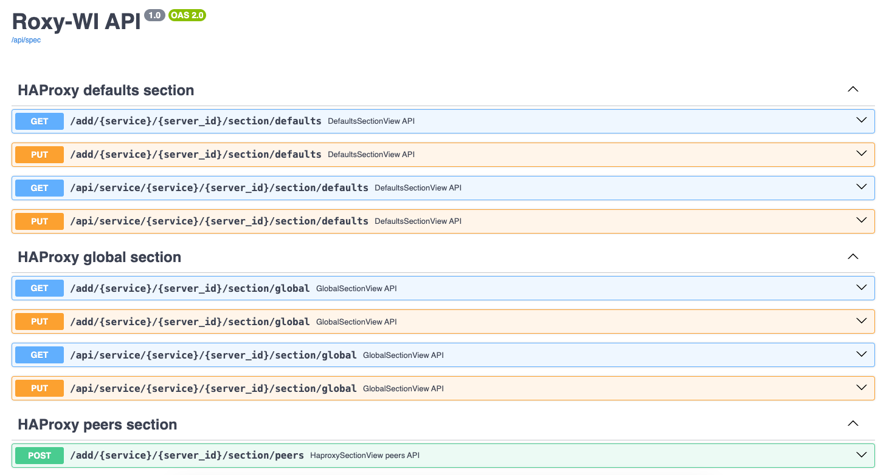
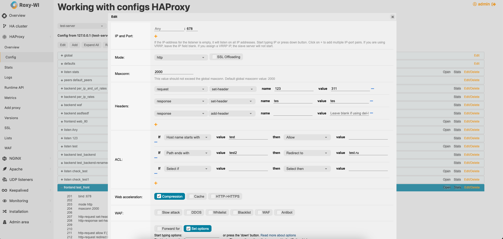

# GUI — это хорошо, но большие дяди хотят IaC
Вечерело, накрапывал морозный дождь… шел 7\-й год разработки Roxy\-WI. Понимание необходимости автоматизации пришло давно, поэтому был разработан API. Он был, скажем так, кривой и местами нелогичный, но работал. После создания [RMON](https://rmon.io/) и написания к нему "нормального" API было решено создать API и для [Roxy\-WI](https://roxy-wi.org/) с поддержкой CRUD и Swagger.

Roxy\-WI Swagger

После консультаций с опытными разработчиками API было принято решение написать его на Flask с использованием [views](https://flask.palletsprojects.com/en/3.0.x/views/) и перейти на JWT\-авторизацию. Старый API был разработан на фреймворке Bottle, но поскольку Roxy\-WI был переписан на Flask, наличие двух фреймворков в одном проекте не казалось хорошей идеей. На тот момент я уже довольно хорошо изучил Flask. JWT был внедрён, чтобы объединить авторизацию в WEB\-версии и API, так как до этого в API использовалась самописная авторизация.

И вот, спустя месяц была выпущена 8 версия! Помимо API и JWT также была внедрена валидация входящих данных на базе [Pydantic](https://docs.pydantic.dev/latest/). Pydantic оказался очень мощным инструментом, но я сопротивлялся использованию библиотеки очень долго \- сам уже не знаю почему. И вот, API готов, но необходима документация, поэтому был нужен Swagger. Описывать самому структуру чуть\-чуть (очень сильно, капец, как сильно, я же не YAML разработчик) не хотелось. И я решил попробовать ИИ, который предлагает JetBrains за 10 у.е. в месяц (зря что ли плачу?!). Так вот, роботы поработят нас еще не скоро и без работы не оставят :\-p. В итоге получилось, правда пришлось поматериться пару вечеров.

API готово, значит пора писать Terraform\-провайдер. Изучив вопрос, я пришёл к выводу, что провайдер нельзя написать на Python — только на Go. Я расстроился и обратился к [@Rocky\_Break](/users/rocky_break)за помощью. Rocky\_Break написал первую версию провайдера и прислал мне книгу по Go. Оказалось, что мало написать API, оно должно еще быть консистентным. Долго ли, коротко ли, но первая версия была выпущена и там уже и я подключился к разработке провайдера (как же не удобно писать на Go, после Python :\`( ).

Кстати! Чтобы была возможностью управлять HAProxy полностью терраформом было необходим доработать работу с конфигурациями HAProxy \- теперь после "накликивания" себе конфига, его можно так же кликами изменить.

Так что теперь есть IaC вэй для создание HA\-кластеров с возможностью создание UDP и HAProxy балансиров ;).

