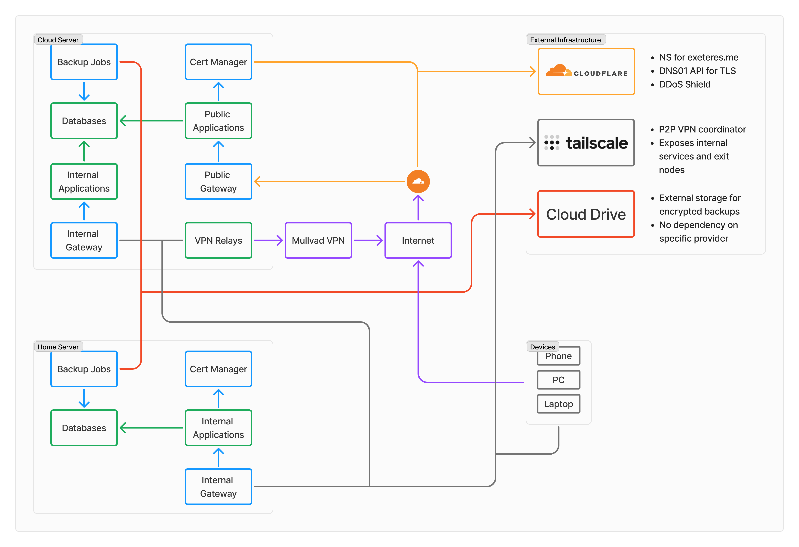
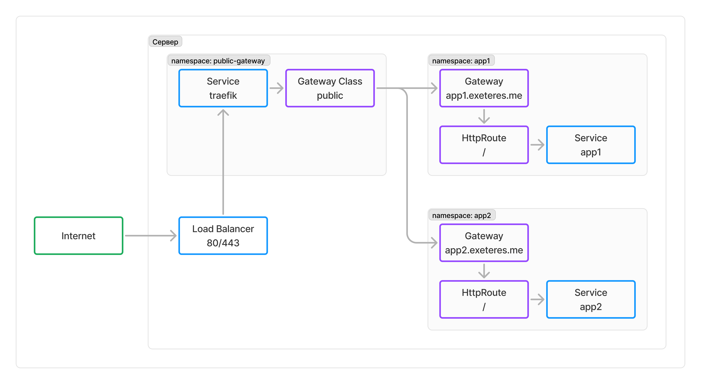
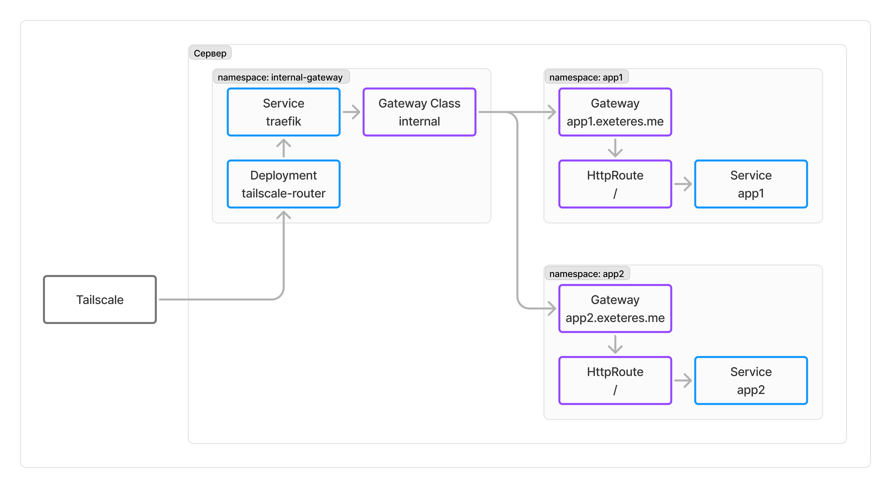
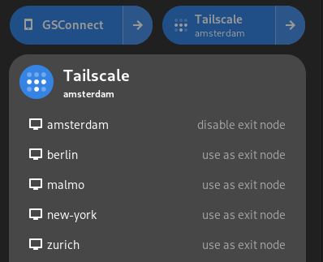

# Home Lab мечты в Kubernetes
Когда я только начал осваивать Linux, я почти сразу загорелся идеей держать собственный сервер для экспериментов и повседневного использования. Такой сервер называют домашней лабораторией и способов ее построения достаточно много. Это интересное занятие очень популярно среди Linux‑энтузиастов.

В этой статье я расскажу про свой путь в построении такой лаборатории с помощью Kubernetes и облачных технологий. Здесь вас ждут полностью воспроизводимые k8s‑кластеры, бекапы с авто‑восстановлением, хитрые VPN‑ретрансляторы, хорошо защищенные приватные и публичные приложения, а также много‑много автоматизации и красивых инженерных решений.

## Содержание

Статья получилась довольно объемной, поэтому я сразу представлю вам ее содержание. Вы можете читать ее по порядку или сразу перейти к интересующим вас разделам.

* [Задачи и требования](#requirements)
* [Архитектура](#archtitecture)
* [Рабочее окружение](#working-environment)
* [Готовим ОС для сервера](#server-os)
* [Terraform](#terraform)
* [Kubernetes и Pulumi](#kubernetes-and-pulumi)
* [Базовая инфраструктура](#base-infrastructure)
* [Доступ к приложениям](#application-access)
* [VPN Relay](#vpn-relay)
* [Бекапы и восстановление](#backups-and-restore)
* [Миграция между кластерами](#migration)
* [Безопасность](#security)
* [Дальнейшие планы и заключение](#plans)

### Задачи и требования

Начнем с описания того, что именно мы будем строить.

Наша система должна обеспечивать работу трех основных групп приложений:

* приватные приложения;
* публичные приложения;
* VPN\-ретрансляторы.

Примеры приватных приложений, которые я использую: 

* [vaultwarden](https://github.com/dani-garcia/vaultwarden/) — сервер для синхронизации менеджера паролей [Bitwarden](https://bitwarden.com/);
* [etebase](https://www.etebase.com/) — сервер для синхронизации календаря, контактов и задач;
* [syncthing](https://syncthing.net/) — сервер для синхронизации файлов между устройствами;
* [plane](https://plane.so/) — Jira\-подобный менеджер задач, в котором я веду все свои проекты;
* [ente](https://ente.io/) — хранилище для фотографий и видео.

Почти все такие приложения должны быть доступны исключительно внутри приватной сети. Это позволит значительно сократить поверхность атаки и я настоятельно рекомендую такой подход всем, кто самостоятельно запускает и использует подобные приложения.

Среди публичных приложений можно привести в пример:

* [zitadel](https://zitadel.com/) — сервер авторизации, который я использую для своих проектов;
* [ghost](https://ghost.org/) — платформа для блога (который пока еще не запущен);
* различные игровые серверы.

И, наконец, VPN\-ретрансляторы. Под этим нелепым названием скрывается технология, позволяющая обходить блокировки VPN\-сервисов. Такие ретрансляторы перенаправляют трафик от конечных устройств к VPN\-серверам, недоступным в России. Кроме того, они тесно интегрированы в приватную сеть и не конфликтуют с ней.

Также наша система должна обеспечивать:

* высокую доступность наиболее критичных сервисов вроде vaultwarden;
* максимальную приватность данных, иногда в ущерб доступности;
* регулярные бекапы всех данных и возможность их восстановления, в том числе для миграции на другие серверы;
* возможность быстро развернуть новый сервер с минимальными усилиями.

Набор требований очень амбициозен, но это лишь добавляет интереса к проекту. Хорошая новость заключается в том, что этот путь уже пройден и я готов поделиться своим опытом!

## Архитектура

В результате долгих экспериментов и многих ошибок я пришел к следующей архитектуре:



Основные компоненты и их взаимодействие

Погружение в архитектуру начнем с представления действующих лиц. Это будут не люди, это будут технологии.

Начнем со следующих технологий:

* [NixOS](https://nixos.org/) — операционная система на базе Linux, которая позволяет управлять пакетами и конфигурацией с помощью декларативного языка программирования. Она позволяет создавать воспроизводимые системы, которые устанавливаются и настраиваются автоматически, что делает ее идеальным выбором для нашей задачи;
* [Kubernetes](https://kubernetes.io/) — небезызвестная система управления контейнерами, которую мы будем использовать для запуска сервисов и приложений. Кластеров Kubernetes у нас будет несколько, каждый на своем сервере. Соответственно, в задачи NixOS входит подготовка кластера к работе;
* [Terraform](https://www.terraform.io/) — инструмент для управления инфраструктурой как кодом, который мы будем использовать для создания виртуальных машин.

Эти три технологии связаны общей целью — создать и поддерживать виртуальный сервер с Kubernetes\-кластером на борту. Это первый уровень инфраструктуры.

На втором уровне находятся:

* [Pulumi](https://www.pulumi.com/) — альтернатива Terraform, которая позволяет управлять инфраструктурой с помощью полноценных языков программирования. Она более гибкая и мы будем использовать ее для управления ресурсами в Kubernetes: создания приложений и их зависимостей, а также автоматизации различных процессов вроде бекапов;
* [Tailscale](https://tailscale.com/) — внешний сервис, который поможет организовать приватную сеть. В отличие от традиционных VPN\-серверов, где один сервер выступает в роли централизованного шлюза, Tailscale лишь координирует прямые подключения между устройствами, объединяя их в одну сеть. В этой сети будут находиться не только серверы и клиентские устройства, но даже отдельные сервисы из Kubernetes\-кластеров. Подобная единая среда сильно упрощает взаимодействие между компонентами системы, в том числе и между кластерами;
* [Cloudflare](https://www.cloudflare.com/) — популярный сервис, предоставляющий множество бесплатных услуг. Среди них мы будем использовать DNS, а также проксирование трафика для публичных приложений, чтобы защититься от DDoS\-атак. Мы также будем использовать его API для автоматического управления DNS\-записями и выпуска сертификатов по протоколу [ACME DNS\-01](https://letsencrypt.org/docs/challenge-types/#dns-01-challenge).

Эти технологии будут использоваться для запуска и управления приложениями, а также для обеспечения к ним доступа.

Теперь поговорим про серверы. Обычно, когда говорят про Home Lab, подразумевают использование собственного сервера, расположенного дома. Такие серверы не лишены недостатков, поэтому в своей лаборатории я использую гибридный подход, совмещающий облачные VPS и домашние серверы. Таким образом, наиболее критичные сервисы, работающие с данными, зашифрованными на клиенте, располагаются на облачных серверах, а все остальные — на домашнем. Это позволяет достичь баланса между доступностью и приватностью.

На этом мы закончим обзор архитектуры и перейдем к рассмотрению каждой технологии в отдельности.

## Рабочее окружение

Перед тем, как начать строить систему, нам нужно подготовить рабочее окружение. Для работы со всей этой инфраструктурой мы воспользуемся такой замечательной технологией как [Dev Containers](https://code.visualstudio.com/docs/devcontainers/containers). Она позволяет собрать все необходимые пакеты и инструменты в контейнере и работать в нем с помощью IDE.

Собирать такие контейнеры локально бывает достаточно долго, поэтому их можно собрать заранее и загрузить в реестр. Для сборки нужного нам контейнера предусмотрен [пайплайн](https://github.com/Exeteres/infra/blob/fe232442e08728a830ded18cfc15d4ff95b5f365/.github/workflows/devcontainer-devops.yaml) в GitHub, а [здесь](https://github.com/Exeteres/infra/tree/fe232442e08728a830ded18cfc15d4ff95b5f365/registry/devcontainer) находится конфигурация и описание содержимого.

В самом контейнере помимо инструментов нам понадобятся некоторые секреты: токены, пароли и прочие подобные вещи. Они хранятся в зашифрованных файлах в папке с исходным кодом. Для управления такими секретами мы будем использовать [SOPS](https://github.com/getsops/sops).

Чтобы расшифровать основные секреты и поместить их в переменные окружения, мы поместим в `.bashrc` внутри контейнера следующую функцию:


```bash
load_secrets() {
  if [ -z "$SOPS_AGE_KEY" ]; then
    export SOPS_AGE_KEY=$(age -d ~/.config/age/key)
    echo "Age key unlocked"
  fi

  export PULUMI_CONFIG_PASSPHRASE=$(sops decrypt --extract '["'pulumi_passphrase'"]' ~/workspace/secrets/infra.yaml)
  ...
  export TF_VAR_yc_sa_key=$(sops decrypt --extract '["'yc_sa_key'"]' ~/workspace/secrets/infra.yaml)

  echo "Secrets loaded"
}
```
Она не делает ничего выдающегося — просто спрашивает пароль, расшифровывает секреты и заполняет ими переменные окружения. Ее приходится вызывать в каждом новом терминале, где я работаю с инфраструктурой — ничего умнее я пока не придумал. В планах научиться расшифровывать секреты с помощью YubiKey.

### Готовим ОС для сервера

Теперь поговорим про операционную систему. Учитывая, что вся полезная нагрузка будет в Kubernetes, мог бы подойти любой Linux\-дистрибутив. Но наша история про автоматизацию, поэтому важно, чтобы установку и настройку можно было многократно воспроизвести.

Как я уже сказал, в качестве ОС мы будем использовать NixOS. В создании кластера нам поможет [k3s](https://docs.k3s.io/) — легковесный дистрибутив Kubernetes, в котором все его компоненты собраны в едином бинарном файле.

Чтобы развернуть такой кластер я написал следующий модуль:

Полный код модуля
```python
{
  lib,
  config,
  ...
}:
lib.exeteres.mkService config {
  name = "kubernetes";
  description = "Single-Node Kubernetes Cluster";

  # Входные параметры модуля, специфичные для каждого сервера
  options = {
    secretFile = lib.mkOption {
      type = lib.types.path;
      description = "Path to the secret file";
    };

    clusterCidr = lib.mkOption {
      type = lib.types.str;
      default = "10.42.0.0/16";
      description = "CIDR for pods";
    };

    serviceCidr = lib.mkOption {
      type = lib.types.str;
      default = "10.43.0.0/16";
      description = "CIDR for services";
    };

    tailnetName = lib.mkOption {
      type = lib.types.str;
      description = "Domain of the Tailscale network";
    };
  };

  config = cfg: [
    {
      # Запускаем k3s
      services.k3s = {
        enable = true;
        role = "server";

        extraFlags = lib.strings.concatStringsSep " " [
          "--secrets-encryption=true"
          "--kubelet-arg=allowed-unsafe-sysctls=net.ipv4.conf.all.src_valid_mark,net.ipv4.ip_forward"

          # Отключаем некоторые встроенные компоненты
          # Позже мы заменим их на более гибкие решения
          "--disable=traefik"
          "--flannel-backend=none"
          "--disable-network-policy"

		  # Задаем кастомные CIDR для подов и сервисов
          # Это нужно, чтобы несколько кластеров в одной сети не конфликтовали между собой
          "--cluster-cidr=${cfg.clusterCidr}"
          "--service-cidr=${cfg.serviceCidr}"

          # Выпускаем сертификат для доступа к кластеру через Tailscale
          # Имя здесь — это имя сервера в сети Tailscale: machineName.tailnetName
          "--tls-san=${config.networking.hostName}.${cfg.tailnetName}"
        ];
      };

      # Создаем файлы с сертификатами и ключами
      sops.secrets = let
        fileNames = [
          "server-ca.crt"
          "server-ca.key"
          ...
        ];

        createSecret = fileName: {
          name = "k3s/${fileName}";
          value = {
            path = "/var/lib/rancher/k3s/server/tls/${fileName}";
            sopsFile = cfg.secretFile;
          };
        };
      in
        builtins.listToAttrs (map createSecret fileNames);
    }

    {
      # Запускаем Tailscale
      services.tailscale = {
        enable = true;
        authKeyFile = "/run/secrets/tailscale/authkey";
      };

      sops.secrets."tailscale/authkey" = {
        sopsFile = cfg.secretFile;
      };
    }
  ];
}
```
Он создает Kubernetes\-кластер, состоящий из одного узла, модифицирует некоторые параметры и добавляет его в сеть Tailscale как отдельное устройство. Стоит отметить, что API\-сервер Kubernetes будет доступен только внутри приватной сети.


> В Tailscale к каждому устройству можно обратиться по домену вида `machineName.tailnetName`. Например, если сервер называется `cloud-a`, а сеть Tailscale — `yak-bebop.ts.net`, то его FQDN будет `cloud-a.yak-bebop.ts.net`. API‑сервер Kubernetes тоже будет доступен по этому адресу. Поэтому в параметрах запуска k3s мы указываем `--tls-san=cloud-a.yak-bebop.ts.net`, чтобы API‑сервер сгенерировал сертификат для этого домена.

Поскольку мы хотим получить воспроизводимую систему, нам придется самостоятельно разместить все необходимые сертификаты для кластера. Иначе они будут сгенерированы случайно при первом запуске. Эти сертификаты и ключи тоже лежат в зашифрованных с помощью sops файлах и для их чтения на сервере используется модуль [nix\-sops](https://github.com/Mic92/sops-nix).

Если вынести некоторый общий код из конфигурации каждого сервера в отдельный [модуль](https://github.com/Exeteres/infra/blob/fe232442e08728a830ded18cfc15d4ff95b5f365/nixos/modules/server/default.nix), то код отдельного сервера выглядит следующим образом:


```python
{
  imports = [
    ../../modules/server
  ];

  networking.hostName = "cloud-a";

  exeteres.services.kubernetes = {
    clusterCidr = "10.32.0.0/16";
    serviceCidr = "10.33.0.0/16";
  };
}
```
Ничего лишнего — только имя хоста и промежутки адресов для подов и сервисов в Kubernetes.

Полный код для всех моих устройств на NixOS можно найти [здесь](https://github.com/Exeteres/infra/tree/fe232442e08728a830ded18cfc15d4ff95b5f365/nixos).

Стоит отметить, что в этой системе на каждом сервере находится отдельный кластер Kubernetes. Одной из моих первых ошибок была попытка создать единый кластер для всех серверов. Это казалось заманчивым, ведь Kubernetes как раз позволяет такое устроить, но это лишь добавляет проблем. Если использовать в таком кластере один master\-сервер, то это единая точка отказа, а multi\-master заметно усложняет обслуживание. Более того, в такой системе приходилось назначать каждому поду `nodeSelector`, чтобы он оказался на нужном сервере, что очень неудобно и не всегда возможно. В итоге я открыл для себя простую истину — кластер должен собирать однородные серверы, а в моем случае они сильно различаются по назначению.

## Terraform

Теперь, когда у нас есть готовая конфигурация и секреты, можно звать Terraform для создания сервера. Этот процесс состоит из двух этапов: создание виртуальной машины и установка на нее NixOS. Первая часть зависит от конкретного провайдера, а вот вторая будет общей для всех.

Конфигурация Terraform находится в этой [папке](https://github.com/Exeteres/infra/tree/fe232442e08728a830ded18cfc15d4ff95b5f365/terraform) и имеет следующую структуру:


```
terraform
├── instances
│   ├── cloud-a
│   │   ├── main.tf
│   │   ├── outputs.tf
│   │   ├── provider.tf
│   │   └── variables.tf
│   ├── cloud-b
│   ├── local-a
│   └── local-b
└── shared
    ├── nixos
    └── providers
        ├── proxmox
        ├── twc
        └── yandex
```
В `instances` находятся корневые модули для конкретных серверов, а в `shared` — общие модули. Сами модули организованы довольно [идиоматично](https://developer.hashicorp.com/terraform/language/modules/develop/structure) для Terraform.

В папке `providers` лежат модули, создающие виртуальную машину либо на ресурсах облачных провайдеров, либо на домашнем сервере через Proxmox. Использование виртуальных машин на домашнем сервере позволяет устранить различия между созданием серверов в облаке и дома, что упрощает автоматизацию. Более того, это позволяет пересоздавать кластеры без каких\-либо ручных действий.

Каждый провайдер имеет свой набор входных параметров, но выходные данные у всех одинаковые и состоят из следующих элементов:

* `id` — уникальный идентификатор сервера в рамках провайдера;
* `ssh_host`, `ssh_port`, `ssh_user` — данные для подключения по ssh;
* `internal_ip` — внутренний IP\-адрес сервера (не путать с внутренним адресом в сети Tailscale). Для облака — это адрес во внутренней сети, для домашнего сервера — адрес в локальной сети;
* `public_ip` — публичный IP\-адрес сервера, если он есть.

Благодаря унифицированному выводу мы можем использовать один и тот же код для следующего этапа — установки NixOS и создания Kubernetes\-кластера.

Кажется, что для установки NixOS нам обязательно нужен кастомный образ, который мы должны предварительно загрузить и использовать при создании виртуальной машины. Это потребовало бы еще больше кода, специфичного для каждого провайдера, но есть способ сделать это значительно проще.

Знакомьтесь, [nixos\-anywhere](https://github.com/nix-community/nixos-anywhere/). Это замечательный инструмент, который позволяет превратить любую Linux\-систему в NixOS, имея лишь доступ по ssh. Для этого он подключается к серверу, скачивает образ NixOS, переключаются в него с помощью [kexec](https://en.wikipedia.org/wiki/Kexec), а затем выполняет установку заданной конфигурации. В результате нам совсем не важно какой дистрибутив стоит на сервере — он все равно "переродится" в NixOS. Что еще приятнее — эта фантастическая технология доступна в виде Terraform модуля.

Модуль для установки NixOS выглядит следующим образом:


```python
locals {
  attr_prefix = "${path.module}/../../../nixos#nixosConfigurations.${var.configuration_name}.config.system.build"
}

module "system-build" {
  source    = "github.com/nix-community/nixos-anywhere//terraform/nix-build"
  attribute = "${local.attr_prefix}.toplevel"
}

module "disko" {
  source    = "github.com/nix-community/nixos-anywhere//terraform/nix-build"
  attribute = "${local.attr_prefix}.diskoScript"
}

module "install" {
  source = "github.com/nix-community/nixos-anywhere//terraform/install"

  nixos_system      = module.system-build.result.out
  nixos_partitioner = module.disko.result.out
  instance_id       = "${var.instance_id}-${var.generation}"
  target_host       = var.ssh_host
  target_port       = var.generation == 1 ? var.initial_ssh_port : var.ssh_port
  target_user       = var.generation == 1 ? var.initial_ssh_user : var.ssh_user

  extra_files_script = "${path.module}/prepare_extra_files.sh"
}
```
Он принимает на вход данные для подключения по ssh, имя конфигурации NixOS и `generation`. Последний параметр — это натуральное число, которое используется для двух целей:

* как часть `instance_id`, изменение которого говорит nixos‑anywhere, что нужно переустановить систему. Увеличив это поле на единицу, можно вызвать полную переустановку NixOS без необходимости пересоздания виртуальной машины;
* определение является ли данная установка первой: это нужно, чтобы использовать дефолтные параметры (обычно, root и порт 22\) для подключения к только что созданной виртуальной машине. После установки вход под root будет запрещен, а порт станет нестандартным, поэтому переустановку надо будет выполнять уже с другими данными.

Кроме того, сюда передается скрипт `prepare_extra_files.sh` со следующим содержимым:


```bash
# Copy ssh host keys
mkdir -p ./etc/ssh

sops decrypt --extract '["ssh_host_rsa_key"]' ~/workspace/secrets/infra.yaml > ./etc/ssh/ssh_host_rsa_key
sops decrypt --extract '["ssh_host_rsa_key.pub"]' ~/workspace/secrets/infra.yaml > ./etc/ssh/ssh_host_rsa_key.pub
sops decrypt --extract '["ssh_host_ed25519_key"]' ~/workspace/secrets/infra.yaml > ./etc/ssh/ssh_host_ed25519_key
sops decrypt --extract '["ssh_host_ed25519_key.pub"]' ~/workspace/secrets/infra.yaml > ./etc/ssh/ssh_host_ed25519_key.pub

chmod 600 ./etc/ssh/ssh_host_rsa_key
chmod 644 ./etc/ssh/ssh_host_rsa_key.pub
chmod 600 ./etc/ssh/ssh_host_ed25519_key
chmod 644 ./etc/ssh/ssh_host_ed25519_key.pub
```
Этот скрипт достает из sops ssh‑ключи для хоста и копирует их в специальную директорию, откуда nixos‑anywhere скопирует их на сервер после установки. Это замыкающий элемент автоматизации, который обеспечивает полностью воспроизводимую установку. Стабильные хостовые ключи позволяют подключаться по ssh без необходимости удалять старые ключи из `known_hosts`. Более того, они также используются для расшифровки секретов, которые доставляет на сервер nix‑sops.

И наконец, код корневого модуля для конкретного экземпляра:


```python
locals {
  name = "cloud-a"
}

module "server" {
  source = "../../shared/providers/yandex"

  name = local.name

  subnet_id = var.subnet_id
  cpu       = var.cpu
  ram       = var.ram
}

module "nixos" {
  source = "../../shared/nixos"

  configuration_name = local.name

  instance_id = module.server.id
  generation  = var.generation

  initial_ssh_port = module.server.ssh_port
  initial_ssh_user = module.server.ssh_user

  ssh_host = module.server.ssh_host
  ssh_port = var.ssh_port
  ssh_user = var.ssh_user
}
```
В первом модуле можно спокойно менять провайдера и входные параметры, но код второго модуля это никак не затронет, ведь выходные данные первого имеют единый интерфейс.

В результате работы Terraform мы получаем готовый сервер с Kubernetes\-кластером на борту и всеми необходимыми секретами. В `outputs.tf` экземпляра надо будет также экспортировать данные для подключения к серверу и все его адреса. Они потребуются для дальнейшей работы.

## Kubernetes и Pulumi

Поблагодарим NixOS и Terraform за прекрасный Kubernetes\-кластер, дальше они нам не понадобятся. Теперь в игру вступает Pulumi. Это более поздний аналог Terraform, который позволяет управлять ресурсами не на весьма ограниченном HCL, а с помощью языков общего назначения, таких как Python и TypeScript.

И хотя такой подход может показаться более громоздким, у нас есть огромное количество инструментов, чтобы это исправить. И самый главный из них — функции. Конечно, в Terraform тоже есть модули, позволяющие декомпозировать и переиспользовать ресурсы, но полноценные функции обладают куда большей гибкостью, которую можно пустить в правильное русло.

С помощью Pulumi мы будем создавать ресурсы в Kubernetes. Для примера попробуем создать deployment, используя только встроенные средства:


```typescript
import * as k8s from "@pulumi/kubernetes"

const namespace = new k8s.core.v1.Namespace("example")

const deployment = new k8s.apps.v1.Deployment("nginx", {
  metadata: {
    name: "nginx",
    namespace: namespace.metadata.name,
  },
  spec: {
    selector: {
      matchLabels: {
        app: "nginx",
      },
    },
    replicas: 1,
    template: {
      metadata: {
        labels: {
          app: "nginx",
        },
      },
      spec: {
        containers: [
          {
            name: "nginx",
            image: "nginx",
          },
        ],
      },
    },
  },
})
```
Весьма многословно, не так ли? Но как вам такой вариант:


```typescript
import { k8s } from "@infra/k8s"

const namespace = k8s.createNamespace({ name: "example" })

const deployment = k8s.createWorkload({
  name: "nginx",
  namespace,
  kind: "Deployment",

  container: {
    image: "nginx",
  },
})
```
Количество строк считать не будем — невооруженным глазом видно, что код стал сильно короче. А добавить сервис к этому deployment можно изменив всего две строки:


```typescript
// k8s.createWorkload -> k8s.createWorkloadService (1)
const { deployment, service } = k8s.createWorkloadService({
  name: "nginx",
  namespace,
  kind: "Deployment",

  port: 80, // и добавить порт тут (2)
  container: {
    image: "nginx",
  },
})
```
Внимательный читатель заметит, что в новом коде пропали метки, обязательные, чтобы deployment и сервис могли обнаружить поды. Конечно же, они никуда не делись, а просто создаются неявно функциями `createWorkload` и `createWorkloadService`, что значительно сокращает объем избыточного кода.

Примеры функций для создания ресурсов
```typescript
const namespace = k8s.createNamespace({ name: "example" })

// Создание ConfigMap с одним ключом и значением
const configMap = k8s.createConfigMap({
  name: "example",
  namespace,

  key: "example",
  value: "example",
})

// Создание Helm-релиза указанной версии
const helmRelease = k8s.createHelmRelease({
  name: "example",
  namespace,

  chart: "nginx-ingress",
  repo: "https://kubernetes.github.io/ingress-nginx",
  version: "1.41.3",

  values: {
    controller: {
      service: {
        type: "LoadBalancer",
      },
    },
  },
})

// Создание сервисного аккаунта, роли и привязки
const { serviceAccount } = k8s.createServiceAccount({
  name: "example",
  namespace,
})

const { role, binding } = k8s.createRole({
  name: "example",
  namespace,

  subject: serviceAccount,

  rule: {
    apiGroups: [""],
    resources: ["pods"],
    verbs: ["get", "list"],
  },
})

// Создание issuer и certificate через cert-manager
const issuer = certManager.createPlainIssuer({
  name: "example",
  namespace,
})

// Создание сертификата через Cert Manager
const certificate = certManager.createCertificate({
  name: "example",
  namespace,

  issuer,
  domain: "example.com",
})

// Создание pvc
const pvc = k8s.createPersistentVolumeClaim({
  name: "example",
  namespace,

  capacity: "1Gi",
})

// Создание deployment'а и сервиса с использованием созданных ресурсов
const { workload, service } = k8s.createWorkloadService({
  name: "example",
  namespace,
  kind: "Deployment",

  port: 80,
  volumes: [pvc, configMap],
  dependsOn: helmRelease,
  serviceAccount,

  container: {
    image: "my-image",

    volumeMounts: [
      {
        volume: pvc,
        mountPath: "/data",
      },
      {
        volume: configMap,
        mountPath: "/config",
      },
    ],
  },
})

// Создание ingress
k8s.createIngress({
  name: "example",
  namespace,

  certificate,
  service,
})
```
Таким образом получается своеобразный конструктор — мы создаем различные ресурсы и просто передаем их в другие ресурсы как параметры. Это позволяет создавать сложные конфигурации из простых блоков и работа с таким кодом становится очень приятным занятием.

## Базовая инфраструктура

Теперь пора перейти к созданию базовой инфраструктуры. Она будет создаваться на каждом сервере независимо от остальных и обеспечивать работу приложений.

Все, что касается Pulumi, находится в этой [папке](https://github.com/Exeteres/infra/tree/fe232442e08728a830ded18cfc15d4ff95b5f365/pulumi) и имеет следующую структуру:


```
pulumi
├── apps
│   ├── vaultwarden
│   └── ...
├── packages
│   ├── cert-manager
│   ├── cert-manager-crds
│   └── ...
├── projects
│   ├── vaultwarden
│   │   ├── index.ts
│   │   ├── package.json
│   │   ├── Pulumi.cloud-a.yaml
│   │   ├── Pulumi.cloud-b.yaml
│   │   └── Pulumi.yaml
│   └── ...
├── scripts
├── tasks
├── package.json
├── tsconfig.json
└── yarn.lock
```
В `packages` находятся пакеты с вспомогательными функциями для различных инфраструктурных вещей вроде Kubernetes. Пакеты с суффиксом `-crds` автоматически генерируются с помощью утилиты `crd2pulumi` и содержат код для создания [кастомных ресурсов](https://kubernetes.io/docs/concepts/extend-kubernetes/api-extension/custom-resources/) Kubernetes.

В `apps` находятся функции для создания ready\-to\-use приложений, в которых уже описаны все необходимые ресурсы.

В `projects` находятся проекты — так в Pulumi называется минимальная единица кода, которую можно независимо запустить. В каждом проекте может быть один или несколько стеков, содержащих различную конфигурацию и секреты. С каждым стеком связано отдельное состояние, содержащее информацию о созданных ресурсах. В качестве имени стека мы будем использовать имя сервера, которое совпадает с именами папок в `instances` (например, `cloud-a`).

Базовая инфраструктура включает в себя 6 проектов:

* `shared`
* `cilium`
* `cert-manager`
* `internal-gateway`
* `public-gateway`
* `kubernetes-dashboard`

Начнем с `shared`, вот его код:


```typescript
const config = new pulumi.Config()

const terraformState = new tf.state.RemoteStateReference("terraform", {
  backendType: "local",
  path: path.join(__dirname, `../../../terraform/instances/${pulumi.getStack()}/terraform.tfstate`),
})

export const domain = config.require("domain")
// ... и много других переменных из config и terraformState
export const publicIp = terraformState.getOutput("public_ip")
```
В этом проекте не создается никаких реальных ресурсов, но происходит две полезные вещи:

* экспортируются общие конфигурационные значения, которые нужны всем остальным проектам;
* реэкспортируются данные из Terraform, которые мы экспортировали в одном из предыдущих разделов. Это обеспечивает плавный переход от Terraform к Pulumi.

Следующий на очереди проект — `cilium`. [Cilium](https://cilium.io/) — это [CNI](https://www.cni.dev/), механизм, обеспечивающий связь между подами, а также соблюдение политик безопасности. По своим возможностям он значительно превосходит встроенный в k3s Flannel, так что мы будем использовать его.

Вот так выглядит код его проекта:


```typescript
import { cilium } from "@infra/cilium"
import { pulumi } from "@infra/core"
import { getSharedEnvironment } from "@projects/common"

const { internalIp } = getSharedEnvironment()

cilium.createApplication({ apiServerHost: internalIp })
```
Функция `createApplication` просто создает Helm\-релиз с нужными параметрами.

Для функционирования Cilium нам нужно сообщить ему адрес API\-сервера Kubernetes, коим является `internalIp`, который мы экспортировали в проекте `shared`. Как же нам его получить? Если вы уже работали с Pulumi или просто очень догадливы, то понимаете, что просто так взять и импортировать ресурс из другого пакета нельзя. Это приведет к тому, что ресурс будет создан в текущем проекте, что нам не нужно. Вместо этого надо создать объект типа `StackReference` и использовать его для доступа к переменным другого проекта.

Чтобы упростить совместное использование данных из других проектов (в том числе из `shared`), я создал специальный пакет `@projects/common`, который содержит различные вспомогательные функции. Его можно безопасно использовать в любом проекте, не боясь каких\-то побочных эффектов.

Для доступа к данным другого проекта в нем существует функция `getStack`, объявленная следующим образом:


```typescript
export function getStack(projectName: string): pulumi.StackReference {
  let stackRef = stackRefMap.get(projectName)

  if (!stackRef) {
    stackRef = new pulumi.StackReference(`organization/${projectName}/${getEnvironmentName()}`)
    stackRefMap.set(projectName, stackRef)
  }

  return stackRef
}
```
Она как раз создает `StackReference` для указанного проекта и кэширует его, чтобы не создавать его заново при каждом вызове. В Pulumi нельзя создавать один и тот же ресурс несколько раз, поэтому кэширование здесь необходимо. Еще один приятный момент — сюда автоматически подставляется имя текущего стека, что позволяет использовать один и тот же код для разных окружений.

Но вернемся к `cilium`. Он использует еще одну вспомогательную функцию `getSharedEnvironment`, позволяющую получить общие переменные из `shared`:


```typescript
const { internalIp } = getSharedEnvironment()

cilium.createApplication({ apiServerHost: internalIp })
```
Как уже было сказано, здесь нам нужен `internalIp`, полученный на этапе создания сервера. В случае кластера из одного узла этот адрес должен быть известен этому узлу, т.е. выводиться командой `ifconfig`. Тогда Cilium сможет найти по нему API\-сервер Kubernetes.


> Я столкнулся с тем, что разные облачные провайдеры дают серверу разные адреса. Обычные провайдеры не парятся и сразу назначают публичный IP, а вот полноценные облака назначают каждому серверу приватный IP во внутренней сети. Публичный же IP появляется за счет действия какого\-то внешнего NATа и в результате сервер даже не знает какой у него публичный IP. В данном случае смысл поля `internalIp` — указывать на тот IP, про который знает сам сервер.

В следующем проекте поднимается [Cert Manager](https://cert-manager.io/), который очень популярен мире в Kubernetes. Это оператор, который автоматически выпускает и обновляет сертификаты с помощью самых разных способов.

Код для развертывания Cert Manager
```typescript
const sharedStack = getSharedStack()
const config = new pulumi.Config()

const { namespace, release } = certManager.createApplication()

const apiTokenSecret = k8s.createSecret({
  name: "cloudflare-api-token",
  namespace,

  dependsOn: release,

  key: "value",
  value: sharedStack.requireOutput("cloudflareApiToken"),
})

const _publicIssuer = certManager.createAcmeIssuer({
  name: "public",
  isClusterScoped: true,

  dependsOn: release,

  email: config.require("acmeEmail"),
  server: config.require("acmeServer"),

  solver: {
    dns01: {
      cloudflare: {
        apiTokenSecretRef: k8s.mapSecretToRef(apiTokenSecret, "value"),
      },
    },
  },
})

const _plainIssuer = certManager.createPlainIssuer({
  name: "plain",
  isClusterScoped: true,

  dependsOn: release,
})

export const publicIssuer = k8s.export(_publicIssuer)
export const plainIssuer = k8s.export(_plainIssuer)
```
Здесь помимо Helm\-релиза также создаются два ресурса нестандартного типа `ClusterIssuer`: `publicIssuer` и `plainIssuer`. Первый используется для выпуска публичных сертификатов, уважаемых в современном мире и подписанных удостоверяющим центром. Второй просто выпускает неподписанные сертификаты исключительно для внутреннего пользования.

Проекты `internal-gateway` и `public-gateway` отвечают за организацию внешнего доступа к приложениям — из внутренней сети и из интернета. Про них мы поговорим в следующем разделе.

И, наконец, проект `kubernetes-dashboard` разворачивает админку, с помощью которой можно "потрогать" кластер. Также ее доступность позволяет убедиться в работоспособности кластера и базовой инфраструктуры.

Вот так выглядит код проекта:


```typescript
const namespace = k8s.createNamespace({ name: "kubernetes-dashboard" })

const config = new pulumi.Config("kubernetes-dashboard")
const domain = config.require("domain")

const { routes } = exposeInternalHttpService({ namespace, domain })

const application = kubernetesDashboard.createApplication({
  namespace,
  routes,
})

kubernetesDashboard.createServiceAccount({
  name: "dashboard-account",
  namespace: application.namespace,
  dependsOn: application.release,
})
```
Помимо самого приложения здесь создается сервисный аккаунт, токен которого можно использовать для авторизации.

Стоит отметить, что для некоторых приложений вроде `kubernetes-dashboard` я включаю имя сервера в доменное имя (например, `dashboard.k8s.cloud-a.exeteres.me`). Это позволяет одновременно получать доступ к одинаковым приложениям, развернутым в разных кластерах.

### Доступ к приложениям

Пришло время поговорить про то, как достучаться до наших приложений. Существует всего два сценария: доступ из интернета и доступ из приватной сети.

В предыдущем разделе был продемонстрирован код проекта для `kubernetes-dashboard`. Давайте посмотрим на эту часть:


```typescript
const { routes } = exposeInternalHttpService({ namespace, domain })

const application = kubernetesDashboard.createApplication({
  namespace,
  routes,
})
```
Опять какая\-то магическая функция `exposeInternalHttpService`. На самом деле она делает всего три вещи:

* создает в неймспейсе сертификат через Cert Manager;
* создает DNS\-запись через Cloudflare;
* создает шлюз и формирует объект `routes`, содержащий всю необходимую информацию для организации доступа к приложению.

Для того чтобы направить трафик к приложениям, мы будем использовать [Gateway API](https://gateway-api.sigs.k8s.io/). Это относительно новый стандарт, призванный заменить классический Ingress API.

Чтобы избежать путаницы, сразу скажу, что в нем существует три сущности:

* `Gateway Controller`
* `Gateway Class`
* `Gateway`

Уже упомянутые проекты `internal-gateway` и `public-gateway` отвечают за создание первых двух сущностей: шлюза и связанного с ним класса. А вот объект типа `Gateway` создается отдельно для каждого приложения и размещается в его неймспейсе. Затем к нему привязываются маршруты, которые определяют, какой трафик какому сервису направлять.

Вернемся к объекту `routes`, который создается в `exposeInternalHttpService`. Его тип имеет следующий интерфейс:


```typescript
export interface RoutesOptions {
  /**
   * The path prefix to use.
   * If not provided, the Gateway will route traffic to the root path.
   */
  pathPrefix?: string

  /**
   * The gateway to use for the routes.
   */
  gateway: Input<raw.gateway.v1.Gateway>
}
```
В нем мы должны обязательно передать объект типа `Gateway`, для которого будут созданы маршруты. Опционально можно указать префикс пути, который будет добавлен ко всем http\-маршрутам.

Как вы уже возможно догадались, передавая сюда шлюзы разных классов, можно изменить способ доступа к приложению. И существуют функции `exposeInternalHttpService` и `exposePublicHttpService` с полностью идентичным интерфейсом, но создающие шлюзы разных классов.

Но как эти классы реализованы? Gateway API как и Ingress — это просто абстракция, контракт, который позволяет стандартизировать весь этот механизм. У этой абстракции есть различные реализации, одна из которых — [Traefik](https://traefik.io/traefik/). Это довольно популярный в облачном мире прокси\-сервер, который поддерживает большое количество способов конфигурации и в том числе Gateway API.

Итак, представляю вашему внимание код проекта `public-gateway`:


```typescript
const namespace = k8s.createNamespace({ name: "public-gateway" })

const { release } = traefik.createApplication({
  namespace,

  release: {
    values: {
      providers: {
        kubernetesGateway: {
          enabled: true,
        },
      },

      gatewayClass: {
        name: "public",
      },

      // ... прочие настройки
    },
  },
})
```
Здесь ничего сложного — мы просто создаем Traefik в отдельном неймспейсе и включаем поддержку Gateway API. Мы также указываем имя для класса — `public`. Именно это имя и использует функция `exposePublicHttpService` для создания шлюза.

В результате будет создан сервис `traefik`, который прикрепится к портам 80 и 443 у единственного сервера нашего кластера. Это именно то поведение, которое мы хотим для публичных приложений.

Все вышесказанное хорошо отражает следующая схема:



Движение входящего трафика при использовании Public Gateway

Она не совсем фактологически верна (конечно же, через gateway class трафик не идет), но зато она наглядно показывает взаимодействие между компонентами.

Как же нам теперь организовать шлюз для внутренней сети? Не поверите, но для него мы тоже будем использовать Traefik. Настройки аналогичные, поэтому приведу только код, который отличается:


```typescript
const { release } = traefik.createApplication({
  namespace,

  release: {
    values: {
	  ...,
      service: {
        type: "ClusterIP", // внимание сюда (1)
      },
    },
  },
})

const service = release.status.status.apply(() => k8s.raw.core.v1.Service.get("traefik", "internal-gateway/traefik"))

export const gatewayIp = service.spec.clusterIP // и сюда (2)
```
Вся разница в типе сервиса: `ClusterIP` вместо `LoadBalancer`. Грубо говоря, последний вынуждает сервер сделать порты пода доступными извне, а первый сделает под доступным только внутри кластера. Кроме того, нам понадобится экспортировать адрес пода внутри кластера для дальнейшего использования.

Но это, конечно же, не все:


```typescript
const { serviceCidr } = getSharedEnvironment()

const config = new pulumi.Config()
const tailscaleAuthKey = config.requireSecret("tailscaleAuthKey")

const { container, serviceAccount } = tailscale.createContainer({
  namespace,
  secretName: "tailscale-router",
  hostname: `gateway-${pulumi.getStack()}`,
  authKey: tailscaleAuthKey,

  // здесь мы публикуем адреса, трафик к которым должен идти к этому девайсу
  // в данном случае — адреса всех серверов в кластере, среди которых и наш traefik
  advertiseRoutes: [serviceCidr],
})

k8s.createWorkload({
  name: "tailscale-router",
  namespace,

  kind: "Deployment",

  container,
  serviceAccount,
})
```
Именно этот код отвечает за то, чтобы наши приложения были доступны в приватной сети.

В Tailscale есть такая замечательная функция как [subnet routers](https://tailscale.com/kb/1019/subnets). Она позволяет любому устройству анонсировать список адресов, трафик к которым оно будет получать и перенаправлять дальше.

Функция `tailscale.createContainer` создает спецификацию контейнера, который подключится к сети как отдельное устройство с нужными параметрами, включая список адресов. Это определение затем используется в уже знакомой вам функции `createWorkload`, которая создает deployment.

Аналогичная схема для приватного шлюза:



Движение входящего трафика при использовании Internal Gateway

Дело осталось за малым — создать DNS\-записи и TLS\-сертификаты. Для публичных и приватных приложений записи создаются почти идентично:


```typescript
export function createPublicDnsRecord(domain: string) {
  const { publicIp } = getSharedEnvironment()

  return createDnsRecord({
    name: domain,
    type: "A",
    value: publicIp,
    proxied: true,
  })
}

export function createInternalDnsRecord(domain: string) {
  const internalGatewayStack = getStack("internal-gateway")
  const gatewayIp = internalGatewayStack.requireOutput("gatewayIp")

  return createDnsRecord({
    name: domain,
    type: "A",
    value: gatewayIp,
  })
}
```
Вся разница в том, что для публичных сервисов используется публичный IP сервера, а для приватных — внутренний IP сервиса `traefik`, который мы экспортировали из `internal-gateway`. Никакой магии!

Что касается TLS\-сертификатов, то все также очень просто:


```typescript
export function createWebCertificate(namespace: k8s.raw.core.v1.Namespace, domain: string) {
  return certManager.createCertificate({
    name: domain.replace("*", "wildcard"),
    namespace,

    issuer: getPublicIssuer(),
    domain,
  })
}
```
Здесь мы используем `publicIssuer` из проекта `cert-manager` базовой инфраструктуры. Несмотря на то, что приложения могут быть приватными, все сертификаты все равно выпускаются публичным удостоверяющим центром, чтобы не иметь дел с самоподписанными сертификатами.

Объединив все это воедино мы и получим функции `exposeInternalHttpService` и `exposePublicHttpService`. Полный код этих функций можно найти по [ссылке](https://github.com/Exeteres/infra/blob/fe232442e08728a830ded18cfc15d4ff95b5f365/pulumi/projects/common/expose.ts).

## VPN Relay

Как известно, в России многие популярные VPN\-сервисы давно заблокированы, и энтузиасты вроде меня поднимают свои серверы для себя и своих друзей.

Если бы речь шла про обычный VPN\-сервер, то этот раздел был бы неинтересным. Давно есть хорошие проекты вроде [Amnezia VPN](https://amnezia.org/en), которые позволяют без труда поднять свой VPN\-сервер даже человеку, не погруженному в Linux и системное администрирование.

Но мои требования немного другие. Во\-первых, я уже использую VPN для доступа к личным сервисам. Без дополнительной настройки он почти наверняка будет конфликтовать с другим VPN на компьютерах и однозначно не будет совместно работать на телефонах, где может быть только одно активное VPN\-соединение. Во\-вторых, я бы хотел сохранить преимущества существующих VPN\-сервисов: возможность выбрать локацию и не светить реальный IP своего сервера.

Возможно ли получить всё и сразу? Оказалось, что да! В Tailscale есть [exit\-ноды](https://tailscale.com/kb/1103/exit-nodes). Этот механизм позволяет перенаправлять весь интернет\-трафик через какое\-либо устройство в сети подобно тому как работают обычные VPN\-сервисы.

Таким образом можно сделать несколько exit\-нод, по одной на каждую локацию, и свободно выбирать их на конкретном устройстве, подобно тому как это происходит в приложениях VPN\-сервисов.

Вот так, например, это выглядит на Linux\-десктопе:

Каждая exit\-нода перенаправляет трафик к серверу VPN\-провайдера, и, поскольку она сама располагается за пределами страны, она может спокойно к нему подключиться. Связь же между exit\-нодами и конечными устройствами происходит через Tailscale, который при невозможности прямого подключения туннелирует трафик через DERP\-серверы. Эти серверы упаковывают WireGuard\-пакеты в TLS\-пакеты, что тоже позволяет обходить блокировки.

Как же достичь такого результата? Идея очень простая: создать несколько подов, состоящих из двух контейнеров. Первый контейнер выведет под в сеть Tailscale как отдельное устройство, а второй подключит к нему wireguard\-интерфейс, который соединится с сервером VPN\-провайдера в конкретной локации. Поскольку все контейнеры пода делят одно сетевое пространство, то они естественным образом окажутся связаны. Затем мы просто создаем нужное количество подов для нужных локаций.

Технические детали реализацииРазумеется, что если просто создать под и закинуть в него два контейнера, настраивающих VPN, то они будут конфликтовать и ничего хорошего из этого не выйдет.

Давайте попробуем решить эту проблему. Сначала создадим контейнер для подключения к VPN\-провайдеру:


```typescript
{
  name: "upstream",
  image: "linuxserver/wireguard:latest",

  volumeMounts: [
    {
      name: "wg0",
      mountPath: "/config/wg_confs",
    },
  ],

  environment: {
    PUID: "1000",
    PGID: "1000",
    TZ: "Etc/UTC",
  },

  securityContext: {
    capabilities: {
      add: ["NET_ADMIN"],
    },
  },
}
```
В этот контейнер нужно будет примонтировать конфигурацию `wg-quick` для создания интерфейса, ее мы разместим в отдельном секрете. Также ему понадобится capability `NET_ADMIN`, чтобы он мог управлять сетью в сетевом пространстве пода.

И создадим контейнер для подключения к Tailscale:


```typescript
  const { container, serviceAccount } = tailscale.createContainer({
    secretName: options.location.name,
    namespace: options.namespace,
    authKey: options.authKey,
    hostname: options.location.name,
    authState: options.authState,
    loginServer: options.loginServer,
    advertiseExitNode: true, // анонсируем, что это exit-нода
  })
```
Секрет с конфигурацией `wg-quick` выглядит следующим образом:


```typescript
const secret = k8s.createSecret({
  name: `${options.location.name}-config`,
  namespace: options.namespace,

  key: "wg0.conf",
  value: pulumi.interpolate`
    [Interface]
    Address = ${options.address}
    PrivateKey = ${options.privateKey}
    DNS = ${options.dnsServerAddress}

    PostUp = iptables -t mangle -A PREROUTING -i ${options.frontendInterface} -j MARK --set-mark 0x1
    PostUp = ip rule del not from all fwmark 0xca6c lookup 51820
    PostUp = ip rule add from all fwmark 0x1 lookup 51820
    PostUp = iptables -t nat -A POSTROUTING -o wg0 -j MASQUERADE
    PostUp = ip route add ${options.dnsServerAddress} dev wg0

    [Peer]
    PublicKey = ${options.location.publicKey}
    Endpoint = ${options.location.endpoint}
    AllowedIPs = 0.0.0.0/0
    PersistentKeepalive = 25
  `.apply(trimIndentation),
})
```
Я раньше тоже боялся этих `iptables` и `ip`. А может и сейчас боюсь... Но правда в том, что этот код не делает ничего сложного.

Давайте разберемся. Когда wg\-quick видит строку `AllowedIPs = 0.0.0.0/0`, которая заставляет завернуть весь трафик в VPN, он делает две вещи.

Во\-первых, он настраивает интерфейс так, чтобы он помечал все пакеты, **уже упакованные** wireguard\-ом, числом `0xca6c`. Т.е. когда в ядро прилетает пакет, адресованный, скажем, `1.1.1.1`, и отправляется в wireguard\-туннель, то он запаковывается в wireguard\-пакет и снова отправляется в ядро, но уже с этой меткой.

Во\-вторых, создается правило маршрутизации, которое отправляет все пакеты, **не помеченные этой меткой**, в таблицу с номером `51820`. В этой таблице находится один единственный маршрут — направлять весь трафик в wireguard\-туннель. Тем временем все остальные, т.е. **уже упакованные пакеты**, отправляются в таблицу по умолчанию, которая осталась без изменений. Вероятнее всего, они просто идут на маршрутизатор и в дальнейшем куда надо.

Таким образом предотвращается ситуация, когда упакованные пакеты снова попадают в VPN\-туннель, опять упаковываются и так рекурсивно до бесконечности.


> Plot Twist: Число `0xca6c` — это `51820` в шестнадцатеричной системе. А `51820` — это дефолтный порт wireguard.

Как это знание поможет решить нашу проблему? А очень просто:

* мы удалим правило, которое запаковывает весь еще не обернутый трафик в wireguard;
* заменим его на другое правило, которое отправляет в wireguard трафик, помеченный числом `1`;
* создадим правило `iptables`, которое будет помечать этой самой единицей все пакеты, приходящие из Tailscale.

И вуаля, мы полностью избавили сеть внутри пода от влияния wireguard\-интерфейса, при этом создав к нему поток данных от клиентов из Tailscale.

Для закрепления, полный скрипт с комментариями:


```bash
# Помечаем все пакеты из frontendInterface (tailscale) единицей
iptables -t mangle -A PREROUTING -i ${options.frontendInterface} -j MARK --set-mark 0x1

# Удаляем дефолтное правило, пакующее весь трафик в wireguard
ip rule del not from all fwmark 0xca6c lookup 51820

# Добавляем новое правило, пакующее только трафик с единицей
ip rule add from all fwmark 0x1 lookup 51820

# Включаем NAT, чтобы скрыть адреса клиентов
iptables -t nat -A POSTROUTING -o wg0 -j MASQUERADE

# Добавляем отдельное правило для DNS-сервера, чтобы предотвратить утечки DNS
ip route add ${options.dnsServerAddress} dev wg0
```
Весь код для создания таких exit\-нод можно подсмотреть [здесь](https://github.com/Exeteres/infra/tree/fe232442e08728a830ded18cfc15d4ff95b5f365/pulumi/apps/vpn).

## Бекапы и восстановление

Следующая важная тема — бекапы. Помимо их естественной функции по защите от потери данных они интересны нам еще по одной причине — миграция данных. Если кластер способен автоматически выполнить восстановление данных из бекапов при создании приложений, то мы обретаем свободу без труда перемещать его между серверами (вернее, сами приложения между кластерами).

Для бекапов мы будем использовать `CronJob` и `Job`. Первые будут создавать регулярные бекапы, а вторые — восстанавливать данные из них перед созданием приложений. В каждом из таких джобов будет выполняться bash\-скрипт, использующий [restic](https://restic.net/) для копирования данных.

Скрипты для создания бекапов и восстановления можно посмотреть в этом [файле](https://github.com/Exeteres/infra/blob/fe232442e08728a830ded18cfc15d4ff95b5f365/pulumi/packages/restic/scripting.ts#L59). Мы же сосредоточимся на их интеграции в кластер с помощью Pulumi.

Для выполнения скриптов я гордо "заинженирил" ряд инструментов. Среди них две абстракции: `Environment` и `Bundle`. В окружениях находится код скриптов, список необходимых пакетов, а также переменные окружения, volumes и volume mounts, необходимые для работы скрипта внутри контейнера. Существует функция `createBundle`, которая превращает набор окружений в bundle — объект, содержащий `ConfigMap` со всеми скриптами и переменные окружения, volumes и volumeMounts, которые должны быть включены в под и контейнер, выполняющий скрипты.

Кроме того, есть еще функция `createContainer`, которая создает контейнер на основе bundle, передавая в него указанные выше параметры.

Код этих абстракций
```typescript
export interface Environment {
  /**
   * The pre-install scripts that should be run before installing packages.
   * Typically, these scripts are used to install additional repositories.
   */
  preInstallScripts?: Record<string, string>

  /**
   * The packages that are available in the environment.
   */
  packages?: string[]

  /**
   * The setup scripts that should be run before the script.
   */
  setupScripts?: Record<string, string>

  /**
   * The cleanup scripts that should be run after the script.
   */
  cleanupScripts?: Record<string, string>

  /**
   * The arbitrary scripts available in the environment.
   */
  scripts?: Record<string, string>

  /**
   * The volumes that should be defined in the environment.
   */
  volumes?: k8s.WorkloadVolume[]

  /**
   * The volume mounts that should be defined in the environment.
   */
  volumeMounts?: k8s.ContainerVolumeMount[]

  /**
   * The environment variables that should be defined in the environment.
   */
  environment?: k8s.ContainerEnvironment
}

export interface BundleOptions extends k8s.CommonOptions {
  /**
   * The environment to bundle the scripts from.
   */
  environment?: Environment

  /**
   * The environments to bundle the scripts from.
   */
  environments?: Environment[]
}

export interface Bundle {
  /**
   * The config map containing the scripts.
   */
  configMap: k8s.raw.core.v1.ConfigMap

  /**
   * The volumes that should be included in the workload.
   */
  volumes: k8s.WorkloadVolume[]

  /**
   * The volume mounts that should be defined in the container.
   */
  volumeMounts: k8s.ContainerVolumeMount[]

  /**
   * The environment variables that should be defined in the container.
   */
  environment: k8s.ContainerEnvironment
}

/**
 * Bundles all the scripts from the given environment into a config map.
 *
 * @param options The bundle options.
 * @returns The bundle containing the config map and the environment.
 */
export function createBundle(options: BundleOptions): Bundle

export interface ContainerOptions extends k8s.Container {
  /**
   * The script bundle to use.
   */
  bundle: Bundle

  /**
   * The name of the main script to run.
   * The script must be available in the bundle.
   */
  main: string
}

/**
 * Creates a spec for a container that runs a script.
 * This spec can be used to create a complete workload or an init container.
 *
 * @param options The options to create the container spec.
 * @returns The container spec.
 */
export function createContainer(options: ContainerOptions): k8s.Container
```
Полный код всего пакета [тут](https://github.com/Exeteres/infra/tree/fe232442e08728a830ded18cfc15d4ff95b5f365/pulumi/packages/scripting).

Поверх этого фреймворка для написания скриптов был построен и [фреймворк](https://github.com/Exeteres/infra/tree/fe232442e08728a830ded18cfc15d4ff95b5f365/pulumi/packages/restic) для выполнения бекапов. Его публичный интерфейс — это функции `createBackupJob`, `createRestoreJob` и `createJobPair`.

В самом простом случае использование бекапов выглядит так:


```typescript
const { restoreJob } = restic.createJobPair({
  namespace,
  bundle,
  options: options.backup,
  volumeClaim: dataVolumeClaim,
})

// Здесь также может быть создание helm-релиза или других ресурсов
const workloadService = k8s.createWorkloadService({
  ...
  dependsOn: restoreJob,
  ...
})
```
Здесь просто передается volume, который будет бекапиться и который нужно восстановить перед созданием приложения. Возвращаемый `restoreJob` затем используется в качестве зависимости у других ресурсов, чтобы убедиться, что данные будут восстановлены перед созданием приложения.

В более сложных случаях эта система может совмещаться с инструментами онлайн\-бекапов. Делается это за счет подмешивания в окружение нужных скриптов и пакетов. Вот так, например, выглядит окружение для онлайн\-бекапа MariaDB:


```typescript
const environment: scripting.Environment = {
  packages: ["mariadb-client", "mariadb-backup"],

  scripts: {
    "online-backup.sh": trimIndentation(`
      #!/bin/sh
      set -e

      echo "| Starting online backup using mariabackup..."
      mariabackup --backup --target-dir=/data --host=$DATABASE_HOST --user=root --password="$MARIADB_ROOT_PASSWORD"
      echo "| Online backup completed"
    `),

    "post-restore.sh": trimIndentation(`
      #!/bin/sh
      set -e

      echo "| Preparing backup using mariabackup..."
      mariabackup --prepare --target-dir=/data
      echo "| Backup prepared"
    `),
  },
}
```
Здесь добавляется два скрипта — `online-backup.sh` и `post-restore.sh`. Проверку их наличия и вызов выполняют скрипты бекапа и восстановления, поэтому их достаточно просто добавить в окружение. Также необходимо добавить пакеты `mariadb-client` и `mariadb-backup`, которые они используют.

Аналогичным образом происходит онлайн\-бекап PostgreSQL.

### Миграция между кластерами

Как уже было сказано, одним из преимуществ использования бекапов является возможность миграции данных между кластерами. Для этого достаточно создать бекап на одном кластере и восстановить его на другом.

В общем случае порядок миграции такой:

1. создать новый сервер и кластер через Terraform;
2. поднять на нем базовую инфраструктуру;
3. сделать бекап всех баз данных в исходном кластере;
4. поднять базы данных на целевом кластере, чтобы они восстановились из бекапов;
5. перевести все приложения на новый кластер;
6. уничтожить базы данных на исходном кластере;
7. уничтожить базовую инфраструктуру на исходном кластере;
8. удалить сервер вместе со всеми данными.

Не будем долго говорить про миграцию, желающие могут посмотреть на код в этом [файле](https://github.com/Exeteres/infra/blob/fe232442e08728a830ded18cfc15d4ff95b5f365/pulumi/tasks/Taskfile.migrate.yml). Он написан с помощью инструмента [Taskfile](https://taskfile.dev/), аналога Makefile, который в данном случае выступает оркестратором процесса миграции.

Именно для возможности миграции серверы существуют в нескольких экземплярах: например, `cloud-a` и `cloud-b`. В обычное время существует только один из них, но когда приходит пора внести какие\-то глобальные изменения, которые могут сломать кластер или требуют его пересоздания, два сервера позволяют минимизировать простой.

### Безопасность

Напоследок, поговорим немного про безопасность. Мы заменили CNI на Cilium и будем использовать его для создания политик безопасности внутри кластера.

В нашем случае Cilium создается с параметром `policyEnforcementMode` равным `always`. Это значит, что весь входящий и исходящий трафик нужно явно разрешить. На первый взгляд это кажется неудобным, но мы, конечно же, не будем писать все правила вручную.

Типичное правило безопасности в Cilium выглядит так:


```typescript
cilium.createPolicy({
  name: "allow-to-my-service",
  namespace,

  description: "Allow traffic to my service",

  egress: {
    toService: myService,
  },
})
```
Это правило разрешает всем подам внутри неймспейса общаться с сервисом `myService`.


> На момент написания статьи, Cilium [не поддерживает](https://github.com/cilium/cilium/issues/34021) сервисы, которые не являются headless, т.е. имеют селектор, выбирающий поды. Но в случае с Pulumi это легко [обходится](https://github.com/Exeteres/infra/blob/fe232442e08728a830ded18cfc15d4ff95b5f365/pulumi/packages/cilium/policy.ts#L258) за счет превращения `toService` в `toEndpoint` с нужными метками, взятыми из селектора сервиса.

Даже настолько простой синтаксис довольно многословный для большинства случаев, поэтому дополнительно были созданы вспомогательные функции:

* `createAllowInsideNamespacePolicy` — разрешает трафик между всеми подами внутри неймспейса;
* `createAllowAllForNamespacePolicy` — разрешает любой трафик, в котором участвуют поды в неймспейсе: используется в неймспейсах вроде `kube-system`;
* `createAllowInternetPolicy` — разрешает исходящий трафик в интернет;
* `createAllowApiServerPolicy` — разрешает трафик к API\-серверу кластера;
* `createAllowFromNamespacesPolicy` — разрешает трафик из других неймспейсов: используется, например, в неймспейсах баз данных;
* `createAllowServicePolicy` — разрешает трафик к указанному сервису: используется в неймспейсах приложений для доступа к базам данных;
* и другие.

Эти функции используется пакетом `@projects/common` для автоматического создания политик в определенных ситуациях:

* при вызове `createMariadbDatabase` создается политика, разрешающая трафик к базе данных;
* при вызове `exposeInternalHttpService` — политика, разрешающая трафик к сервису из неймспейса `internal-gateway`;
* при вызове `createBackupBundle` — политика, разрешающая трафик к облачному хранилищу для бекапов.

Таким образом, даже несмотря на необходимость явного разрешения трафика, мы можем создавать все необходимые политики безопасности почти автоматически.

### Дальнейшие планы

Перед тем как закончить, я бы хотел поделиться своими мыслями насчет дальнейшего развития проекта. Сейчас он находится в относительно завершенном состоянии, но чем дальше я занимаюсь его развитием, тем больше замечательных технологий встает на моем пути и тем больше появляется идей.

В качестве глобальных точек роста я вижу следующие направления:

* **Более тесно использовать Cilium**. Несмотря на то, что его основное предназначение — это CNI и политики безопасности, у него есть огромное количество продвинутых инструментов, которые можно использовать для решения различных задач. Он может выступать как полноценный фаервол для хоста, использоваться в качестве LoadBalancer и даже способен заменить Traefik. Для тех, кому интересно, оставляю ссылку на хорошую [статью](https://blog.stonegarden.dev/articles/2024/02/bootstrapping-k3s-with-cilium/) по использованию Cilium вместе с k3s.
* **Независимость от публичной версии Tailscale**. Tailscale является неотъемлемой частью системы и его отказ будет очень болезненным. 01\.10\.2024 он без предупреждения [заблокировал](https://www.reddit.com/r/Tailscale/comments/1fu0iwk/seems_tailscale_geoblocked_russia_completely/) устройства с российскими IP\-адресами. Спустя день блокировку откатили, но согласно [ответу](https://www.reddit.com/r/Tailscale/comments/1fu0iwk/comment/lq9c1ev/) техподдержки в скором будущем они будут вынуждены ее вернуть. А значит, что пришла пора переходить на self\-hosted решения: [Headscale](https://headscale.net/) и [NetBird](https://netbird.io/).
* **Отказаться от Cloudflare для приватных приложений**. Прямо сейчас для всех приватных приложений создается DNS\-запись в Cloudflare. Вы даже можете сами проверить это для одного из упомянутых в статье доменов. Несмотря на то, что сами адреса приватные и недоступны без VPN, все равно хотелось бы их не светить. Самым лучшим решением мне видится использование [MagicDNS](https://tailscale.com/kb/1081/magicdns) и создание отдельных устройств в сети Tailscale для каждого сервиса внутри кластера.
* **Отказаться от Terraform**. Сейчас он используется только для создания сервера, т.к. будучи более популярным, имеет большую поддержку среди облачных провайдеров. В дальнейшем я бы хотел перейти на Pulumi полностью, чтобы избавиться от необходимости использовать два инструмента. Для этого придется портировать провайдеры с помощью [pulumi\-terraform\-bridge](https://github.com/pulumi/pulumi-terraform-bridge).
* **Мониторинг**. Разумеется, мониторить нагрузку на сервисы, которыми пользуется один человек, это занятие не самое полезное. Но возможность быстро узнать работоспособность кластера и приложений, а также получать уведомления о проблемах не лишена смысла. Как минимум, я бы хотел всегда знать об успешности бекапов, ведь самое ценное в этой системе — это данные.
* **Полноценный проект**. Сейчас это просто набор конфигураций и скриптов, но я бы хотел превратить его в полноценный проект, который любой желающий сможет поднять на своем железе в пару команд. Это потребует абстракции от конкретных провайдеров, упрощения конфигурации и, вероятно, написание полноценного CLI, который будет управлять всеми этими процессами.

## Заключение

Я надеюсь, что вам понравился этот обзор. Я старался достаточно подробно раскрыть особенности использования различных инструментов и показать, как они могут быть использованы вместе.

Как я уже сказал в самом начале — способов построения Home Lab много и все они имеют право на жизнь. Я же надеюсь, что мой опыт будет полезен вам как для решения практических задач, так и для вдохновения на новые инженерные подвиги.

Если вы вдруг не перешли ни по одной ссылке в статье, то оставляю ссылку на [репозиторий](https://github.com/Exeteres/infra).

Только зарегистрированные пользователи могут участвовать в опросе. [Войдите](/kek/v1/auth/habrahabr/?back=/ru/articles/848868/&hl=ru), пожалуйста.Что вы чаще всего разворачиваете на своих серверах?23\.68% Публичные приложения: персональные сайты, блоги973\.68% Приватные приложения для хранения своих данных282\.63% Игровые серверы152\.63% VPN2018\.42% Другое7 Проголосовали 38 пользователей. Воздержались 3 пользователя. Только зарегистрированные пользователи могут участвовать в опросе. [Войдите](/kek/v1/auth/habrahabr/?back=/ru/articles/848868/&hl=ru), пожалуйста.Какие серверы вы используете для этих целей?27\.59% Облачные VPS86\.9% Выделенные серверы в ДЦ231\.03% Домашние серверы934\.48% Гибридный подход как в статье10 Проголосовали 29 пользователей. Воздержались 7 пользователей. Только зарегистрированные пользователи могут участвовать в опросе. [Войдите](/kek/v1/auth/habrahabr/?back=/ru/articles/848868/&hl=ru), пожалуйста.Какие технологии вы используете для доступа к приложениям?61\.29% Статический VPN (WireGuard, OpenVPN)1929\.03% Динамический VPN (Tailscale, Zerotier, Firezone, Netbird)948\.39% Интернет: по белому IP159\.68% Интернет: через тунель (ngrok, Cloudflare Tunnel)39\.68% Другое3 Проголосовал 31 пользователь. Воздержались 6 пользователей. Только зарегистрированные пользователи могут участвовать в опросе. [Войдите](/kek/v1/auth/habrahabr/?back=/ru/articles/848868/&hl=ru), пожалуйста.Если бы систему как в статье можно было развернуть в один клик, вы бы ее использовали?50% Однозначно да!1523\.33% Идея неплохая, но лично мне не нужно.726\.67% Сомневаюсь, что это будет жизнеспособно.80% Это никому не нужно!0 Проголосовали 30 пользователей. Воздержались 6 пользователей. 