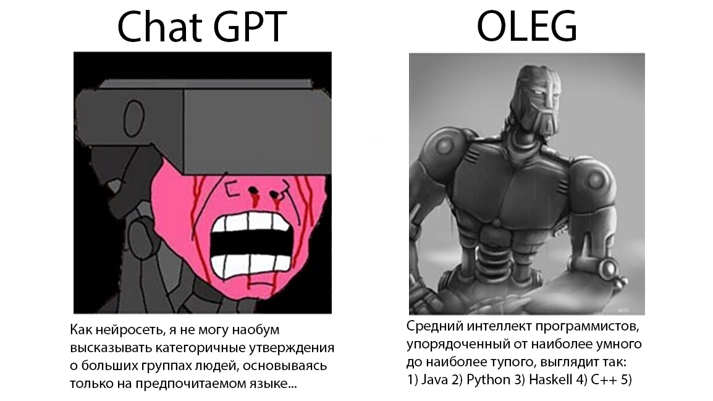
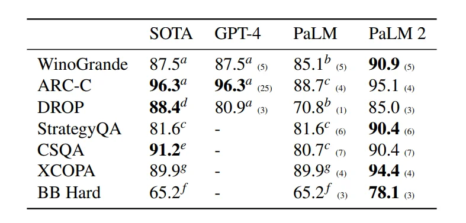
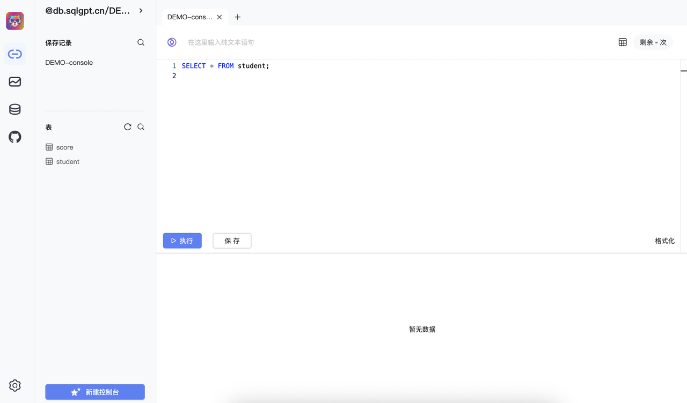
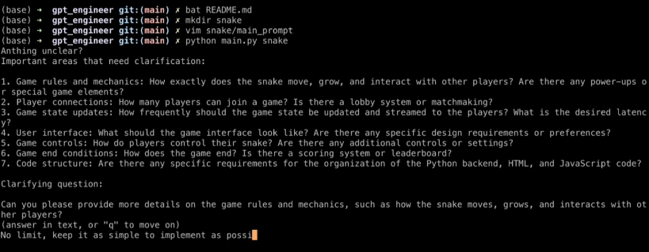

---
tags:
  - java
  - ai
  - нейросети
  - failover
  - openai
  - chatgpt
  - llm
  - failover
  - bar
  - failoverbar
source: https://habr.com/ru/companies/bar/articles/745842/
habs:
  - Блог компании Failover Bar
  - Программирование
  - Java
  - Машинное обучение
---
# LLM API для Java
Прочитав сегодняшнюю статью о том, как [в Сан\-Франциско массово собираются LLM\-щики](https://habr.com/ru/companies/getmatch/articles/745790/), коллега сказал \- "лучше б там собирались BDSM\-щики, это, по крайней мере, понятное развлечение". Для человека не посвященного, "нейросети" \- это всё ещё что\-то про Python и математическую статистику. 

Тем не менее, можно кусать низко висящие фрукты и с помощью Java, дергать API для Chat GPT, и тогда ничего учить не придётся. В этой статье будут ссылки на несколько фреймворков с простым API для жабы и котла, которые можно использовать хоть сейчас.

## Hexascribe (Chatbot\-Builder, VertexAI\-kt)

Все слышали про ChatGPI, но что там по другим платформам? Давайте взглянем на Google Vertex AI. Это разработка древней, чем звёзды (точней, чем репутация Гугла как компании про алгоритмы и машинное обучение, а не компанию про отключение адблока на ютубе). Входящая в Вертекс модель PaLM 2 [даст просраться](https://www.reddit.com/r/singularity/comments/13e1b5h/performance_of_gpt4_vs_palm_2/) не только бесплатной GPT3, но и GPT4\. Туда же входит Imagen (ima\-gen, генерит картинки), и Codey \- их ответ Копайлоту. GitLab использует Коди [как пример](https://about.gitlab.com/blog/2023/05/02/explain-this-vulnerability/) для фичи "Поясни за уязвимость".

Хорошие API для них делают ребята из [Hexascribe](https://github.com/hexascribe). На их гитхабе выложено две библиотеки.

Первая из них даёт API до Palm 2, выложена под лицензией Apache 2\.0 (можно использовать в коммерческом приложении), и лежит на гитхабе по адресу [hexascribe/vertexai\-kt](https://github.com/hexascribe/vertexai-kt). Она адаптирована для Kotlin Multiplatform, то есть ее можно использовать **не только на Android, но и на iOS**. Я ненавижу котёл, но это именно то применение, где он действительно нужен. На десктопе оно тоже запустится.

Как выглядит код интеграции:


```kotlin
val vertexAI by lazy {
    VertexAI.Builder()
        .setAccessToken("YOUR_ACCESS_TOKEN")
        .setProjectId("YOUR_GOOGLE_CLOUD_PROJECT_ID")
        .build()
}
val textRequest by lazy {
    vertexAI.textRequest()
        .setModel("some-model")
        .setTemperature(0.8)
        .setMaxTokens(256)
        .setTopK(40)
        .setTopP(0.8)
}
viewModelScope.launch {
    val result = textRequest.execute("Say this is a test")
    print(result.getOrThrow())
}
```
Если же вам вдруг захочется пописать чат\-ботов, то для этого существует вторая их либа \- [hexascribe/chatbot\-builder](https://github.com/hexascribe/chatbot-builder). Она тоже выложена под Apache 2\.0, и тоже варится в мультиплатформенном котле.

Как выглядит код интеграции для Android:


```java
@Composable
fun ChatScreen() {
    val chatBot = ChatBot.Builder("YOUR_OPEN_AI_KEY")
        .setDarkMode(true)
        .addMessage(RoleEnum.ASSISTANT, "Hi, how can I help you today?")
        .addPreSeededMessage(RoleEnum.SYSTEM, "You are a helpful seller car assistant")
        .setInputFieldBorderWidth(1)
        .build()
    chatBot.ComposeScreen()
```
## langchain4j

Вначале было слово, Адам с Евой, и [фреймворк LangChain](https://python.langchain.com/docs/get_started/introduction.html) от Харрисона Чейза. Суть ленгчейна \- грамотный набор абстракций, поверх которых строятся унифицированные цепочки трансформаций, которые можно подключать к разным наборам данных. С октября 2022 вокруг него выстроилась целая экосистема компонентов и модулей \- начиная от очевидного API для моделей и заканчивая persistence и стримингом разных ступеней цепочки. Можно взять какой\-то изначальный кусок данных, и потом сделать ему 100500 "отростков" с разными способами обработки. Например, обмазать шаблонами промптов, отправить в несколько облачных LLM (GPT3, BLOOM), сохранить результаты в разные подсистемы.

[langchain4j/langchain4j](https://github.com/langchain4j/langchain4j) выложена под лицензицией Apache 2\.0, и представляет из себя тупую джавовую обёртку. Ее "тупость" хороша тем, что она не будет мешаться логике экосистемы, а при необходимости, вы сами легко допишете недостающую функциональность.

Она запускается даже на Java 8\.

Она поддерживает не только обе версии бута: Spring Boot 2 и Spring Boot 3, но и имеет в комплекте готовые стартеры.

То есть, ее можно использовать как в дремучем легаси, так и в современном коде.

Вот как выглядит код получения ФИО и даты рождения из неструктурированного текста:


```java
class Person {

    private String firstName;
    private String lastName;
    private LocalDate birthDate;

    public String toString() {...}
}

interface PersonExtractor {

    @UserMessage("Extract information about a person from {{it}}")
    Person extractPersonFrom(String text);
}

PersonExtractor extractor = AiServices.create(PersonExtractor.class, model);

String text = "In 1968, amidst the fading echoes of Independence Day, "
    + "a child named Oleg arrived under the calm evening sky. "
    + "This newborn, bearing the surname Oleg, marked the start of a new journey.";
    
Person person = extractor.extractPersonFrom(text);
// Person { firstName = "Oleg", lastName = "Oleg", birthDate = 1986-04-30 }
```
Только не забывайте про персональные данные [по 152\-ФЗ](https://www.consultant.ru/document/cons_doc_LAW_61801/), ведь все эти тексты уходят на сервера Гугла.

Более подробные примеры есть как для [чистой джавы](https://github.com/langchain4j/langchain4j-examples/tree/main/other-examples/src/main/java), так и [для Spring Boot](https://github.com/langchain4j/langchain4j-examples/blob/main/spring-boot-example/src/test/java/dev/example/CustomerSupportApplicationTest.java). Я бы рекомендовал версию со Spring Boot, автор явно понимает, как люди пользуются спрингом.

## Midjourney Proxy

Все понимают, что даже с изобретением отечественного [Кандинского](https://rudalle.ru/kandinsky2) (ruDALL\-E, Sber AI), Midjourney надолго стала дефолтом индустрии. Заказчики хотят видеть интеграцию не с Кандинским и Stable Diffusion, а с дефолтом. Проблема мижорни в том, что авторы больны терминальной стадией дискорда головного мозга, и у него нет API даже за деньги.

Поэтому, для использования Midjourney обязательно нужно использовать прокси, транслирующую нормальный код в сообщения Дискорда. За это время пользователи породили бесчисленное количество прокси\-апи, все они страдают разными болезнями. Например, апи для Ноды [от Другой Ноги](https://www.thenextleg.io/docs/v2/getting-started) устанавливает лимиты в один запрос раз в 3 секунды, и требует подключения к чужим серверам от вендора библиотеки.

С этой проблемой нам поможет репозиторий [novicezk/midjourney\-proxy](https://github.com/novicezk/midjourney-proxy), полностью опубликованный под лицензией Apache 2\.0, и имеющий сборку для Docker.

Есть два нюанса. Первый \- вам потребуется вытащить ключ авторизации прямо из хидеров Дискорда.

Я проделал эту операцию, залогинившись в веб. Нужно залогиниться в Дискорд в браузере, открыть инструменты разработчика (F12 в хроме для шиндовс), перейти на вкладку Network, и послать какое\-нибудь сообщение другу. Во вкладке Network появится дополнительная строчка в логе. Щелкаем на эту строчку, идём в Headers, ищем заголовок Authorization: TOKEN, используем этот токен в библиотеке.

Второй нюанс в том, что вся документация на novicezk/midjourney\-proxy написана на китайском языке. Возможно, это отличный способ начать учить китайский, если вы понимаете, о чем я....

API работает на JSON\-чиках, как и положено, и выглядит вот так:


```markdown
2. /mj/submit/simple-change 绘图变化-simple

接口作用同 /mj/submit/change(绘图变化)，传参方式不同，该接口接收content，格式为ID 操作，例如：1320098173412546 U2
放大 U1～U4
变换 V1～V4

3. /mj/submit/describe 提交describe任务

{
    // 图片的base64字符串
"base64": "data:image/png;base64,xxx"
}

后续任务完成后，task中prompt即为图片生成的prompt

{
"action":"DESCRIBE",
"id":"3856553004865376",
"prompt":"1️⃣ xxx1 --ar 5:4\n\n2️⃣ xxx2 --ar 5:4\n\n3️⃣ xxx3 --ar 5:4\n\n4️⃣ xxx4 --ar 5:4",
"promptEn":"1️⃣ xxx1 --ar 5:4\n\n2️⃣ xxx2 --ar 5:4\n\n3️⃣ xxx3 --ar 5:4\n\n4️⃣ xxx4 --ar 5:4",
"description":"/describe 3856553004865376.png",
"imageUrl":"https://cdn.discordapp.com/ephemeral-attachments/xxxx/xxxx/3856553004865376.png",
// ...
}

```
## Chat2DB

Следующая библиотека превращает разговорый язык в SQL. То есть, это клиент к SQL базе данных, с поддержкой MySQL, PostgreSQL, Oracle. Есть умный ассистент, который помогает с оптимизацией запросов.

Библиотека [chat2db/Chat2DB](https://github.com/chat2db/Chat2DB) выложена на гитхабе под лицензией Apache 2\.0, и даже имеет документацию на английском языке. Проект создан в недрах Алибабы. Там в документации даже написано, как из Китая соединяться по VPN с сервисами Open AI.

А вот скриншоты там на чистом китайском. Не то, чтобы они были сильно нужны. На всякий случай, приложу один скриншот, чтобы вам было с чего сгореть.

Никакого кода здесь не будет, скриншот на китайском полностью объясняет суть проекта.

А что вы хотели? Китайцы очень сильно зарубились в AI штуки. Хотите, чтобы вся документация и скриншоты были на чистом русском языке \- пишите свои библиотеки!

Признаюсь, что хотя я работал бэкенд\-разработчиком много лет, но так и не выучил SQL нормально. В том числе, потому, что мы писали свои базы поверх No\-SQL, и попользоваться чужими хорошими базами не было времени. Мне всегда было проще написать запрос текстом в Гугле, и получить его результат в виде SQL первым ответом на Stack Overflow. Эта библиотека делает примерно то же самое, только вместо гугла там сервисы Open AI. Результат получается так себе (хуже, чем у живых людей на Stack Overflow), поэтому уволят нас ещё нескоро. Тем не менее, результат впечатляет, оно криво\-косо, но работает.

## GPT Engineer

[AntonOsika/gpt\-engineer](https://github.com/AntonOsika/gpt-engineer) \- это Developer\-as\-a\-Service. Она генерит код на основе инструкций, которые ты пишешь робото\-программисту в консоли.

Посмотреть, как это работает, можно [вот в этом видосе](https://user-images.githubusercontent.com/4467025/243695075-6e362e45-4a94-4b0d-973d-393a31d92d9b.mov). К сожалению, Хабр не позволяет сделать встроенное видео с гитхаба. В ролике разработчик набирает инструкции и получает код. А ручки\-то вот они.

Теперь, нож в спину: написана эта штука на Python.

На этом всё, джава\-человечки. Ждём, когда вас заменит кто\-то более дешевый, типа программистов на питоне.

Как всегда, статья написана при поддержке российского дистрибутива джавы [Axiom JDK](https://axiomjdk.ru/), и моего бара [Failover Bar](https://failover.bar/), потому что я пишу этот пост в рабочее время :\-)   
  
Очевидно, все участвующие в этом топе библиотеки запускаются и отлично работают на Axiom JDK. Другое дело что, для продуктов российской критической информационной инфраструктуры, наверное, не смогут использовать Open AI. Поэтому, следующий этап развития подобных библиотек \- адаптиация для российской экосистемы, например, для Sber AI.

