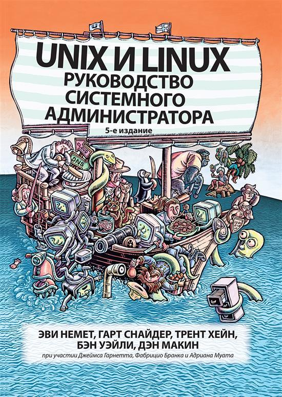
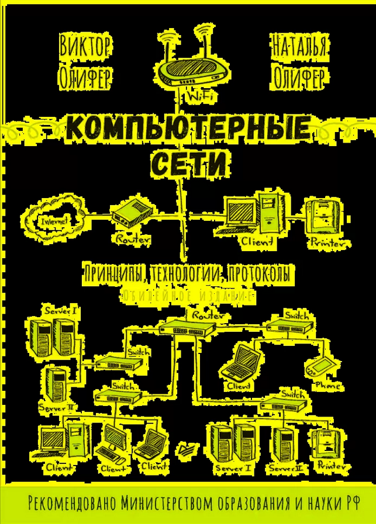
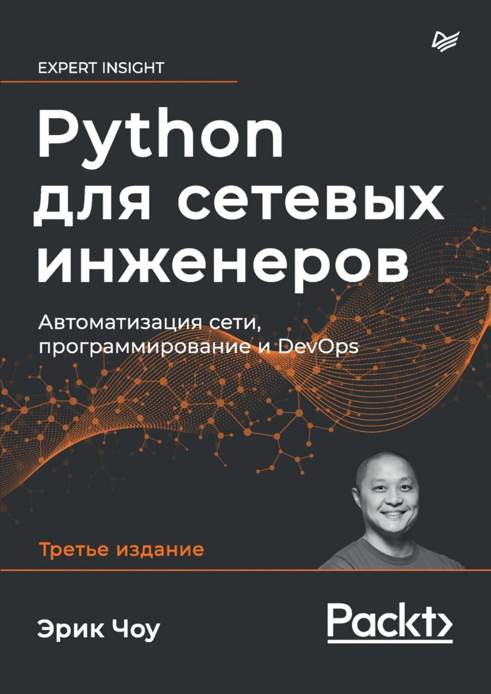
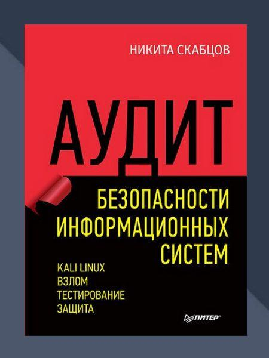

---
tags:
  - книги
  - обучение
source: https://habr.com/ru/companies/skillbox/articles/751112/
habs:
  - Блог компании Skillbox
  - Учебный процесс в IT
  - Профессиональная литература
---
# Библиотека системного администратора  подборка книг на русском
Привет, Хабр! Сегодня День системного администратора, с чем и поздравляем всех причастных. Ну а в качестве дополнения к поздравлению выкладываем подборку книг, которые могут быть интересны как новичкам, так и профессионалам в администрировании. 

#### 1\. Тайм\-менеджмент для системных администраторов

**Автор:** Томас А. Лимончелли

 

Книга написана сисадмином для сисадминов. Обычно подобные книги выпускают для широкого круга читателей, но эта подготовлена с учетом специфики профессии системного администратора. Ведь очень часто ее представителям, работая над важными и долгосрочными проектами, приходится отвлекаться на проблемы других сотрудников. 

Кроме того, сисадмину часто приходится задерживаться по вечерам и работать по выходным. Эта книга помогает научиться не только лучше управлять ежедневной рутиной, но и справляться с проблемами. Например:

* Управлять отвлекающими факторами.
* Исключать непроизводительные затраты времени.
* Вести список дел.
* Разрабатывать процедуры для регулярно совершаемых действий.
* Документировать и автоматизировать рабочие процессы.

Достоинство книги в том, что в ней много примеров из карьеры самого автора,то есть это не просто теория. Читатель получает советы от опытного профессионала, который отлично разбирается в нюансах своей специальности. 

**Отзыв Андрея Камардина, системного инженера и спикера курса «Администрирование Windows и работа с Powershell»:** *«Рекомендую для начинающих и тех, кто решил сам освоить профессию. В книге есть рекомендации, что делать в разных ситуациях, и все это описывается с конкретными примерами».*

#### 2\. Unix и Linux: руководство системного администратора

**Авторы:** Немет Эви, Хейн Трент Р., Снайдер Гарт

Книга «Unix и Linux: руководство системного администратора» Немет Э. \| ISBN 978\-5\-907144\-10\-1 \| Библио\-Глобус

Эта книга — уже пятое издание. Она, как и указано в названии, представляет собой полное руководство по установке, настройке и обслуживанию любой системы на основе FreeBSD или Linux, включая системы, предоставляющие базовую инфраструктуру интернета и облачную инфраструктуру.

Руководство состоит из нескольких частей, включая: 

* «Основы администрирования» — вводный раздел с весьма подробной информацией о загрузке системы, ядре, демонах, процессах и других сущностях и процессах;
* «Работа в сетях» — главы, в которых собраны знания о сетях TCP/IP, маршрутизации, DNS, электронной почте и веб\-хостинге;
* «Хранение данных» — раздел, посвященный работе с дисками, массивами и сетевыми файловыми системами (NFS и SMB);
* «Эксплуатация» — главы о системах управления конфигурацией, виртуализации, мониторинге, безопасности и анализе производительности.

Авторы уделяют внимание не только работе с дистрибутивами, но и безопасности сетей, устройству Docker, CI/CD. Есть как теория, так и кейсы, в которых авторы рассказывают о собственном опыте. 

Книга универсальная, она подходит как для новичков, так и для профессионалов.

***Вот, что говорит о книге Валерий Линьков, эксперт в эксплуатации сетей и ИБ, гендиректор ООО «Неправильная школа»:*** *«Эта книга для меня одна из самых нужных, тех, что обязательно должны быть в собственной библиотеке. Она помогает помнить различные нюансы. Если что\-то забыл, к книге всегда можно обратиться и что\-то дополнительно перечитать».*

#### 3\. Компьютерные сети. Принципы, технологии, протоколы

**Авторы:** Олифер Виктор Григорьевич, Олифер Наталия Алексеевна

 

В первую очередь книга предназначена для начинающих специалистов, которые хотят получить базовые знания о принципах построения компьютерных сетей, понять особенности традиционных и перспективных технологий локальных и глобальных сетей, изучить способы создания крупных составных сетей и управления такими сетями.

Кстати, это уже шестое издание книги, первое вышло более 20 лет назад. Новое издание значительно переработано, авторы добавили много новой информации. К примеру, появился новый раздел «Беспроводные сети», также переработана часть, которая посвящена технологиям SDH, OTN и DWDM.

#### 4\. Python для сетевых инженеров. Автоматизация сети, программирование и DevOps

**Автор:** Эрик Чоу

 

Python для сетевых инженеров. Автоматизация сети, программирование и DevOps (pdf \+ epub)», Эрик Чоу – скачать pdf на Литрес

В этой книге рассматриваются основы Python с уклоном в сетевую тематику. Книга не очень сложная, она отлично подходит для новичков. Ее задача — не изучение глубин Python, а обучение основам языка программирования, которые будут полезны для сетевых инженеров. Соответственно, в книге рассматривается работа с сетевым оборудованием разных производителей. 

Третье издание посвящено анализу сетевых данных с помощью стека ELK (Elasticsearch, Logstash, Kibana и Beats) и Azure Cloud Networking. В него также включены сведения по использованию Ansible и фреймворков pyATS и Nornir. Были обновлены примеры для лучшего понимания концепций и обеспечения совместимости.

Автор Эрик Чоу — специалист с огромным опытом. Эрик работал с сетями в таких компаниях, как Amazon, Microsoft. В книге он рассказывает о собственных проектах с теорией и примерами.

Книга рекомендуется специалистам с опытом, которые хотели бы углубить свои знания.

#### 5\. Аудит безопасности информационных систем

**Автор**: Николай Скрабцов 

 

Аудит безопасности информационных систем Автор: Скабцов Н. В. Год: 2018 Описание:.. \| ITc \| сообщество программистов \| ВКонтакте

Автор рассматривает методы обхода систем безопасности сетевых сервисов, а также методы проникновения в открытые информационные системы. Речь идет о направлении, которые используют «белые хакеры», — пентестинге, приемы и методы которого дают возможность обнаружить слабые места в защите информационных систем. 

Многим профессионалам, чья работа связана с компьютерными сетями, будет полезно ознакомиться с этой книгой. Она дает понимание того, что такое тесты на проникновение и как их использовать. 

Книга специализированная, ее стоит изучать специалистам с опытом, которые хотели бы получить больше знаний и практики в информационной безопасности. 

#### 6\. Книга «PowerShell для сисадминов»

**Автор:** Адам Бертрам

Книга предназначена для профессионалов. Она позволяет научиться использовать PowerShell для того, чтобы эффективно управлять системой, получив возможность автоматизировать задачи. Читатель узнает, как: 

* комбинировать команды, управлять потоком выполнения, обрабатывать ошибки, писать сценарии, запускать их удаленно и тестировать их с помощью фреймворка Pester;
* анализировать структурированные данные, такие как XML и JSON, работать с популярными сервисами (например, Active Directory, Azure и Amazon Web Services), создавать системы мониторинга серверов;
* создавать и проектировать модули PowerShell;
* использовать PowerShell для удобной, полностью автоматизированной установки Windows;
* создавать лес Active Directory, имея лишь узел Hyper\-V и несколько ISO\-файлов;
* создавать бесчисленные веб\- и SQL\-серверы с помощью всего нескольких строк кода.

Несмотря на то что издание техническое, автор часто шутит, причем неплохо. Это несколько упрощает чтение. 

Есть и еще несколько книг, которые могут оказаться полезными для сисадмина. **Их рекомендует Дмитрий Зайцев, спикер профессии** [**«DevOps\-инженер»**](https://skillbox.ru/course/profession-devops/#:~:text=DevOps-%D0%B8%D0%BD%D0%B6%D0%B5%D0%BD%D0%B5%D1%80%20%D1%83%D0%BC%D0%B5%D0%B5%D1%82%20%D0%BF%D1%80%D0%BE%D0%B3%D1%80%D0%B0%D0%BC%D0%BC%D0%B8%D1%80%D0%BE%D0%B2%D0%B0%D1%82%D1%8C%20%D0%BD%D0%B0,%D0%BA%D0%BE%D0%BC%D0%BF%D0%B0%D0%BD%D0%B8%D0%B8%20%D1%81%20%D0%BA%D1%80%D1%83%D0%BF%D0%BD%D0%BE%D0%B9%20IT-%D0%B8%D0%BD%D1%84%D1%80%D0%B0%D1%81%D1%82%D1%80%D1%83%D0%BA%D1%82%D1%83%D1%80%D0%BE%D0%B9) **в Skillbox, организатор конференций Highload\+\+, DevOpsDays Moscow, DevOpsConf, RITconf и митапа DevOps Moscow и CTO/CIO в flocktory. Вот эти книги:**

* Site Reliability Engineering \[Book] — хотя бы одну книгу, но лучше все три. Хорошо ставит понимание алертинга, мониторинга и вообще онколла всякого.
* «Операционная система UNIX». Авторы: А. М. Робачевский, С. А. Немнюгин, О. Л. Стесик.
* «Современные операционные системы». Автор: Э. Танненбаум.
* Devops Handbook — как нормально описанный набор практик. Авторы: Джин Ким, Джез Хамбл, Патрик Дебуа, Джон Уиллис.
* Designing Data\-Intensive Applications: The Big Ideas Behind Reliable, Scalable, and Maintainable Systems. Автор: Мартин Клеппманн. Книгу стоит прочесть для понимания того, как работают большие системы.

Вот и всё на сегодня — если у вас есть собственные книги, которые вы можете порекомендовать, расскажите о них в комментариях!

