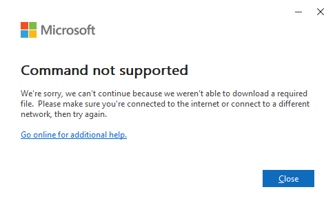
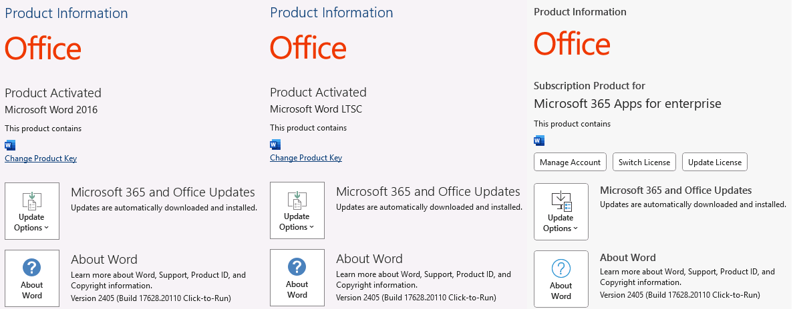
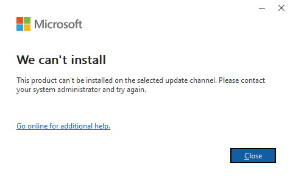
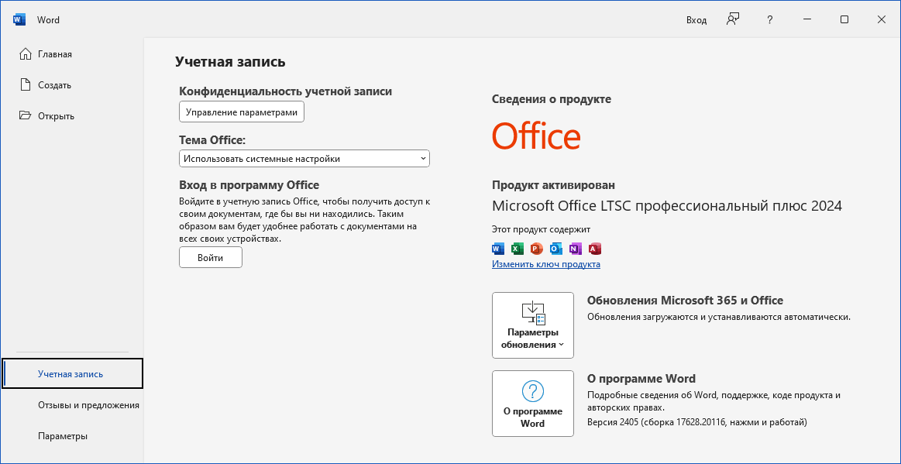

# Как загрузить, установить Office 2024 LTSC с сайта Microsoft и активировать навсегда 
Десять лет назад я писал пару статей \- [Как загрузить последний Office с сайта Microsoft без всякого App\-V / Хабр (habr.com)](https://habr.com/ru/companies/stars_s/articles/245677/) и [Как загрузить Microsoft Office 16 с сайта Microsoft / Хабр (habr.com)](https://habr.com/ru/articles/249435/), при помощи на тот момент еще мало кому известного Office Deployment Tool.

Время бежит стремительно, за Office 2016 выходит Office 2019, Office 2021, и вот сейчас подошло время для Office 2024\. Что ж, посмотрим, что поменялось в плане загрузки, установки и активации продукта за десять лет.

Для начала о версиях и изданиях Microsoft Office. Чтобы не быть слишком дотошным в описании, скажу коротко самое главное, \- с годами линейка Office развивается, существуют разные подписки и планы обновления, \- новые функции появляются в новых версиях, для старых версий выходят исправления ошибок и заплатки к найденным уязвимостям.

Microsoft давно перешел на систему распространения продуктов семейства Office по разным, так называемым, "каналам" (channels), в зависимости от того как часто вы хотите получать нововведения и обновления.

Ключевым отличием в текущей загрузке и установке Office от того, что было актуально во времена Office 2016, является то, что вы должны определить, каким каналом распространения вы собираетесь пользоваться, \- то есть с какого канала собираетесь устанвливать сам продукт. Тем, кто хотел бы подробно изучить разные каналы распространения я предложу почитать первоисточник \- [Обновления Office \- Office release notes \| Microsoft Learn](https://learn.microsoft.com/ru-ru/officeupdates/). Остальным кратко резюмирую \- Microsoft сейчас предпочитает всем продать подписку на Microsoft 365 (то, что ранее называлось Office 365\), с регулярно обновляемыми возможностями в течение так называемой [Современной политики жизненного цикла](https://learn.microsoft.com/ru-ru/lifecycle/policies/modern). По этой же современной политике распространяются пользовательские (коробочные, ретейл) версии Office 2021\. Office 2021, например, [поддерживается лишь до 13 октября 2026](https://learn.microsoft.com/ru-ru/lifecycle/products/office-2021). А более старые версии следуют, так называемой [политике фиксированного жизненного цикла](https://learn.microsoft.com/ru-ru/lifecycle/policies/fixed), в рамках которой [Office 2016](https://learn.microsoft.com/ru-ru/lifecycle/products/microsoft-office-2016) и [Office 2019](https://learn.microsoft.com/ru-ru/lifecycle/products/microsoft-office-2019) поддерживаются лишь до 14 октября 2025\. В целом, они не перестанут работать после, однако, перестанут обновляться. И у тех из вас, кто пользуется почтовыми сервисами на базе Microsoft Outlook.com или Office365, а возможно и пользователям Microsoft Exchange, с обновлениями выпущенными после 14 октября 2025 уже пора призадуматься об обновлении.

Кроме пользовательских версий семейства Office и подписок Microsoft 365 существуют также бессрочные версии продуктов. Мы их частно называем корпоративными или LTSC. Они поддерживаются Microsoft значительно дольше, но при этом обновлений функционала не получают, а получают лишь заплатки к уязвимостям и исправления серьезных ошибок. Для любопытных предлагаю посмотреть [сравнение версии сборок пользовательских и корпоративных версий Office 2019](https://learn.microsoft.com/ru-ru/officeupdates/update-history-office-2019) (версия 2405 (сборка 17628\.20110\) против версии 1808 Office 2019 LTSC (сборка 10410\.20026\)) и [для Office 2021](https://learn.microsoft.com/ru-ru/officeupdates/update-history-office-2021) (версия 2405 (сборка 17628\.20110\) против версии 2108 Office 2021 LTSC (сборка 14332\.20706\)). Все они ежемесячно обновляются, но разница в функционале велика. В корпоративные версии весомые нововведения в Excel и Word, связанные сейчас в первую очередь с нейросетями, искуственным интеллектом и работой с большими таблицами не попадают. 

Недавно были анонсированы версии Microsoft Office 2024 и Microsoft Office 2024 LTSC. Я в данной заметке опишу, как устанавливать LTSC версию, \- причем с самыми последними нововведениями, выходящими от Microsoft. Тем, кто не хочет нововведений тоже расскажу что делать.

Итак, примите за рекомендацию, но судите сами чего вы хотите, \- выбирайте для установки [Актуальный канал](https://learn.microsoft.com/ru-ru/officeupdates/current-channel) (Current Channel) \- как наиболее полный по возможностям из не Insider каналов. То есть стабильный, но свежий. В нем сейчас доступны Office 2024 / 2024 LTSC с финальной лицензией (не Preview, которая стухнет). Сегодня там доступна версия 2405 (сборка 17628\.20110\). Именно начиная с версии 17628 можно активировать Office 2024 LTSC без статуса Preview. В канале PerpetualVL2024 также доступна уже неделю сборка 17628, однако версия функционала там ниже чем в Current \- выбирать вам.

Если вас устраивает Office 2019 или 2021, и вы хотите обновляться реже, выбирайте [Полугодовой корпоративный канал](https://learn.microsoft.com/ru-ru/officeupdates/semi-annual-enterprise-channel). Сегодня в нем доступна версия *2308 (сборка 16731\.20674\)*. Оттуда спокойно качайте и устанавливайте Office 2019/2021\.

Если вы совсем не хотите обновлений функционала, выбирайте канал PerpetualVL2019, PerpetualVL2021 или PerpetualVL2024\.

Собственно, вы приняли решение загрузить и установить корпоративный Office 2024 (или любой более ранний), выбрали один из каналов, описанных выше, и готовы приступать к загрузке и установке.

Как и десять лет назад, о чем я писал в статьях по ссылкам в начале данного поста, вам потребуется Office Deployment Tool. [Качайте его с сайта Microsoft](https://www.microsoft.com/en-us/download/details.aspx?id=49117) и распаковывайте (в моем примере в C:\\ODT). Если у вас нет каких\-либо особых оснований, всегда берите последнюю версию инструмента, \- только последняя ODT может загружать последние версии Office. (Да, старая ODT времен 2021 года работает без блокировки России, но не знает Office 2024\)

Ах, беда, Microsoft заблокировал загрузку Office при помощи ODT из России, скажете вы? :) Утилита дает ошибку при любой попытке..



Ошибка ODT при попытке загрузить что\-то из России

Нет, ни разу не беда. Microsoft, как обычно, закрывая основную дверь оставляет нам обходные пути. Вам следует в ключе реестра CountryCode в HKCU\\Software\\Microsoft\\Office\\16\.0\\Common\\ExperimentConfigs\\Ecs установить значение "std::wstring\|US" \- или любое другое, кроме "std::wstring\|RU"

Сделать это можно, выполнив команду: `reg add "HKCU\Software\Microsoft\Office\16.0\Common\ExperimentConfigs\Ecs" /v "CountryCode" /t REG_SZ /d "std::wstring|US" /f`

Теперь правим файл конфигурации, \- по умолчанию берем за пример данный нам configuration\-Office2021Enterprise.xml, копируем его как configuration.xml, в нем меняем канал с PerpetualVL2021 на Current (или на тот канал, что вам нравится), выбираем как продукты ProPlus2024Volume, VisioPro2024Volume и ProjectPro2024Volume (ненужное убрать). Меняем язык на "ru\-ru" \- можно добавить строкой ниже \<Language ID\="en\-us" /\> вторую (третью, четвертую,..) строку \<Language ID\="ru\-ru" /\>, \- тогда у вас будет два (три,..) языка интерфейса. Сохранили файл? Всё, теперь из командной строки (в режиме администратора) перейдите в папку C:\\ODT и запустите setup.exe /download configuration.xml

Процесс начнется и будет, в зависимости от скорости вашего канала интернет, загружать все в текущую папку. В моем случае в C:\\ODT\\Office\\Data\\16\.0\.17628\.20110 загрузилась последняя сборка 16\.0\.17628\.20110 Актуального канала на сегодняшний день.

Сейчас открою всем интереснейший момент \- в рамках загруженной сборки/билда 16\.0\.17628\.20110 (или любой другой), я могу установить любой из продуктов \- одиночный коробочный Word 2019 (выбрав в configuration.xml вместо ProPlus2024Volume продукт Word2019Retail), корпоративный Office 2019 Standard, выбрав Standard2019Volume или любой другой продукт или комбинацию, [выбрав продукт по списку отсюда](https://learn.microsoft.com/ru-ru/microsoft-365/troubleshoot/installation/product-ids-supported-office-deployment-click-to-run). Версия при этом будет зависеть лишь от сборки в данном канале. Например, сейчас в Актуальном канале сборка 16\.0\.17628\.20110 версии 2405 (май 2024\) для всех SKU \- от Office 2016 до LTSC 2024 или Microsoft 365 Apps. При этом, если вы будете загружать Office из его "родных" каналов, \- например Office 2024 LTSC в канале PerpertualVL2024 \- сборка сейчас также 2405 (а билд сегодня даже выше, \- но в будущем уже версия не будет повышаться), у Office 2021 LTSC в канале PerpetualVL2021 \- версия 2108 и у Office 2019 LTSC в канале PerpetualVL2019 \- версия 1808\. В Insider каналах уже доступны сборка 17730 (версия 2407\) и 17726 (версия 2406\), \- скоро эти сборки попадут и в другие каналы, \- при этом в Current канале сборка повысит версию, а в каналах PerpertualVL \- нет. Вывод, \- если вы не из тех кто одним молотком с каменного века пользуется, а прогрессируете вместе с технологиями, ставьте из Current канала. Да, есть неудобство в том, что вы по одному configuration.xml скачиваете, а после для установки его правите (страницей ниже картинка с ошибкой подтверждение тому что продукты Volume отказываются устанвливаться из канала Current) \- но неудобство легко обходится \- загрузили из одного канала, установили как другой. Или сменили сторонними средствами канал после установки и обновляетесь регулярно, \- получая не только новые сборки, но и версии. В том числе для LTSC.

То есть в ретейл канале есть издания Volume, и вы можете иметь сборку 16\.0\.17628\.20110 версии 2405 \- как для Office 2016, Office 2019, Office 2019 LTSC, Office 2021, Office 2021 LTSC, Office 2024 или Office 2024 LTSC. При загрузке качается общие файлы, выбрать для установки вы можете любую версию на следующем шаге.



Тут примеры Office 2016 Volume, 2024 Volume и Microsoft 365 Apps \- все одной версии, одни бинарники, отличия в возможностях и поддержке реглируются лицензией. Бинарники одинаковы.

В моем случае, я имею вот такой файл configuration.xml


```
<Configuration>

  <Add OfficeClientEdition="64" Channel="Current">
    <Product ID="ProPlus2024Volume">
      <Language ID="en-us" />
      <Language ID="ru-ru" />
      <ExcludeApp ID="Lync" />
    </Product>
    <Product ID="VisioPro2024Volume">
      <Language ID="en-us" />
      <Language ID="ru-ru" />
    </Product>
    <Product ID="ProjectPro2024Volume">
      <Language ID="en-us" />
      <Language ID="ru-ru" />
    </Product>
  </Add>

  <Remove All="True" />
  <!--  <RemoveMSI All="True" /> -->
  <!--  <Display Level="None" AcceptEULA="TRUE" />  -->
  <!--  <Property Name="AUTOACTIVATE" Value="1" />  -->
</Configuration>
```
Получаю двуязычную версию корпоративного Office 2024 LTSC из Актуального канала (то есть с последними нововведениями). Что там нового можно [почитать в Release notes](https://learn.microsoft.com/ru-ru/officeupdates/current-channel#version-2405-may-30).

При этом, хотя я и успешно скачал последнюю версию 16\.0\.17628\.20110 корпоративного Office 2024 с актуального канала (указав в configuration.xml как канал Current, а как продукт ProPlus2024Volume), установить в актуальном канале корпоративную версию штатный инструмент не даст. **Установка загруженного Office** при помощи ODT выполняется командой `setup.exe /configure configuration.xml` после того как загрузка завершится. 

Если я загружал корпоративную версию Office (имеет Volume в названии продукта) с некорпоративного канала (не имеет букв VL в названии канала), установка не пойдет. 

Однако, просто **заменив в файле configuration.xml название канала на PerpetualVL2024** для Office 2024 LTSC (или PerpetualVL2019, PerpetualVL2021 для Office 2019 LTSC и Office 2021 LTSC соответственно), сохранив файл, я смогу успешно установить корпоративное издание, используя бинарные файлы, загруженные с Актуального (не корпоративного) канала. Обратите внимание, что после установки вы можете вручную изменить канал обновления назад на актуальный (или любой другой), \- или оставить как есть. Подробнее почитать тут: [Измените канал обновления Приложений Microsoft 365 для устройств в вашей организации \- Deploy Office \| Microsoft Learn](https://learn.microsoft.com/ru-ru/deployoffice/updates/change-update-channels). Легкий способ смены канала обновления для уже установленной версии предлагает, например Office Installer от https://msfree.su, или [скрипты на Github](https://github.com/MicrosoftDocs/OfficeDocs-DeployOffice/blob/public/DeployOffice/updates/change-update-channels.md).

После установки осталось лишь активировать продукт. Если вы подписчик Microsoft365 или имеете свой собственный KMS сервер или MAK ключ, активируете сами. Иначе, предлагаю вам из PowerShell выполнить (в режиме администратора) команду `irm https://get.activated.win | iex` нажать 2 (OHook activation) и далее 1 (Install Office OHook Activation). При этом система активируется навсегда. Не как в случае KMS на 90 или 180 дней, а навсегда. Совсем навсегда. Финальной (не Preview) лицензией Office 2024 LTSC, что сейчас не доступно для KMS активаций пакета ProPlus2024Volume (для Standard2024Volume KMS активация финальной лицензии уже доступна).

Надеюсь, вам это все помогло. Если это все для вас слишком сложно, вы не хотите использовать "родные" утилиты Microsoft, а готовы сторонним методом установить Office, вам следует смотреть в сторону https://msfree.su и их утилит Office Installer (не варез, лишь средство загрузки). Будьте готовы к тому, что антивирус не любит сторонние средства установки. Я и сам не люблю, потому предложил вам более сложный метод, основанный только на решениях самого Microsoft.

