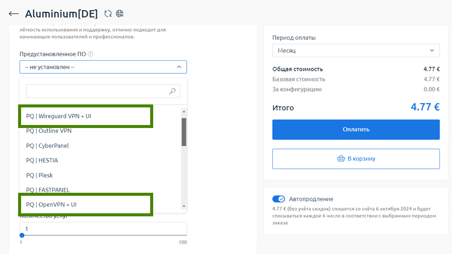

# Как сделать и настроить собственный VPN
В статье рассмотрим четыре способа создания собственного VPN. Начнем с самого простого варианта, что под силу даже начинающим пользователям ПК.

## Подготовка

Для всех четырех способов нам понадобиться виртуальный сервер (VPS).

Идем на [PQ.Hosting](https://pq.hosting/?from=33511), выбираем страну размещения и заказываем самый недорогой тариф. Обратите внимание, что во многих странах доступно 10 гигабитное подключение. Само собой, лучше выбирать эти локации. В качестве операционной системы для установки указываем Ubuntu 24\.04 или Debian 12; в поле "Доменное имя" ничего не вводим, из дополнительных опций тоже ничего не нужно.

После оплаты сервера вы получите необходимые данные для доступа к нему – IP адрес и root\-пароль.

## Способ 1\. Amnezia

Самый простой и быстрый вариант настройки VPN самому. Достаточно просто установить программу\-клиент [AmneziaVPN](https://amnezia.org/ru/downloads) на компьютер или телефон и при первом ее запуске указать данные для подключения к нашему виртуальному серверу (IP адрес и root\-пароль). Затем программа сама настроит на нем всё необходимое и установит VPN соединение.

Загрузить AmneziaVPN можно [с GitHub](https://github.com/amnezia-vpn/amnezia-client?tab=readme-ov-file#amnezia-vpn) или [отсюда](https://amnezia.org/ru/downloads). Приложение доступно для всех популярных десктопных и мобильных операционных систем, полностью бесплатно и является программным обеспечением с открытым исходным кодом.

Стоит отметить, что кроме поддержки привычных OpenVPN, WireGuard, IPsec и др. протоколов, в Amnezia есть собственный защищенный [протокол AmneziaWG](https://habr.com/ru/companies/amnezia/articles/769992/).

## Способ 2\. Виртуальный сервер с предустановленным VPN

Некоторые хостеры при заказе сервера сразу предлагают установить на нем VPN с удобным веб\-интерфейсом (UI) для управления пользователями. К примеру, на [PQ.hosting](https://pq.hosting/?from=33511) это можно сделать для двух самых популярных впн\-протоколов – OpenVPN и Wireguard:



Оформление заказа виртуального сервера с предустановленным VPN на Ubuntu 22\.04

После активации сервера нужно зайти в веб\-интерфейс управления VPN\-ом, создать нового пользователя и скачать его конфигурационный файл с настройками подключения.

Затем этот файл достаточно загрузить или импортировать в любой VPN\-клиент с поддержкой нужного протокола, в таблице ниже – наиболее популярные варианты:


| **VPN клиент** | **Протокол** | **Поддерживаемые ОС / Аппаратное обеспечение** |
| --- | --- | --- |
| [OpenVPN Connect](https://openvpn.net/client/) | OpenVPN | Windows, MacOS, Linux, Android, iOS, ChromeOS |
| [WireGuard](https://www.wireguard.com/install/) | WireGuard | Windows, MacOS, Linux, Android, iOS и др. |
| Роутеры со встроенным VPN\-клиентом | OpenVPN | Большинство современных роутеров, например Asus RT\-AX53U, RT\-AX55, RT\-AC68U, RT\-AC86U, TP\-Link Archer AX55, AX72, AX73, AXE75 и многие другие |
| WireGuard | Некоторые современные роутеры, например Asus RT\-AX88U, TP\-Link Archer BE900 |
| Роутеры с альтернативной прошивкой (DD\-WRT, OpenWrt и т.д.) | OpenVPN | Большинство современных роутеров\* |
| WireGuard | Некоторые современные роутеры\* |

\* *перед установкой альтернативной прошивки проверяйте совместимость и наличие VPN клиента на сайте разработчика прошивки*

## Способ 3\. Готовый скрипт

На GitHub есть готовые универсальные скрипты для полуавтоматической настройки VPN. Мастер установки задаст несколько вопросов, настроит всё сам и создаст пользовательский файл конфигурации для подключения к VPN.

Один из наиболее популярных скриптов – [для OpenVPN](https://github.com/Nyr/openvpn-install), и также [для WireGuard](https://github.com/Nyr/wireguard-install).

## Способ 4\. Сделать VPN самому

Самый трудоемкий вариант, где будем настраивать VPN на сервере с Ubuntu 24\.04 сами. Из протоколов выберем проверенный временем OpenVPN, поддержка которого заявлена в большинстве современных роутеров.

Подключаемся к VPS как *root*, создаем нового пользователя и добавляем его в *sudo*:


```
adduser user
usermod -aG sudo user
```
Затем входим на сервер как *user* и выполняем все дальнейшие команды от его имени.

Обновим списки пакетов и установим OpenVPN и Easy\-RSA (для управления сертификатами в инфраструктуре открытых ключей):


```
sudo apt update -y
sudo apt install openvpn easy-rsa -y
```
В папке нашего пользователя создаем директорию с символической ссылкой и нужными правами:


```
mkdir ~/easy-rsa
ln -s /usr/share/easy-rsa/* ~/easy-rsa/
chmod 700 ~/easy-rsa
```
Создаем конфигурационный файл для Easy\-RSA и инициализируем инфраструктуру открытых ключей (PKI):


```
cd ~/easy-rsa
echo -e 'set_var EASYRSA_ALGO ec\nset_var EASYRSA_DIGEST sha512' > vars
./easyrsa init-pki
```
Сгенерируем ключи удостоверяющего центра:


```
./easyrsa build-ca nopass
```
Система запросит ввести универсальное имя, здесь можно просто нажать Enter.

Выпустим и подпишем пару "ключ\-сертификат" для сервера:


```
./easyrsa gen-req server nopass
./easyrsa sign-req server server
```
При выполнении первой команды вас попросят указать *Common Name*, здесь просто нажмите Enter. Для второй команды запрос нужно подтвердить, введя `yes`.

Скопируем созданные файлы в каталог OpenVPN:


```
sudo cp ~/easy-rsa/pki/private/server.key /etc/openvpn/server
sudo cp ~/easy-rsa/pki/issued/server.crt /etc/openvpn/server
sudo cp ~/easy-rsa/pki/ca.crt /etc/openvpn/server
```
Для дополнительной защиты, создадим предварительный общий ключ (PSK), который будет использоваться с директивой *tls\-crypt*:


```
sudo openvpn --genkey secret /etc/openvpn/server/ta.key
```
Выпустим и подпишем пару "ключ\-сертификат" для клиента *client1*:


```
./easyrsa gen-req client1 nopass
./easyrsa sign-req client client1
```
В первой команде на требование указать *Common Name* нажмите Enter, при выполнении второй команды подтвердите запрос вводом `yes`.

Создадим директорию для клиентских конфигов, скопируем туда нужные файлы и установим для них соответствующие права:


```
mkdir ~/openvpn-clients
chmod -R 700 ~/openvpn-clients
cp ~/easy-rsa/pki/private/client1.key ~/openvpn-clients/
cp ~/easy-rsa/pki/issued/client1.crt ~/openvpn-clients/
sudo cp /etc/openvpn/server/{ca.crt,ta.key} ~/openvpn-clients/
sudo chown user ~/openvpn-clients/*
```
Настроим конфиг OpenVPN на основе дефолтного примера. Для этого скопируем шаблонный файл *server.conf* в рабочую директорию:


```
sudo cp /usr/share/doc/openvpn/examples/sample-config-files/server.conf /etc/openvpn/server/
```
C помощью любого текстового редактора открываем файл *server.conf* для редактирования:


```
sudo vim /etc/openvpn/server/server.conf
```
В этом файле нужно внести следующие изменения:

* заменить `dh dh2048.pem` ***на*** `dh none`
* раскомментировать строку `push "redirect-gateway def1 bypass-dhcp"`
* раскомментировать две строки с DNS серверами:  
`push "dhcp-option DNS 208.67.222.222"`   
`push "dhcp-option DNS 208.67.220.220"`   
По умолчанию здесь указаны адреса публичных DNS серверов от OpenDNS. Рекомендую сразу их заменить на DNS сервера от CloudFlare (1\.1\.1\.1, 1\.0\.0\.1\) или Google (8\.8\.8\.8 и 8\.8\.4\.4\)
* заменить `tls-auth ta.key 0` ***на*** `tls-crypt ta.key`
* заменить `cipher AES-256-CBC` ***на*** `cipher AES-256-GCM` и после этой строки добавить еще одну новую – `auth SHA256`
* добавить в конце файла две строки:  
`user nobody`  
`group nogroup`

Чтобы включить переадресацию пакетов, раскомментируем (вручную или с помощью утилиты *sed*) строку `net.ipv4.ip_forward=1` в файле */etc/sysctl.conf* и применим изменения:


```
sudo sed -i '/net.ipv4.ip_forward=1/s/^#//g' /etc/sysctl.conf
sudo sysctl -p
```
Теперь нужно настроить форвардинг и маскарадинг в iptables, но для этого сначала посмотрим имя публичного сетевого интерфейса на сервере:


```
ip route list default
```
Пример результата выполнения команды показан ниже, в нем имя нужного нам интерфейса отображается сразу после "*dev*" :


> *default via 123\.45\.67\.8 dev* ***ens3*** *proto static onlink*

Здесь интерфейс называется *ens3*, в вашем случае он может быть другой.

Разрешаем переадресацию и включаем маскарадинг в iptables. При необходимости имя интерфейса (*ens3*) в трех местах замените на нужное:


```
sudo apt install iptables-persistent -y
sudo iptables -A INPUT -i tun+ -j ACCEPT
sudo iptables -A FORWARD -i tun+ -j ACCEPT
sudo iptables -A FORWARD -i ens3 -o tun+ -j ACCEPT
sudo iptables -A FORWARD -i tun+ -o ens3 -j ACCEPT
sudo iptables -t nat -A POSTROUTING -s 10.8.0.0/8 -o ens3 -j MASQUERADE
sudo netfilter-persistent save
```
Добавляем сервис OpenVPN в автозагрузку и запускаем его:


```
sudo systemctl enable openvpn-server@server.service
sudo systemctl start openvpn-server@server.service
```
Проверить, запущен ли VPN можно командой:


```
sudo systemctl status openvpn-server@server.service
```
Нам осталось создать файл конфигурации .ovpn, который клиент будет использовать для подключения к VPN.

Файл .ovpn должен содержать базовые параметры, сертификаты и ключи. Чтобы не объединять это всё вручную, напишем небольшой BASH\-скрипт:

create\_client\_config.sh
```bash
#!/bin/bash

# Формат использования: create_client_config.sh <clientname>
# Перед использованием в SERVER_IP вместо X.X.X.X необходимо указать IP адрес вашего сервера

SERVER_IP=X.X.X.X
DIR=~/openvpn-clients
 
cat <(echo -e \
   "# Client OpenVPN config file"\
   "\nclient" \
   "\ndev tun" \
   "\nproto udp" \
   "\nremote $SERVER_IP 1194" \
   "\nresolv-retry infinite" \
   "\nnobind" \
   "\nuser nobody" \
   "\ngroup nogroup" \
   "\npersist-key" \
   "\npersist-tun" \
   "\nremote-cert-tls server" \
   "\nkey-direction 1" \
   "\ncipher AES-256-GCM" \
   "\nauth SHA256" \
   "\nverb 3" \
   ) \
   <(echo -e "\n<ca>") \
   ${DIR}/ca.crt \
   <(echo -e "</ca>\n\n<cert>") \
   ${DIR}/${1}.crt \
   <(echo -e "</cert>\n\n<key>") \
   ${DIR}/${1}.key \
   <(echo -e "</key>\n\n<tls-crypt>") \
   ${DIR}/ta.key \
   <(echo -e "</tls-crypt>") \
   > ${DIR}/${1}.ovpn
```
В скрипте вместо `X.X.X.X` впишите IP адрес вашего сервера, поместите файл в любую директорию и установите исполняемые права:


```
chmod +x create_client_config.sh
```
Создаем .ovpn файл для *client1*:


```
./create_client_config.sh client1
```
Готово! В папке *\~/openvpn\-clients* появился *client1\.ovpn*. Скачайте его и просто импортируйте в любой OpenVPN\-клиент или на роутер с поддержкой этой функции.

