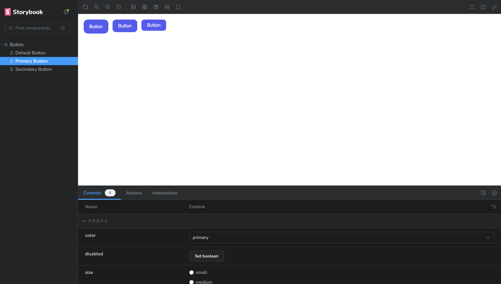
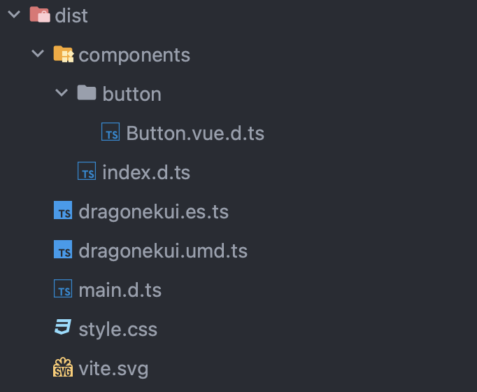
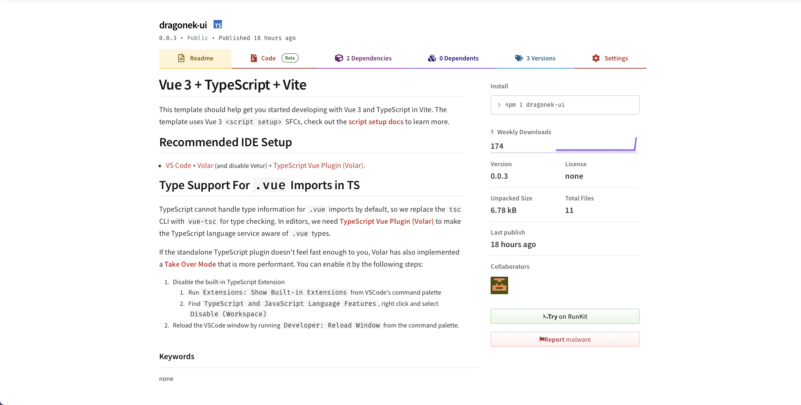

---
tags:
  - ui-kit
  - vue.js
  - vue
  - ui
  - ui/ux
  - uikit
  - javascript
source: https://habr.com/ru/articles/761570/
habs:
  - Веб-разработка
  - CSS
  - JavaScript
  - Программирование
  - VueJS
---
# Как сделать свой UI Kit на Vue 3 + storybook и задеплоить его на npm
Сейчас очень популярная история создавать свой UI Kit и везде рассказывать какой он крутой и как он ускорил разработку, поэтому я решил написать небольшой гайд, как заиметь себе собственный UI Kit.

## А зачем он вообще нужен?


Зачем?

1. Это удобно и быстро, все компоненты лежат в одном месте.
2. Несколько команд могут удобно его использовать, не прибегая к технике ctrl \+ c \-\> ctrl \+ v.
3. Новые изменения сразу актуализируются во всех проектах.
4. Можно прикрутить Storybook и показать менеджерам, как вы умеете xD.
5. Это некий бренд, сделав крутой UI Kit и сделав под него базовую доку, ты можешь говорить о том, что у нас есть некоторые open source решения.

### Мы поняли зачем \- приступаем


Тут должна была быть Наталья Морская Пехота

### Начнем с базы

С помощью vite заинитим проект на vue 3 с typescript \- [тык](https://vitejs.dev/guide/)


```bash
npm create vite@latest ui-kit -- --template vue-ts
```
Проект есть, теперь чуть\-чуть поколдуем с нашим package.json, сделаем базовые манипуляции, для того чтобы это было больше похоже на UI Kit.

Добавим vue в devDependencies и добавим peerDependecies с зависимостью vue \>\= 3\. Делаем это для того, чтобы получить наименьшее количество кода на выходе, а значит лучшую производительность.


```json
"peerDependencies": {
    "vue": ">=3"
}
```

> Почитать что такое эти ваши dependencies, devDependencies и peerDependencies можно тут \- [тык](https://saturncloud.io/blog/whats-the-difference-between-dependencies-devdependencies-and-peerdependencies-in-npm-packagejson-file/#:~:text=js%20project.-,Dependencies%20are%20the%20packages%20that%20are%20required%20for%20your%20application,installed%20in%20the%20user%27s%20environment.), если кратко:  
> **dependencies** \- зависимости, которые пойдут в конечный бандл.  
> **devDependencies** \- зависимости которые нужны только для разработки и не требуются в конечном бандле.  
> **peerDependencies** \- зависимости, которые должны быть установлены у пользователя в его проекте, для использования вашей библиотеки

**Укажем экспорты для файлов нашей библиотеки:**

Указываем что файлы нашей библиотеки будут в папке *dist:*


```json
"files": [
  "dist"
],
```
Настроим экспорты стилей и js бандлов для import/require(что за имена такие модные, вы поймете в следующем пункте, не переживайте).


```json
"exports": {
  ".": {
    "import": "./dist/dragonekui.es.ts",
    "require": "./dist/dragonekui.umd.ts"
  },
  "./styles": "./dist/style.css"
},
```
Получим примерно вот такой *package.json*

package.json
```json
{
  "name": "dragonek-ui",
  "version": "0.0.3",
  "type": "module",
  "main": "./dist/dragonekui.umd.ts",
  "module": "./dist/dragonekui.es.ts",
  "types": "./dist/components/index.d.ts",
  "files": [
    "dist"
  ],
  "exports": {
    ".": {
      "import": "./dist/dragonekui.es.ts",
      "require": "./dist/dragonekui.umd.ts"
    },
    "./styles": "./dist/style.css"
  },
  "scripts": {
    "dev": "vite",
    "build": "vue-tsc && vite build",
  },
  "devDependencies": {
    "@types/node": "^20.6.0",
    "@vitejs/plugin-vue": "^4.2.3",
    "typescript": "^5.0.2",
    "vite": "^4.4.5",
    "vue": "^3.3.4",
    "vue-tsc": "^1.8.5"
  },
  "peerDependencies": {
    "vue": ">=3"
  }
}

```
### Настроим vite

Далее нам нужно настроить [vite](https://vitejs.dev), чтобы он правильно собирал наш проект и все было красиво!

В vite.config.ts, добавим [options.lib](https://vitejs.dev/config/build-options.html#build-lib), для того чтобы собирать проект как библиотеку, там укажем название нашей библиотеки, entry point \- корневой файл для сборки либы, и filename на выходе(имя, которое будет использовать в папке dist при сборке проекта), по стандарту собирается два файлы библиотеки в формате **es** и **umd** их можно поменять в зависимости от ваших потребностей, с помощью свойства formats.


> Почитать про форматы можно вот тут \- [тык](https://dev.to/iggredible/what-the-heck-are-cjs-amd-umd-and-esm-ikm)


```typescript
lib: {
  entry: resolve(__dirname, 'src/components/index.ts'),
  name: 'dragonekui',
  fileName: (format) => `dragonekui.${format}.ts`,
},
```
Я сделал entry point файл index.ts в компонентах, туда я буду импортировать все мои компоненты и в дальнейшем их экспортировать.

Далее в этом же файле нужно поднастроить rollup. Указываем в опции external \- vue, показывая, что пакет является внешней зависимостью и прокидываем ее определение в том проекте, где мы будем использовать наш пакет, обычно там инстанс vue есть Vue.


```typescript
rollupOptions: {
  external: ['vue'],
  output: {
    globals: {
      vue: 'Vue',
    },
  },
},
```
Также нужно добавить генерацию типов для нашего пакета, это мы сделаем с помощью специального плагина для vite \- [vite\-plugin\-dts](https://www.npmjs.com/package/vite-plugin-dts).


```bash
npm i -D vite-plugin-dts
```

```typescript
plugins: [
  dts({
    insertTypesEntry: true,
  }),
],
```
Получим примерно вот такой *vite.config.ts*

vite.config.ts
```typescript
import vue from '@vitejs/plugin-vue';
import { defineConfig } from 'vite';
import { resolve } from 'path';
import dts from 'vite-plugin-dts';

export default defineConfig({
  build: {
    lib: {
      entry: resolve(__dirname, 'src/components/index.ts'),
      name: 'dragonekui',
      fileName: (format) => `dragonekui.${format}.ts`,
    },
    rollupOptions: {
      external: ['vue'],
      output: {
        globals: {
          vue: 'Vue',
        },
      },
    },
  },
  plugins: [
    vue(),
    dts({
      insertTypesEntry: true,
    }),
  ],
  resolve: {
    alias: {
      '@': resolve(__dirname, 'src'),
    },
  },
});

```
### Storybook

Устанавливаем storybook по их официальному гайду \- [тык](https://storybook.js.org/blog/storybook-vue3/)


```bash
npx sb init
```
Получаем установленный storybook в проект и папочку с examples, ее можно удалить, она нам не понадобиться.

Обязательно в *tsconfig.json,* добавляем *.stories.ts* формат в exclude, чтобы нам не генерились типы для этих файлов:


```json
"exclude": [
  "src/**/*.stories.ts"
],
```
### Приступим к написанию кода


Кот пишет код

Я покажу пример на кнопке.

Сделаем простенький компонент кнопки:

*src/components/button/Button.vue*

Button.vue
```typescript
<script lang="ts" setup>
import { defineProps, PropType } from 'vue';

const props = defineProps({
  disabled: {
    type: Boolean,
    default: false,
  },
  size: {
    type: String as PropType<'small' | 'medium' | 'large'>,
    default: 'medium',
  },
  color: {
    type: String as PropType<'primary' | 'secondary'>,
    default: 'primary',
  },
});
</script>

<template>
  <button class="button" :class="[props.size, props.color]" :disabled="props.disabled">
    <slot name="left-icon" />
    <slot />
    <slot name="right-icon" />
  </button>
</template>

<style scoped>
.button {
  color: #ffffff;
  outline: none;
  border: none;
  padding: 0 16px;
}

.small {
  height: 32px;
  border-radius: 8px;
}

.medium {
  height: 36px;
  border-radius: 10px;
}

.large {
  height: 40px;
  border-radius: 12px;
}

.primary {
  background: #535bf2;
}

.secondary {
  background: #a7a7a7;
}
</style>

```
Далее напишем story для этой кнопки:

*src/components/button/Button.stories.ts*

Button.stories.ts
```typescript
import { StoryFn, Meta } from '@storybook/vue3';
import Button from './Button.vue';

export default {
  title: 'Button',
  component: Button,
  argTypes: {
    disabled: {
      control: { type: 'boolean' },
      defaultValue: false,
    },
    size: {
      control: { type: 'radio' },
      options: ['small', 'medium', 'large'],
      defaultValue: 'medium',
    },
    color: {
      control: { type: 'select' },
      options: ['primary', 'secondary'],
      defaultValue: 'primary',
    },
  },
} as Meta<typeof Button>;

const Template: StoryFn<typeof Button> = (args) => ({
  components: { Button },
  setup() {
    return { args };
  },
  template: `
    <div style="display: flex; flex-direction: row; gap: 12px;">
      <Button v-bind="args" size="large">Button</Button>
      <Button v-bind="args" size="medium">Button</Button>
      <Button v-bind="args" size="small">Button</Button>
    </div>
  `,
});

export const DefaultButton: StoryFn<typeof Button> = (args) => ({
  components: { Button },
  setup() {
    return { args };
  },
  template: '<Button v-bind="args">Button</Button>',
});

export const PrimaryButton = Template.bind({});
PrimaryButton.args = { color: 'primary' };

export const SecondaryButton = Template.bind({});
SecondaryButton.args = { color: 'secondary' };

```
Запускаем:


```bash
npm run storybook
```
Получаем вот такой результат:



story с нашей кнопочкой

### Заключительный этап

Теперь нам нужно сделать export нашей кнопки из ранее указанного нами entry point(src/components/index.ts)


```typescript
import Button from './button/Button.vue';

export {
  Button,
};
```
Отлично, теперь можно попробовать сбилдить получившийся код и посмотреть, что будет в папке dist.

Билдим


```bash
npm run build
```
Получаем на выходе папку с нашим js bundle \- *dist/dragonekui.es.ts*, *dist/dragonekui.umd.ts,* и файлы с типами в *dist/components/\*/\*.vue.d.ts* и файл с экспортом всех этих типов *dist/components/index.d.ts*



Полученный build

### Финал. Деплой на npm

* Для начала, нужно зарегистрироваться на npm \- [тык](https://www.npmjs.com/signup)
* После, нужно залогиниться


```bash
npm login
```
* Далее билдим наш проект, и публикуем его на npm (не забывай каждый раз повысить версию пакета, пакеты с одинаковой версией не опубликуются)


```bash
npm run build && npm publish
```
Готово, теперь у тебя есть UI\-KIT задеплоенный на npm.



UI\-KIT на npm

**Весь код можно найти в этом репо \-** [**тык**](https://github.com/dragoneknp/ui-kit-template)

Если статья показалась вам интересной, то у меня есть [**Тг\-канал**](https://t.me/frontendforthesoul), где я пишу про новые технологии во фронте, делюсь хорошими книжками и интересными статьями других авторов.

