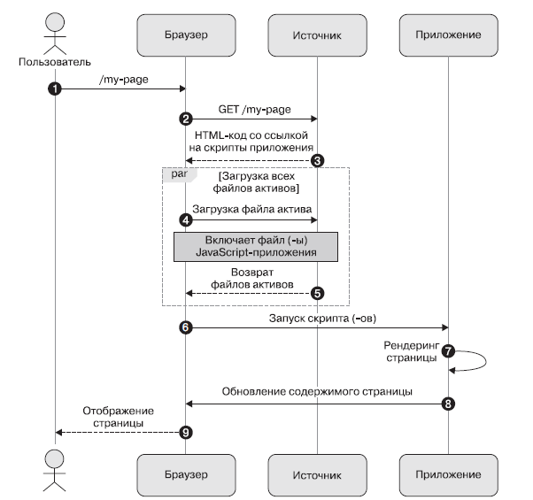
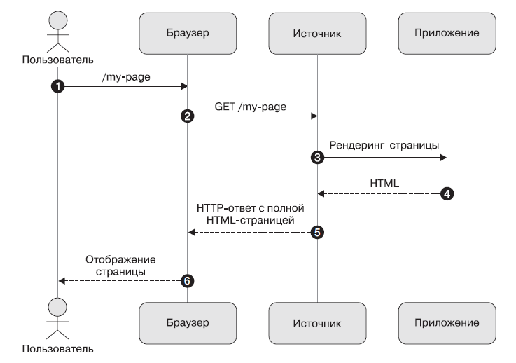
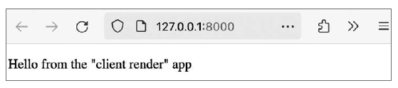
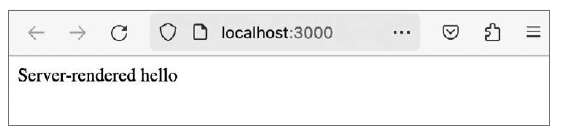
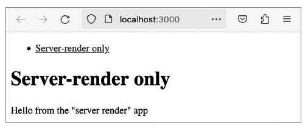
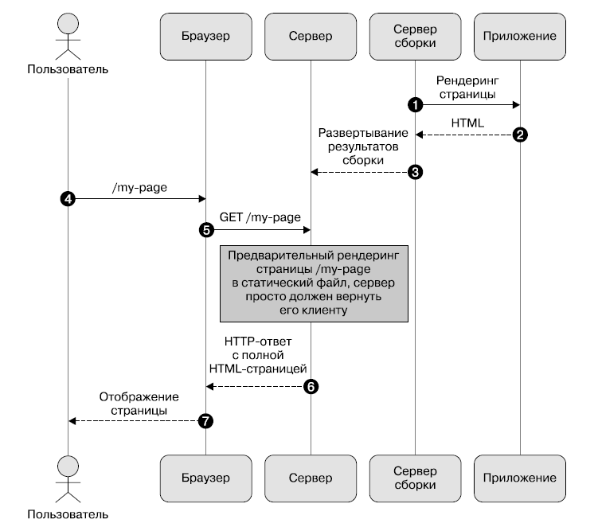

# Книга  «Паттерны проектирования JavaScript»
[](https://habr.com/ru/companies/piter/articles/845702/) Привет, Хаброжители!  

  

Раскройте потенциал паттернов проектирования JavaScript. Найдите структурированные решения распространенных задач разработки, пригодные для многократного использования и повышающие масштабируемость, производительность и удобство сопровождения кода. Узнайте, как применение этих паттернов позволяет создавать более чистый и понятный код, способствует организации совместной работы в команде, сокращает количество ошибок и экономит время и силы.Автор дает исчерпывающее представление о паттернах проектирования в современном JavaScript (ES6\+) и приводит практические примеры их применения. Сначала вы познакомитесь с порождающими, структурными и поведенческими паттернами проектирования в идиоматическом для JavaScript стиле, а затем переключитесь на архитектурные паттерны и паттерны пользовательского интерфейса. Вы узнаете, как применять паттерны, характерные для таких библиотек, как React, и распространять их на фронтенд и микрофронтенд. В последней части книги представлены и проиллюстрированы паттерны улучшения производительности и безопасности, включая обмен сообщениями, события и стратегии загрузки ресурсов, а также паттерны высокопроизводительных асинхронных вычислений. В издании приводятся примеры использования React и Next.js, а также JavaScript и Web API. Они помогут выбрать и внедрить проверенные паттерны проектирования в различных веб\-экосистемах и изменить ваш подход к разработке.  


**Для кого эта книга**
Издание предназначено для разработчиков и архитекторов программного обеспечения (ПО), которые хотят использовать JavaScript и веб\-платформу для повышения продуктивности, качества ПО и производительности своих приложений.  

  

Знакомство с паттернами проектирования программного обеспечения будет преимуществом, но не является обязательным.  

  

Вот три основные проблемы, с которыми сталкиваются разработчики и архитекторы:  

* они знакомы с концепциями программирования, но не знают, как эффективно реализовать их на JavaScript;
* им требуется структурировать код JavaScript и приложения таким образом, чтобы их можно было поддерживать и расширять;
* они хотят обеспечить бо́льшую производительность для пользователей своих JavaScript\-приложений

 
 
**Структура издания**
В главе 1 «Работа с порождающими паттернами проектирования» говорится о порождающих паттернах проектирования, которые помогают организовать создание объектов. Мы рассмотрим реализацию паттернов Прототип (Prototype), Одиночка (Singleton) и Фабрика (Factory) в JavaScript.  

  

В главе 2 «Реализация структурных паттернов проектирования» рассматриваются структурные паттерны проектирования, помогающие выстроить связи между сущностями. Мы реализуем паттерны Заместитель (Proxy), Декоратор (Decorator), Приспособленец (Flyweight) и Адаптер (Adapter) в JavaScript.  

  

Глава 3, «Использование поведенческих паттернов проектирования», посвящена поведенческим паттернам проектирования, которые служат для организации взаимодействия между объектами. Мы узнаем о паттернах Наблюдатель (Observer), Состояние (State), Стратегия (Strategy) и Посетитель (Visitor) в JavaScript.  

  

В главе 4 «Изучение паттернов библиотек реактивных представлений» рассматриваются библиотеки реактивных представлений, такие как React. С этими библиотеками появляются новые паттерны для изучения, внедрения и сравнения.  

  

В главе 5 «Стратегии рендеринга и гидратации страниц» говорится об оптимизации производительности страниц, что в наше время является одной из главных задач. Это важно как для повышения конверсии клиентов на странице, так и для поисковой оптимизации, поскольку поисковые системы, такие как Google, учитывают основные показатели сайта.  

  

Глава 6, «Микрофронтенды, зоны и островные архитектуры», посвящена микрофронтендам. Подобно движению микросервисов на уровне сервисов, микрофронтенды предназначены для разделения большой площади на более мелкие фрагменты, которые можно быстрее обрабатывать и доставлять.  

  

В главе 7 «Паттерны производительности асинхронного программирования» говорится об однопоточной модели параллелизма JavaScript, основанной на циклах событий. Она является одной из его самых сильных сторон, но часто неправильно понимается или недостаточно используется в ситуациях, когда важна производительность. Написание асинхронного кода на JavaScript с высокой производительностью и расширяемостью — ключевой момент в обеспечении бесперебойной работы пользователей при масштабировании системы.  

  

В главе 8 «Паттерны событийно\-ориентированного программирования» говорится, что событийно\-ориентированное программирование на JavaScript имеет первостепенное значение для приложений, чувствительных к безопасности, поскольку это способ передачи информации из различных веб\-контекстов и в них. Приложения, ориентированные на события, часто можно оптимизировать для повышения производительности и масштабируемости.  

  

В главе 9 «Максимизация производительности — отложенная загрузка и разделение кода» рассказывается о том, как для достижения максимальной производительности JavaScript\-приложения сократить количество загружаемого и интерпретируемого неиспользуемого кода JavaScript. Приемы, которые можно использовать для решения этой проблемы, называются отложенной загрузкой и разделением кода.  

  

В главе 10, «Стратегии загрузки активов и выполнение кода вне основного потока», рассматривается, как в жизненном цикле приложения возникают ситуации, когда загрузка большего количества кода JavaScript или активов неизбежна. Вы узнаете об оптимизации загрузки активов в конкретном случае JavaScript, а также других веб\-ресурсов и, наконец, о том, как выполнять JavaScript вне основного потока браузера.
  

**Файлы примеров**  

  

Файлы кода для этой главы можно найти на GitHub по адресу [github.com/PacktPublishing/Javascript\-Design\-Patterns](https://github.com/PacktPublishing/Javascript-Design-Patterns).  

  

## Клиентский и серверный рендеринг с помощью React

  

В веб\-контексте рендеринг на стороне клиента — это процесс, в ходе которого JavaScript выполняется в браузере пользователя для создания или обновления содержимого страницы. Полностью клиентское приложение с рендерингом будет отображать значимый контент только после того, как соответствующий код JavaScript будет загружен, синтаксически разобран и запущен.  

  

На следующей диаграмме последовательности (рис. 5\.1\) мы используем термин «источник» вместо термина «сервер», поскольку одним из преимуществ полного рендеринга на стороне клиента является то, что ресурсы, предоставляющие контент, могут быть так называемым *статичным хостингом*. Сюда входят сервисы вроде AWS Simple Storage Service (S3\), Netlify, Cloudflare Pages и GitHub Pages, а также другие. В них нет динамических компонентов на стороне сервера.  

  

В отличие от подхода выше, рендеринг на стороне сервера обозначает процесс, в ходе которого сервер генерирует полный HTML\-документ при запросе браузером и возвращает его (рис. 5\.2\).  

  

### Рендеринг на стороне клиента в React

  

*Рендеринг на стороне клиента* — это метод рендеринга по умолчанию в React. Давайте с нуля создадим приложение, выполняющее рендеринг на стороне клиента.  

  

1\. Начнем с компонента App, отображающего некоторый текст, и его пропа type:  

  


```javascript
export function App({ type = '' }) {
  return (
    <div>
     <p>Hello from the {type + ' '}app</p>
    </div>
  );
}
```
  

   

**Рис. 5\.1\.** Диаграмма последовательности рендеринга на стороне клиента  

  

2\. Затем мы создаем файл точки входа client.jsx. Он импортирует приложение и использует пакет ReactDOM для рендеринга с пропом type, установленным в значение «client render».  

  


```javascript
import React from 'react';
import ReactDOM from 'react-dom/client';
import { App } from './src/app';

ReactDOM.createRoot(document.querySelector
  ('#app')).render(
  <App type={ˋ"client render"ˋ} />
);
```
  

  

**Рис. 5\.2\.** Диаграмма последовательности рендеринга на стороне сервера  

  

3\. Для выполнения этого примера нужен HTML\-документ, который позволит успешно запустить метод ReactDOM.createRoot. Другими словами, нам нужен HTML\-документ, содержащий элемент с id\=app, ссылающийся на нашу точку входа:  

  


```javascript
<div id="app"></div>
<script src="./dist/client.js"></script>
```
  

4\. Обратите внимание, что точкой входа является файл dist/client.js, а не client.jsx. Это связано с тем, что синтаксис JSX в React не может быть запущен нативно в браузере. Вместо этого мы запускаем файл точки входа client.jsx через этап компиляции и сборки с помощью инструмента esbuild. Команда сборки выглядит примерно так:  

  


```javascript
npx esbuild client.jsx --bundle --outdir=dist
```
  

Теперь, если загрузить файл index.html в браузере, отобразится следующее (рис. 5\.3\).  

  

   

**Рис. 5\.3\.** Рендеринг строки Hello from the “client render” app в браузере  

  

### Рендеринг на стороне сервера в React

  

Node.js, представленный на сайте как «кросс\-платформенная среда выполнения JavaScript с открытым исходным кодом», дает возможность запускать JavaScript на сервере. Часто используемый пакет для создания серверов на Node.js — Express.  

  

В этом разделе мы рассмотрим, как работать с Node.js и Express для рендеринга React\-приложения на стороне сервера.  

  

Простой Express\-сервер, возвращающий строку 'Server\-rendered hello' при загрузке корневого пути, выглядит следующим образом:  

  


```javascript
import express from 'express';
const app = express();
app.get('/', (_req, res) => {
  res.send('Server-rendered hello');
});
const { PORT = 3000 } = process.env;
app.listen(PORT, () => {
  console.log(ˋServer started on http://localhost:${PORT}ˋ);
});
```
  

И снова будет использоваться инструмент esbuild для сборки и компиляции JSX в JavaScript:  

  


```javascript
npx esbuild server.js --bundle --platform=node --outdir=dist
```
  

Затем можно запустить сервер, выполнив следующую команду:  

  


```javascript
node dist/server.js
```
  

По умолчанию он работает на порту 3000, но это можно переопределить с помощью переменных среды.  

  

При загрузке localhost:3000 в браузере будет отображаться следующее сообщение (рис. 5\.4\).  

  

   

**Рис. 5\.4\.** Рендеринг строки Server\-rendered hello в браузере  

  

Это простейший пример серверного рендеринга с использованием Node.js и Express.  

  

Далее мы рассмотрим, как использовать пакет ReactDOM для получения компонентов React и их рендеринга на стороне сервера.  

  

1\. Пакет ReactDOM предоставляет как точку входа react\-dom/client (используемую в предыдущем разделе), так и точку входа react\-dom/server. Как следует из названий, клиентская точка входа предназначена для работы на стороне клиента (в браузере, клиентский JavaScript), а серверная точка входа — на стороне сервера (через Node.js или другую серверную среду выполнения JavaScript).  

  

2\. Мы будем использовать два метода: ReactDOMServer.renderToStaticMarkup и ReactDOMServer.renderToString. Они позволят выполнить рендеринг React\-приложения в HTML\-файле на стороне сервера.  

  

3\. В файле src/server\-render.jsx содержатся функции renderNav и serverRenderApp. Они задействуют методы ReactDOMServer.renderToStaticMarkup и ReactDOMServer.renderToString для рендеринга Nav и App соответственно:  

  


```javascript
import React from 'react';
import ReactDOMServer from 'react-dom/server';
import { App } from './app';
import { Nav } from './nav';

export function renderNav() {
  return ReactDOMServer.renderToStaticMarkup(<Nav />);
}
export function serverRenderApp() {
  return ReactDOMServer.renderToString(<App type={ˋ"server render"ˋ} />);
}
```
  

Здесь файл app.jsx тот же, что и в предыдущем разделе, а nav.jsx выглядит следующим образом:  

  


```javascript
import React from 'react';

export function Nav() {
  return (
    <ul>
      <li>
        <a href="/">Server-render only</a>
      </li>
    </ul>
  );
}
```
  

4\. Затем можно использовать renderNav и serverRenderApp в файле server.js. Мы вносим изменения в обработчик app.get('/') для отображения навигации и приложения:  

  


```javascript
// других изменений нет
app.get('/', (_req, res) => {
  res.send(ˋ
    <!DOCTYPE html>
    ${renderNav()}
    <h1>Server-render only</h1>
    <div id="app">${serverRenderApp()}</div>
  ˋ);
});
```
  

5\. После повторной сборки сервера мы запустили с помощью node файл dist/server.js и открыли адрес localhost:3000, чтобы увидеть следующее (рис. 5\.5\):  

  

   

**Рис. 5\.5\.** Рендеринг строки Hello from the “server render” app вместе с заголовком и навигацией  

  

В чем разница между ReactDOMServer.renderToStaticMarkup и ReactDOMServer.renderToString? Если коротко, то регидратацию метода renderToStaticMarkup не выполнить на стороне клиента. Другими словами, его нельзя использовать в качестве исходного HTML\-кода, чтобы затем тот же код React\-приложения мог быть запущен на стороне клиента для обеспечения полностью интерактивного опыта. Мы вернемся к этому вопросу в одном из следующих разделов.  

  

### Компромиссы между рендерингом на стороне клиента и сервера

  

Итак, каковы преимущества и недостатки рендеринга на стороне клиента и сервера?  

  

Основное преимущество клиентского рендеринга заключается в том, что работа приложения полностью выполняется в браузерах пользователей, что делает его очень масштабируемым, поскольку количество пользователей, использующих систему, не будет оказывать давления на исходные серверы. Главные недостатки клиентского рендеринга связаны с функциональностью, доступной только на стороне сервера. Например, cookies для сервера или установка тегов meta для предварительного просмотра в социальных сетях.  

  

Слабой стороной серверного рендеринга является то, что работа программы должна выполняться строго на сервере. Но, как говорилось ранее, поскольку сервер представляет собой «контролируемую» среду, такой подход имеет и ряд преимуществ. А именно задержка по отношению к другим совмещенным системам, как правило, будет ниже, чем полноценное перемещение данных по маршруту «браузер — сервер», так как сеть сервера известна и вряд ли будет иметь такие же различия в производительности, как сеть конечного пользователя. Не дожидаясь загрузки всей страницы, а затем активов и каскада «синтаксического анализа и выполнения» JavaScript, серверный рендеринг способен улучшить основные показатели веб\-информации, такие как *скорость загрузки основного контента* (Largest Contentful Paint, LCP) и *суммарное смещение макета* (Cumulative Layout Shift, CLS).  

  

В конечном счете функциональность, отображаемая клиентом, является основной причиной использования JavaScript, а значит, удаление этой возможности будет иметь смысл только в ограниченных сценариях использования, таких как сайты с контентом (например, блоги, новостные сайты и сайты документации).  

  

Мы изучили разницу между рендерингом на стороне клиента и сервера, а также то, как реализовать оба способа с помощью React и Node.js. В следующем разделе мы рассмотрим подходы к рендерингу, предоставляемые фреймворком Next.js для React.  

  

## Статический рендеринг с помощью Next.js

  

Next.js — это фреймворк React для создания веб\-приложений полного стека (full stack). Он предоставляет инструменты и подходы, предназначенные для повышения продуктивности разработчиков (рис. 5\.6\).  

  

   

**Рис. 5\.6\.** Диаграмма последовательности действий для случая создания статического сайта или с предварительным рендерингом  

  

Next.js включает в себя маршрутизатор файловой системы для страниц, набор примитивов маршрутизации для React, поддержку рендеринга на стороне клиента и сервера, примитивы для получения данных и многое другое.  

  

Мы сосредоточимся на такой функции Next.js, как *генерация статических сайтов* (Static Site Generation, SSG). Эта методология напоминает рендеринг на стороне сервера, но сглаживает некоторые его недостатки, поскольку рендеринг выполняется во время сборки, а не во время запроса.  

  

Теперь, когда мы разобрались с тем, как генерация статических сайтов изменяет поток данных, когда пользователь запрашивает сайт, поговорим об автоматической генерации статических сайтов в Next.js.  


**Об авторе**
**Уго Ди Франческо** — инженер\-программист, специалист по JavaScript. Получил степень магистра в области вычислительной математики в Университетском колледже Лондона (University College London, UCL). Использовал JavaScript для создания масштабируемых и производительных платформ в таких компаниях, как Canon и Elsevier, а также в таких отраслях, как книгоиздание и здравоохранение. В настоящее время Уго с помощью Node.js, TypeScript, React и Kubernetes решает задачи, связанные с туризмом, в компании Eurostar, а также ведет собственный сайт Code with Hugo. Вне основной деятельности он увлекается фехтованием: тренируется и участвует в соревнованиях по всему миру.
  

Более подробно с книгой можно ознакомиться на [сайте издательства](https://www.piter.com/collection/new/product/patterny-proektirovaniya-javascript?utm_source=habr&utm_medium=post&utm_campaign=javascript&utm_content=patterny-proektirovaniya&utm_term=book):  

  

[» Оглавление](https://www.piter.com/collection/new/product/patterny-proektirovaniya-javascript?utm_source=habr&utm_medium=post&utm_campaign=javascript&utm_content=patterny-proektirovaniya&utm_term=oglavlenie#Oglavlenie-1)  

[» Отрывок](https://www.piter.com/collection/new/product/patterny-proektirovaniya-javascript?utm_source=habr&utm_medium=post&utm_campaign=javascript&utm_content=patterny-proektirovaniya&utm_term=otryvok#Otryvok-1)  

  

По факту оплаты бумажной версии книги на e\-mail высылается электронная книга.  

Для Хаброжителей скидка 25% по купону — **JavaScript**