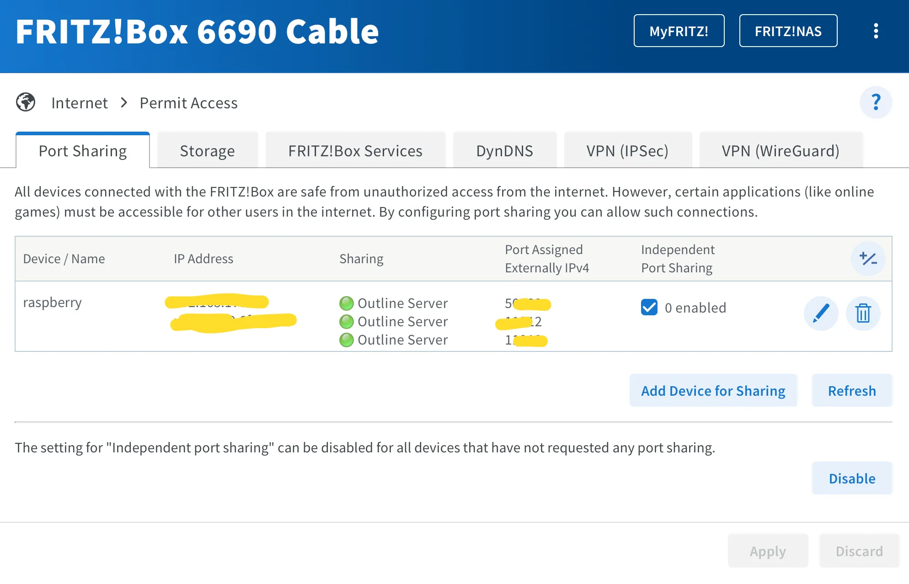

# Личный домашний VPN на основе Raspberry (Shadowsocks) (для самых маленьких)
*Настраиваем свой маленький, домашний и ламповый VPN на основе Shadowsocks (Outline). Нужен Raspberry и настраиваемый wi\-fi\-роутер. Пошаговая инструкция. Без абонентской платы и аренды VPS.*

Прежде всего, небольшой дисклеймер: я ненастоящий сварщик, я просто перелопатил много информации, скомпилировал ее и получил нужный мне результат. Им я и поделюсь со всем миром, где известное правительство пытается блокировать уже частные соединения VPN.

До этого блокировали пока что только коммерческие сервисы VPN. [Пока под раздачу попадают протоколы WireGuard и OpenVPN (август 2023\)](https://meduza.io/feature/2023/08/08/polzovateli-vtoroy-den-zhaluyutsya-na-sboi-v-rabote-servisov-dlya-obhoda-blokirovok) (*ссылка на СМИ, выполняющее функции иноагента*). Первый очень популярен своей легкостью и быстродействием, быстрой настройкой. К сожалению, у такого трафика на лбу написано «Я — VPN соединение”. Второй протокол уже довольно старый и популярный, но тоже довольно легко обнаруживается РКН. На сегодня РКН только тренируется с блокировками, но похоже, что Shadowsocks пока работает без перебоев. Тем не менее, "[эксперты «Роскомсвободы»\* также предполагают, что следующим шагом властей может стать блокировка Shadowsocks, нестандартного протокола, созданного для обхода Великого китайского файрволла, и подобных ему инструментов](https://roskomsvoboda.org/post/blokirovki-openvpn-wireguard-terona/)” (*ссылка на сайт некоммерческой организации выполняющей функции иностранного агента*). Пока до этого протокола еще не добрались, на основе него, а точнее Outline, использующий технологию Shadowsocks, и настроим свой VPN\-сервер.


---

### Что нам понадобится?

Пожалуйста, имейте ввиду, что я рассказываю свой личный кейс, но при смекалке вы вполне можете адаптировать его под себя.

Итак, моим близким людям, находящимся в РФ, нужен незаблокированный доступ в Интернет. Да и мне он тоже может понадобится, если я сам буду (нет) в РФ.

Что у меня есть:

* я живу за границами РФ;
* у меня обычное домашнее подключение к Интернету у обычного провайдера (с динамическим IP\-адресом);
* Raspberry PI 400 (был у меня подаренный на ДР);
* wifi\-роутер Fritz! Box 6690 (у вас может быть любой другой не тупой роутер, который можно настраивать в деталях);
* персональная ЭВМ.


---

### Приступим

Прежде всего, с помощью [Raspberry Pi Imager](https://www.raspberrypi.com/software/), установим на флешку microSD легкую 64\-битную Raspberry Pi OS Lite. Вставляем карточку в Raspberry и подключаемся к нему через SSH с компьютера:


```
ssh user@192.168.178.44
```
*Где****user****ваше имя пользователя в Raspberry, а****192\.168\.178\.44****— IP\-адрес вашего Raspberry в вашей домашней сети.*

Вводим пароль, затем обновляемся (вводим команды по очереди, со всем соглашаемся):


```
sudo apt update
sudo apt dist-upgrade
sudo apt clean
sudo reboot
```
После перезагрузки снова подключаемся к Raspberry по SSH:


```
ssh user@192.168.178.44
```
*Где****user****ваше имя пользователя в Raspberry, а****192\.168\.178\.44****— IP\-адрес вашего Raspberry в вашей домашней сети.*

Вводим пароль и устанавливаем Docker. Сначала скачиваем скрипт для установки.


```
curl -fsSL https://get.docker.com -o get-docker.sh
```
Запускаем скрипт установки Docker:


```
sh get-docker.sh
```
Разрешаем работать обычному пользователю с Docker без прав root:


```
sudo usermod -aG docker $USER
```


---

### Настройка роутера и DynDNS

Обычный провайдер домашнего интернета по умолчанию выдает динамический IP\-адрес, который время от времени меняется. Зафиксировать его можно либо арендовав постоянный IP\-адрес, либо воспользоваться сервисом DynDNS. Смысл его в том, что при каждой смене динамического IP\-адреса провайдером, сервис обновляет данные и таким образом доменное имя остается всегда статичным (что нам и нужно), а IP\-адрес можеть меняться хоть раз в час.

Я использовал бесплатный сервис [https://ydns. io/](https://ydns.io/) — он не просит никаких ваших данных, кроме email, очень простой и без рекламы:

* после регистрации в разделе Hosts создаем новый, присваеваем какое\-нибудь имя и указываем свой IP\-адрес, который вам выдал ваш провайдер. Узнать это можно, если, например, зайти на [https://2ip. ru](https://2ip.ru/) (обратите внимание, чтобы были выключены iCloud Private Relay, если у вас Mac, и любые другие VPN или сервисы, которые могут скрыть ваш реальный IP\-адрес) или посмотреть в настройках роутера;
* в настройках созданного хоста нажмите кнопку Get Update URL и скопируйте ссылку;

* в настройках роутера в разделе DynDNS введите: логин, пароль от ydns. io и скопированную ссылку Update URL (каждый раз при смене IP\-адреса провайдером, роутер будет “нажимать” на эту ссылку, таким образом передавая сервису свой новый IP\-адрес).

***Обратите внимание, что сам сервис на домене*** [***ydns.io***](http://ydns.io/)***, а предоставляет он домен ydns.eu***


в моем случае, это роутер Fritz!Box 6690

Теперь мы имеем статичное доменное имя, по которому можно обращаться к нашему IP\-адресу и настроенный роутер, который при смене IP\-адреса обновляет данные на сервисе DynDNS.


---

### Установка Outline

Разработчики из [JigSaw](https://jigsaw.google.com/) предоставляют максимально простой скрипт для установки, вам нужно написать одну команду в терминале, все остальное сделает скрипт. К сожалению, при попытке установить сервер Outline на Raspberry, будет выдаваться ошибка, что Raspberry не является x86 машиной и установка будет прерываться.

Энтузиастами скрипт был доработан и теперь Outline прекрасно работает и на arm64 Raspberry.

Также стоит учесть, что по умолчанию скрипт берет ваш динамический IP\-адрес и устанавливает его в своих настройках. Нам это не подходит, потому что когда провайдер сменит IP, то к VPN\-серверу мы не сможем подключиться. Именно поэтому мы и сделали хост DynDNS выше.


```
SB_IMAGE=oreoluwa/shadowbox:daily sudo --preserve-env bash -c "$(wget -qO- https://raw.githubusercontent.com/EricQmore/installer/main/install_server.sh) --hostname user.ydns.eu"
```
*Где в конце****user. ydns. eu****— это ваш хост, который вы создали выше. Таким образом, мы указываем скрипту, чтобы в настройках создаваемого сервера было указано наше доменное имя.*

Если все ок, то скрипт выдаст зеленым строчку такого вида:


Копируем зеленую строчку и обращаем внимание на указанные порты ниже

Также, скорее всего, он поругается на установки Firewall, что не доступны определенные порты. Их он тоже укажет: один порт UDP, а также два порта TCP и UDP.

На случай, если наш сервер перезагрузится, нужно предусмотреть автоматический запуск контейнеров, чтобы VPN\-сервер всегда поднимался. Вводим команды по очереди:


```
sudo systemctl enable docker.service
sudo systemctl enable containerd.service
```
Теперь перезагрузим Raspberry, чтобы убедиться, что контейнеры запускаются снова и VPN\-сервер поднимается сам:


```
sudo reboot
```
Снова подключаемся к Rasberry:


```
ssh user@192.168.178.44
```
*Где****user****ваше имя пользователя в Raspberry, а****192\.168\.178\.44****— IP\-адрес вашего Rasberry в вашей домашней сети.*

Проверяем, запустились ли контейнеры:


```
docker ps
```
В списке должно быть как минимум две записи: watchtower (следит за обновлениями) и shadowsocks.

Вернемся к компьютеру:

* Запускаем уже заранее скачанный Outline Manager с официального сайта [https://getoutline. org/ru/get\-started/\#step\-1](https://getoutline.org/ru/get-started/#step-1), нажимаем Set Up в правом нижнем углу (раздел Advanced).

* в окно «Paste your installation output here” вставляем ту наше »зеленую” строчку.

VPN\-сервер готов.

* Открываем вкладку Settings и в поле “Port for new access keys” заменяем на один из портов TCP, которые нам указал скрипт в терминале.

* Во вкладке Connections нажимаем «Add new key”, называем как угодно («mama iphone”), нажимаем справа символ »Поделиться” и в появившемся окне жмем »Copy access key”.


---

### Пробрасываем порты в роутере

У нас есть свой собственный VPN\-сервер, работающий на Raspberry в домашней сети, но сейчас к нему нельзя подключиться, потому что он недоступен из “внешнего” интернета. Поэтому нужно пробросить порты, который нам указал скрипт в выводе терминала в настройках роутера. В моем роутера Fritz! Box 6690 это делается элементарно:

* в разделе Home Network выбираем Network Connections и в списке устройств домашней сети находим Raspberry, например, 192\.168\.178\.44
* нажимаем “карандаш” для редактирования настроек;
* нажимаем “Permit Access” и ставим галочку Permit independent port sharing for this device;
* нажимаем кнопку Change port sharing и в появившемся разделе снова жмем “карандаш”;
* затем выбираем New sharing и в появившемся окне Create sharing выбираем Port sharing;
* В Application можно выбрать Other application и выбираем протокол порта;
* Так у вас должно быть три записи на три порта: 1 порт UDP и 2 порта TCP, применяем настройки.

Наш VPN\-сервер доступен по трем портам из “внешнего” интернета, пробуем подключаться.


---

Перед тем, как объявить своим близким, что вы подняли свой VPN\-сервер и готовы поделиться окном в незаблокированный интернет, стоит попробовать самому подключиться к своему серверу из “внешнего” интернета.

* Устанавливаем Outline Client с официального сайта [https://getoutline. org/ru/get\-started/\#step\-3](https://getoutline.org/ru/get-started/#step-3) на свой смартфон и отключаемся от wifi, то есть используем мобильный интернет;
* Вводим скопированный на предыдущих шагах ключ из Outline Manager в “Добавить сервер”;

* Если все ок, появляется кнопка “Подключить”, жмем ее;

* Если подключение произошло, то кружок становится зеленым, появляется кнопка “Отключить”;

* На [https://2ip. ru](https://2ip.ru/) проверяем наш IP\-адрес. Должен быть домашний IP\-адрес. Можно открыть еще пару сайтов, чтобы проверить, что подключение есть и трафик по нему идет.

Подключение VPN работает, все хорошо.


---

### Итог

Мы подняли свой собственный VPN\-сервер на Raspberry на протоколе Shadowsocks в своей домашней сети, который работает достаточно автономно даже при перезагрузках и обновлениях динамического IP\-адреса. Без абонентской платы, то есть практически бесплатно. И мы можем это дело немного администрировать: дать по ключу доступа каждому, видеть объем его трафика и даже ограничивать его и в случае необходимости отключить(удалить) ключ.

В будущем еще можно подумать, какие сервисы можно поднять на Raspberry, раз он уже есть. Например, [AdGuard Home](https://github.com/AdguardTeam/AdGuardHome) — будет еще эффективнее резать рекламные баннеры, блокировать вредоносные сайты, противодействовать трекингу ваших устройств.

По идее, такое VPN\-соединение будет сложно определить РКН, из преимуществ также является то, что соединение устанавливается не с хостинг\-провайдером, что выглядело бы для РКН как «частное VPN‑соединение с арендованным за границей VPS».

Имейте ввиду, что вы все делаете на свой страх и риск, я снимаю с себя всякую ответственность. Желаю удачи!


> **!!!ВНИМАНИЕ!!!** Если вы живете в стране, где за скачивание торрентов бросают в тюрьму на 45 лет, то будьте крайне осторожны с раздачей ключе доступа к вашему VPN\-серверу. «Миссия невыполнима», скачанная с торрентов младшим братишкой, в вашей стране будет выглядеть так, что это сделали вы со всеми вытекающими последствиями.

*\*некоммерческая организация выполняющая функции иностранного агента*

