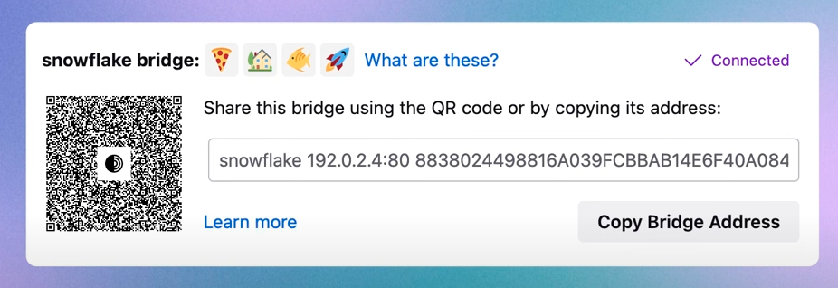

# Новые протоколы шифрования трафика
  

  

Несмотря на запрет отдельных сервисов, протоколы VPN по\-прежнему широко используются в корпоративной среде и частными лицами.  

  

В последнее время использование стало затруднено из\-за того, что зашифрованный трафик распознаётся и теряется на каналах связи. Выходом из этой ситуации может быть обфускация, когда трафик делают похожим на обычные HTTPS\-пакеты. Компании\-разработчики средств информационной безопасности представили несколько новых протоколов, предназначенных именно для этого. По словам разработчиков, новые протоколы работают эффективнее старых методов обфускации.  

  

## Stealth

  

Например, разработчики из компании Proton недавно представили новый протокол [Stealth](https://protonvpn.com/blog/stealth-vpn-protocol). Он использует обфускацию, чтобы скрыть VPN\-соединение. Общая идея заключается в том, чтобы сделать VPN\-трафик похожим на «обычный» трафик — или обычные HTTPS\-соединения. Stealth делает это с помощью обфусцированного TLS\-туннелирования через TCP. Это отличается от большинства популярных протоколов, которые обычно используют UDP, что упрощает их обнаружение. Кроме того, Stealth также устанавливает VPN\-соединения особым и уникальным способом, который позволяет обойти интернет\-фильтры.  

  

Несмотря на все функции обфускации, протокол показывает более высокую производительность, чем обфусцированные VPN\-протоколы прошлого поколения, обычно работающие на базе OpenVPN через TCP.  

  

Stealth также совместим с сервисом [Accelerator](https://protonvpn.com/secure-vpn/vpn-accelerator), который увеличивает скорость соединения на каналах с медленным интернетом за счёт использования протокола [BBR](https://datatracker.ietf.org/doc/html/draft-cardwell-iccrg-bbr-congestion-control-00).  

  

  

  

Stealth сделан с нуля и не основан ни на одном из существующих протоколов, он доступен для всех клиентов компании, которые используют фирменное приложение. Единственной претензией может быть проприетарный характер этой разработки.  

  

## Cloak

  

Ещё одна разработка в данном направлении — программа [Cloak](https://github.com/cbeuw/Cloak?tab=readme-ov-file), которая пытается маскировать проксированный трафик под обычную браузерную активность с помощью стеганографии. Она является дополнением к другим прокси\-инструментам вроде OpenVPN или Shadowsocks.  

  

  

  

В отличие от традиционных инструментов с явными отпечатками трафика, Cloak очень сложно точно распознать в потоке пакетов, и это чревато большим количеством ложных срабатываний, объясняют разработчики.  

  

Для любого стороннего наблюдателя хост с сервером Cloak неотличим от обычного веб\-сервера. Это справедливо как при пассивном наблюдении за потоком трафика к серверу и от него, так и при активном исследовании поведения сервера, что достигается за счёт использования ряда криптографических методов стеганографии.  

  

Cloak может использоваться совместно с любой прокси\-программой, туннелирующей трафик через TCP или UDP, например Shadowsocks или OpenVPN. На одном сервере может быть запущено несколько прокси\-серверов, и сервер Cloak будет выступать в роли обратного прокси, соединяя клиентов с нужным им прокси.  

  

Cloak мультиплексирует трафик через несколько базовых TCP\-соединений, что уменьшает нагрузку на основной канал и накладные расходы на рукопожатие TCP. Это также делает структуру трафика более похожей на реальные веб\-сайты.  

  

Протокол позволяет нескольким клиентам подключаться к серверу через один порт (по умолчанию 443\). Он также предоставляет функции управления трафиком: лимит использования и контроль пропускной способности. Это позволяет обслуживать несколько пользователей, даже если базовый прокси не был рассчитано на многопользовательскую работу.  

  

Cloak также поддерживает туннелирование через промежуточный CDN, например, Amazon Cloudfront.   

  

## WebTunnel

  

В числе новых разработок можно упомянуть ещё [WebTunnel](https://blog.torproject.org/introducing-webtunnel-evading-censorship-by-hiding-in-plain-sight/), новый тип мостов Tor.  

  

Это подключаемый транспорт для имитации трафика HTTPS, созданный под влиянием [HTTPT](https://www.usenix.org/conference/foci20/presentation/frolov). Он оборачивает соединение с полезной нагрузкой в WebSocket\-подобное HTTPS\-соединение, которое со стороны выглядит как обычный HTTPS (WebSocket), то есть как обычное соединение с веб\-сервером.  

  

WebTunnel настолько похож на обычный веб\-трафик, что может сосуществовать с веб\-сайтом на одной конечной точке, то есть с одним доменом, IP\-адресом и портом. Такое сосуществование позволяет обратному прокси направлять как обычный веб\-трафик, так и WebTunnel на соответствующие серверы приложений.   

  

Для большинства пользователей WebTunnel может использоваться в качестве альтернативы мостам obfs4\.   

  

  

  

## Старые протоколы

  

Традиционные протоколы VPN, такие как OpenVPN, WireGuard, IKEv2, PPTP и L2TP, относительно легко распознать в сети.   

  

В течение многих лет существовали различные проекты по обфускации существующих протоколов, но многие из них представляют собой доработки существующих протоколов, которые уже не очень хорошо работают.  

  

Протокол VPN обычно состоит из двух каналов: канал данных и канал управления. Канал управления отвечает за обмен ключами, аутентификацию и обмен параметрами (например, предоставление IP\-адреса или маршрутов и DNS\-серверов). Канал данных отвечает за передачу трафика. Вместе они поддерживают безопасный туннель. Однако, чтобы ваши данные прошли через этот безопасный туннель, они должны быть инкапсулированы.  

  

Инкапсуляция — это когда протокол VPN берёт пакеты и помещает их внутрь другого пакета. Этот дополнительный уровень необходим, потому что конфигурации протоколов не обязательно совпадают с конфигурациями обычного интернета. Дополнительный уровень позволяет информации пройти через туннель. После того как VPN\-туннель установлен, задача канала управления заключается в поддержании стабильности соединения.  

  

Как уже было сказано, традиционные протоколы относительно легко распознать в сети. Поэтому и создаются усовершенствованные доработки для них.