# Проектирование эффективной системы кэширования
## Введение

Кэширование ― одна из важнейших практик в проектировании современных высоконагруженных ИТ\-систем. Статья позволит почерпнуть практический опыт проектирования механизма кэширования и будет интересна системным аналитикам, проектировщикам систем и архитекторам высоконагруженных систем.

В этой статье:

* что такое кэширование и для чего оно нужно;
* какие бывают подходы к кэшированию;
* пример проектирования приложения с кэшем;
* с какими проблемами можно столкнуться при реализации кэширования и как их решить.

## Что такое кэширование и для чего оно нужно

Представим, что мы ―  стартап и у нас есть небольшой новостной сайт. Система пока маленькая: бэкенд\-приложение развёрнуто на одном сервере, есть одна база данных.  Помимо новостного сервиса есть несколько сторонних бэкендов: внешние бэкенды (например, сервис погоды) и бэкенды смежных команд (например, сервис подсчета лайков к новостям).

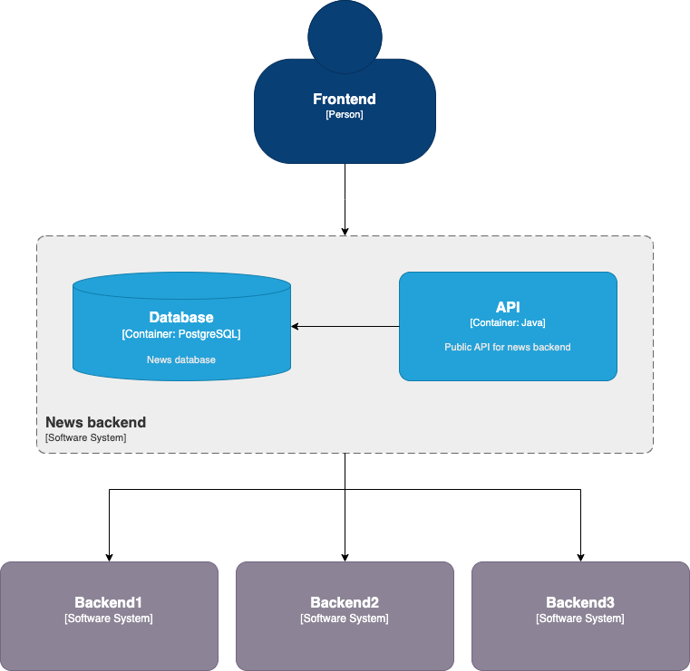

**Рис.1** ― Архитектура маленького новостного сайта

Со временем приложение растёт и количество пользователей увеличивается. Чтобы справиться с возрастающей нагрузкой, мы решаем масштабироваться горизонтально: разворачиваем дополнительные экземпляры приложения и баз данных.

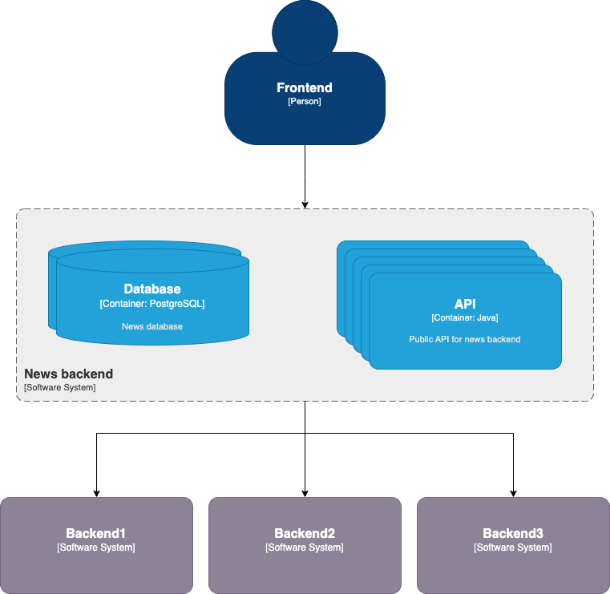

**Рис.2** ― Горизонтальное масштабирование новостного сайта

Такая архитектура хорошо работает, пока трафик растёт равномерно и мы успеваем масштабировать сервера. В какой\-то момент мы выпускаем эксклюзивную резонансную новость. Все наши пользователи одновременно открывают страницу приложения с этой новостью, комментируют, ставят лайки. Система не справляется с такой нагрузкой: фронтенд шлёт очень много запросов на бэкенд, страницы не открываются, потому что сервисы не успевают возвращать ответы на большое количество одновременных запросов. 

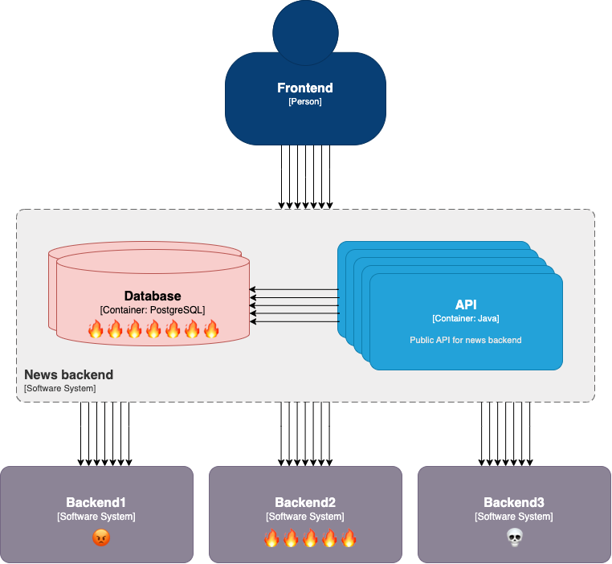

**Рис.3** ―  Приложение не справляется с пиковой нагрузкой

Один из паттернов, который можно использовать для эффективной работы в таких кейсах ― это **кэширование**.

**Кэширование (caching)** ― механизм оптимизации производительности ИТ\-систем. Суть кэширования заключается в добавлении буфера между приложением и базой данных или приложением и сервисом для хранения часто используемых данных. Ключевая идея механизма состоит в том, чтобы иметь возможность получать данные намного быстрее, чем из основного источника данных. Кэш обычно гораздо меньше по размеру, чем основной источник, поэтому данные в кэше актуальны в пределах ограниченного периода времени.

## Классификация подходов к кэшированию

Кэширование ―  одна из самых сложных и объёмных тем в разработке ИТ\-систем. Существует большое количество подходов к реализации кэширования в зависимости от деталей вашей задачи. Способов их классификации очень много, поэтому рассмотрим основные классификации подходов к кэшированию и наиболее известные виды этих подходов.

**По порядку размещения кэша**

1. В браузере (browser cache). Кэш будет сохраняться на уровне фронтенда и храниться на устройстве пользователя.
2. В прокси (proxy cache). Прокси может быть размещен между фронтендом и приложением или между приложением и бэкендом. Прокси будет фильтровать запросы: часть направлять по исходному пути, а на часть отвечать кэшированными данными.
3. В базе данных (database cache). Может быть реализован с помощью плагинов или in\-memory индексов некоторых СУБД.
4. В памяти приложения (in\-memory cache). Такой кэш сохраняется только в рамках выполняемого процесса и одного сервера. При перезапуске приложения кэш будет утерян. Если экземпляры приложения развёрнуты на нескольких серверах, на каждом сервере будет свой кэш.
5. Распределённый кэш (distributed cache). Распределённый кэш является общим для нескольких экземпляров приложения. Часто реализуется внешним сервисом, например, с помощью Redis или Memcached, но также может быть представлен библиотекой внутри приложения.

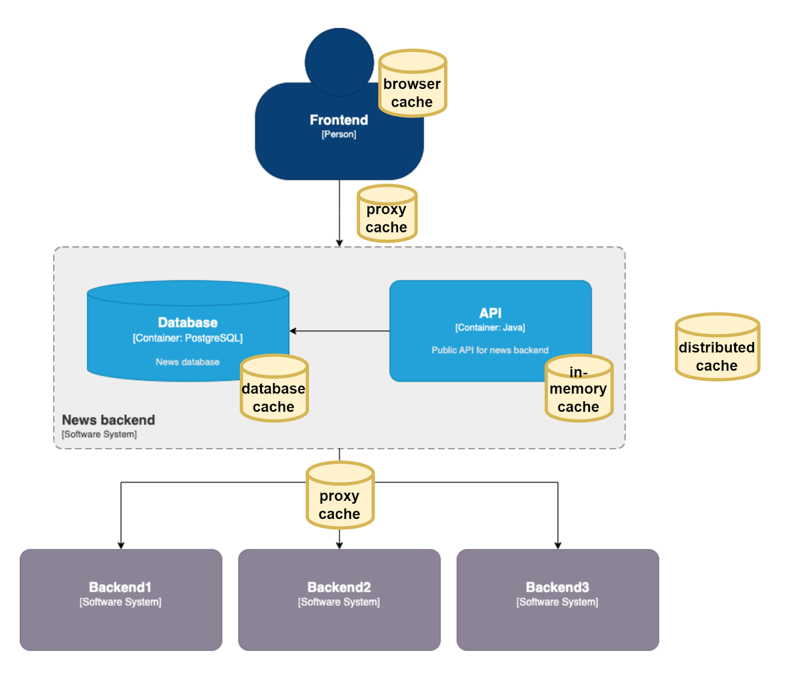

**Рис. 4** ―  Классификация кэширования по месту расположения

**По порядку вытеснения кэша**

1. Вытеснение давно неиспользуемых записей кэша (LRU, Least Recently Used). Из кэша вытесняются те записи, которые давно не использовались.
2. Вытеснение редко используемых записей кэша (LFU, Least Frequently Used). Из кэша вытесняются те записи, которые используются реже всего.
3. Вытеснение недавно использованных записей кэша (MRU, Most Recently Used). Из кэша вытесняются последние использованные записи.

**По порядку взаимодействия с кэшем**

1. Кэширование на стороне (Cache\-Aside). Подход, при котором приложение обращается в кэш, и если данные есть в кэше, то используются кэшированные данные. Если данных в кэше нет ― приложение делает запрос к основному хранилищу.
2. Сквозная запись (Write\-Through). Подход, при котором данные записываются одновременно в кэш и в основное хранилище данных.
3. Write\-Behind. Подход, при котором сначала обновляется кэш, а потом ― основное хранилище данных.
4. Сквозное чтение (Read\-Through). Подход, на первый взгляд похожий на кэширование на стороне: если данных в кэше нет, то данные берутся из базы данных. Важное отличие: координация запросов в базу происходит на стороне кэша, а не приложения.
5. Упреждающее чтение (Read\-Ahead). Подход, при котором данные помещаются в кэш на основе предположения о том, какие данные будут запрошены следующими.

## Пример приложения с кэшем

### Архитектура приложения

Рассмотрим, как можно спроектировать кэш на уровне приложения на примере нашего новостного сайта. 

**Шаг 1\. Добавляем кэш в памяти приложения (in\-memory cache)**

Самое простое решение ―  реализовать хранение кэша в памяти приложения. При запросе с фронтенда приложение будет обращаться сначала в хранилище кэша. Если кэша в хранилище нет, то приложение будет обращаться в основную базу данных и сохранять данные в кэше. 

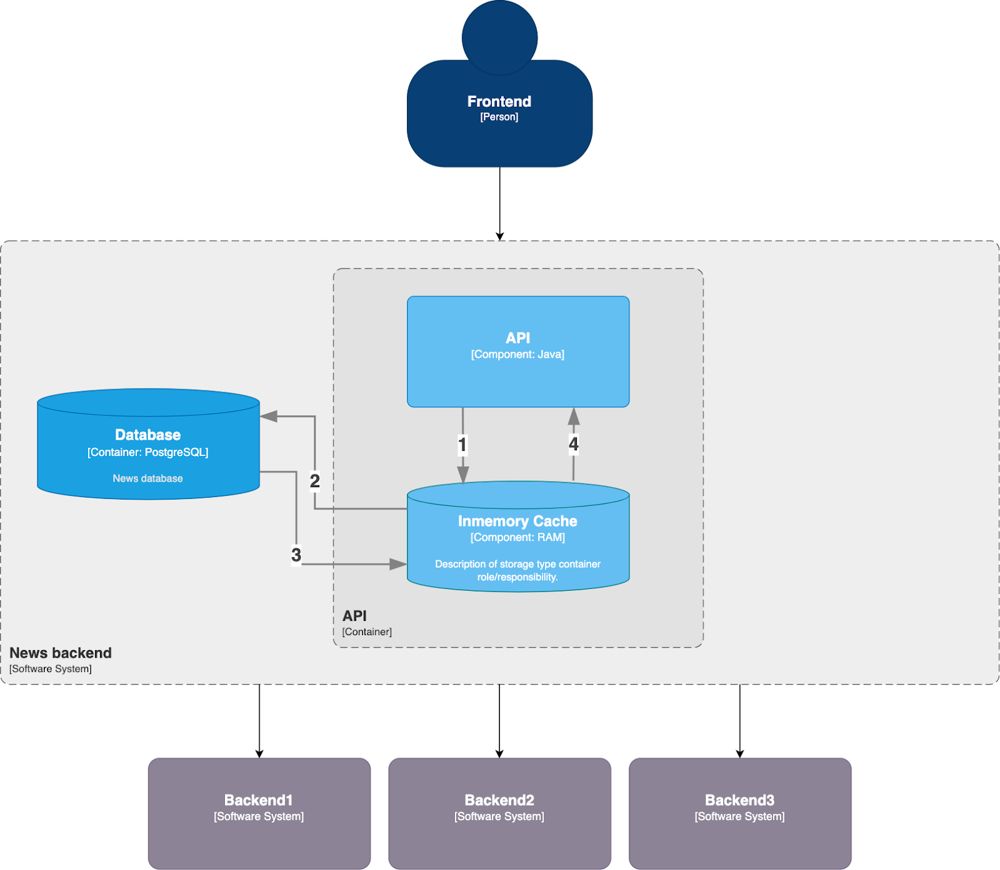

**Рис. 5**  ― Архитектура приложения  с кэшем в памяти приложения

**Шаг 2\. Добавляем распределенный кэш**

Наш новостной сайт имеет одну важную особенность: новости для всех пользователей отображаются одинаковые. Это позволяет нам реализовать распределённый кэш (например в Redis). Так одна нода приложения сможет записывать новости в кэш, а другие ―  читать.

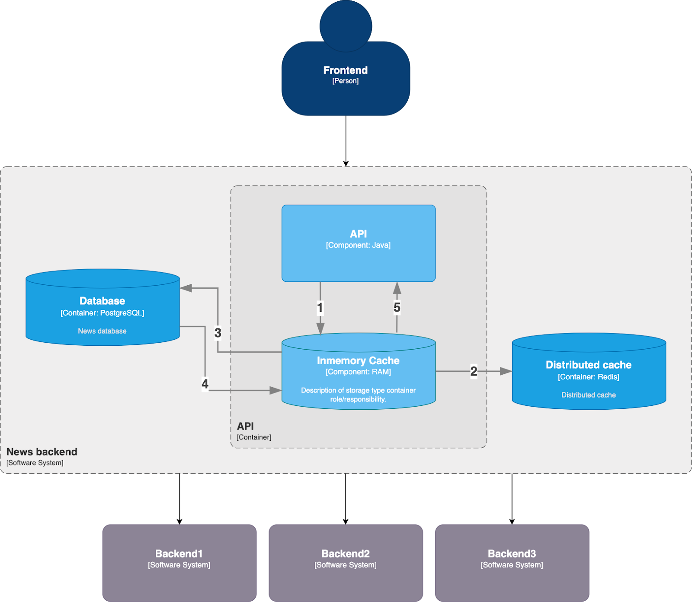

**Рис. 6**  ― Архитектура приложения с кэшем в памяти приложения и распределённым кэшем

### В каком виде данные хранятся в кэше

Каждая запись в кэше содержит три поля.

1. **Ключ** (Key). Обычно ключом является кортеж (структура данных) из параметров запроса или параметров базы данных.
2. **Значение** (Value). Это сами данные, например, содержимое новости.
3. **Время жизни** (Time To Live). Это «срок годности» записи ― время, через которое запись нужно обновить или удалить.

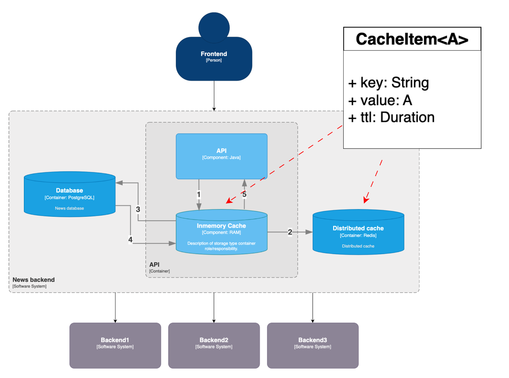

**Рис. 7**  ― Структура записи кэша

### Как оценить эффективность внедрения кэширования

Реализовать кэширование само по себе недостаточно. Необходимо также оценить, насколько кэширование эффективно работает. Для этого можно реализовать **мониторинг**. 

Для мониторинга эффективности кэша можно использовать метрики.

1. Процент попадания (hitrate или hit ratio). Метрика говорит о том, сколько запросов в процентном выражении получают ответы из кэша и какой ―  из базы данных. Чем большее количество запросов получают данные из кэша, тем лучше.  
  
Процент попадания (hitrate) \= Количество попаданий в кэш / (Количество попаданий в кэш \+ количество промахов)
2. Сравнение количества элементов в кэше с количеством данных в исходном хранилище. Например, если количество пользователей увеличилось на 10%, а кэш пользователей увеличился в 2 раза ―  это может быть показателем того, что используется некорректный ключ кэширования.
3. Размер записи кэша в байтах (средний размер, расчет перцентилей размера). Метрика позволяет определить ситуации, когда запись содержит больше данных чем нужно.
4. Количество записей, вытесняемых из кэша в секунду (evictions). Высокое количество может говорить о том, что размер кэша слишком маленький или о том, что выбран неэффективный ключ кэширования.
5. Задержка получения данных из кэша (latency) ― время, нужное на получение данных из кэша. Задержка получения данных из кэша должна быть меньше задержки получения данных из оригинального источника.
6. Количество ошибок получения данных из кэша в секунду. Метрика позволяет детектировать сбои на системах кэширования.

## С какими проблемами можно столкнуться при реализации кэширования и как их решить

Важно понимать, что хотя кэширование ускоряет работу приложения, оно также усложняет его и может вызывать различные проблемы и даже ухудшать производительности приложения при неправильном подходе.

Рассмотрим некоторые проблемы, с которыми можно столкнуться при реализации кэширования.

### Дублирование запросов в полете

Такая проблема возникает, когда:

* с минимальной разницей во времени поступают одинаковые запросы;
* нужных данных нет в кэше.

Так одинаковые запросы одновременно начинают нагружать базу данных. 

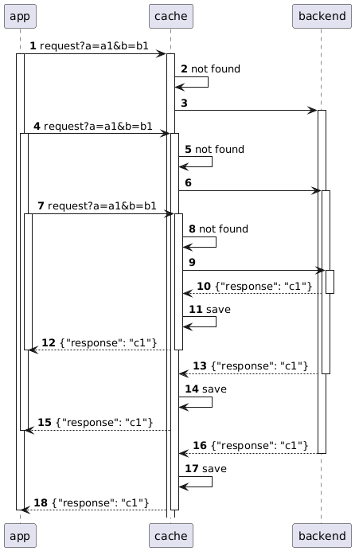

**Рис. 8**  ― Дублирование запросов в полете

Для решения проблемы можно использовать **паттерн singleflight**. Паттерн предполагает реализацию дополнительной функции, которая будет по некоторому набору параметров дедуплицировать запросы (устранять дубли).

Паттерн может применяться как к HTTP\-запросам, так и к запросам к базе данных.

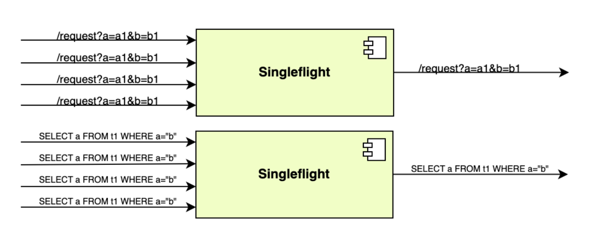

**Рис. 9**  ― Паттерн singleflight

При применении паттерна уже перед началом запроса сохраняется факт того, что запрос по какому\-то ключу находится в полете. Так дублирующие запросы в кэш не будут запускать новые запросы в основной источник, а будут дожидаться ответа на самый первый запрос.

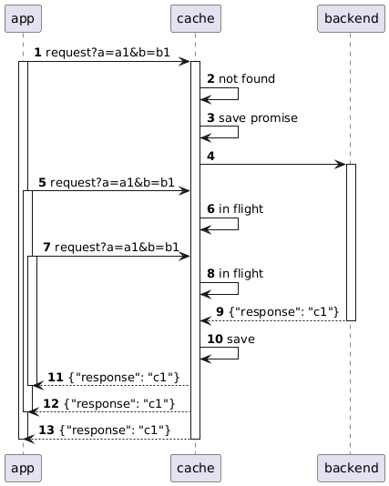

**Рис.10**  ―  Дедупликация запросов с помощью паттерна singleflight

Так как на нашем сайте все новости одинаковые, то ожидается много параллельных одинаковых запросов на открытие страницы с новостью. При таких условиях применение паттерна singleflight может давать до 50% hitrate, то есть снизить нагрузку в 2 раза.

### Недоступность данных во время сбоя

Такая проблема возникает, когда:

* свежих данных для запроса нет в кэше;
* основной источник данных по каким\-то причинам недоступен и не отвечает на запросы.

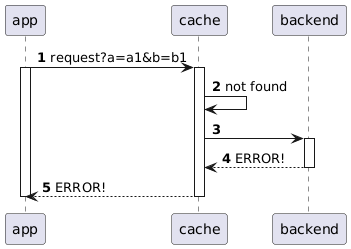

**Рис. 11** ―  Недоступность данных во время сбоя

Пользователь увидит в приложении ошибку. Во многих случаях пользователю не обязательно видеть самые свежие данные, можно показать устаревшие с пояснением. Например, на нашем новостном сайте тексты новостей меняются не часто, лучше показать новость без последних правок, чем ошибку. Для таких случаев бывает полезно иметь альтернативный источник данных. Этот паттерн называется **fallback**. 

Часто для реализации паттерна fallback используется подход **fallback cache**. Fallback cache ― это дополнительный кэш, в котором последний успешный ответ от основного источника хранятся намного дольше, чем в основном кэше. 

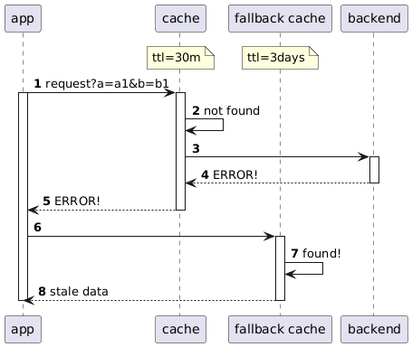

**Рис. 12** ― Fallback cache

Из этого дополнительного кэша данные берутся только в случаях, когда недоступны и свежий кэш и основной источник данных. Важно, что сохранение данных во второй кэш происходит при каждом получении свежих данных от бэкенда. 

Паттерн fallback cache можно реализовать и другим способом: объединить два кэша в один.

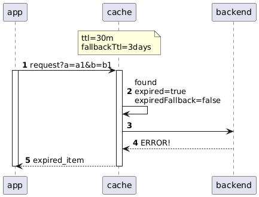

**Рис.13** ―  Реализация паттерна fallback cache с объединением кэшей

Вместо одного TTL (Time To Live) можно хранить два значения. Первое ― время, в течение которого данные кэша валидны для обычного использования, второе ―  время, в течение которого кэш можно использовать как дополнительный, когда не отвечает бэкенд.  

### Таймауты мешают наполнению кэша

Иногда таймауты могут мешать наполнению кэша. Проблема возникает, когда:

* при обращении приложения за кэшем, данных в кэше нет;
* бэкенд ответил таймаутом на запрос, но через время ответил данными;
* кэш не дождался ответа от бэкенда.

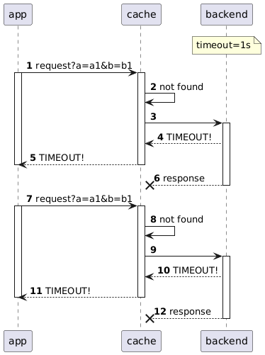

**Рис. 14** ― Таймауты мешают наполнению кэша

Со временем это может привести к тому, что все данные кэша перестанут быть актуальными. Это вызовет повышение нагрузки на бэкенд и только усугубит сбой, который привел к первоначальному повышению времени ответа. 

Часто эту проблему решают простым увеличением таймаута. Но бывают ситуации, в которых предпочтительнее не показать какую\-то отдельную информацию, чем замедлить загрузку приложения полностью. В таких ситуациях решить проблему можно добавлением еще одного таймаута между приложением и кэшем.

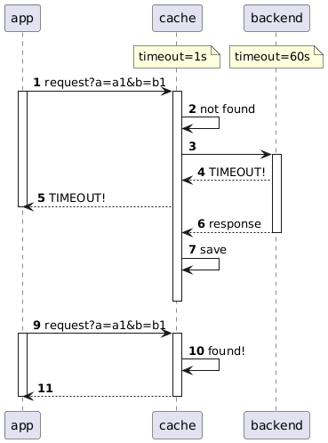

**Рис. 15** ―  Добавление второго таймаута

Таймаут между приложением и кэшем должен быть маленьким, чтобы приложение не ждало данные слишком долго. Но между кэшем и бэкендом необходимо установить увеличенный таймаут, чтобы механизм кэширования дожидался данных максимально долго и кэш мог наполняться в фоне.

### Объединяем паттерны

Все описанные паттерны можно объединить в общий механизм. 

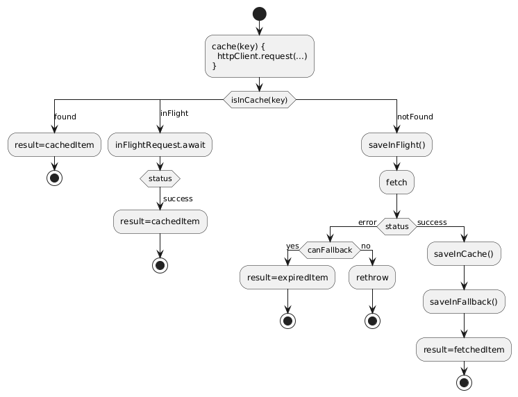

**Рис. 16** ― Кэширование с применением различных паттернов

Как будет работать такой механизм: 

1. Приложение обращается в кэш за данными.
2. Если данные есть в кэше, то приложение отображает данные кэша.
3. Если запрос сейчас в полёте, дожидаемся ответа от бэкенда (паттерн singleflight). Если данные получены из бэкенда ― то отдаём данные в приложение. Если получена ошибка, то пытаемся получить дополнительный кэш или откатиться на предыдущую версию кэша (паттерн fallback cache).
4. Если данных нет, то отправляем запрос в бэкенд и отмечаем, что запрос сейчас в полёте. Если данные получены, то сохраняем данные в кэш и отдаём в приложение. Если получена ошибка ― то пытаемся получить дополнительный кэш или откатиться на предыдущую версию элемента кэша (паттерн fallback cache).

Важно, что приведенная схема будет эффективно работать только при нагрузке определённого характера. В каждой системе кэширование необходимо проектировать с нуля, учитывая особенности пользовательского поведения и структуры данных.

## Резюме

1. Кэширование ― важная практика в проектировании высоконагруженных ИТ\-систем. Кэширование позволяет увеличить производительность веб\-приложений и выдерживать пиковые нагрузки.
2. Кэширование ―  одна из сложнейших задач в разработке ИТ\-систем. Подходов к кэшированию очень много, подбирать необходимо исходя из задачи, пользовательского поведения, структуры данных.
3. Оценка эффективности кэширования строится на мониторинге метрики hitrate, задержки получения данных, объёма записей кэша и других.
4. Кэширование может принести не только пользу, но и проблемы. Для разрешения проблем кэширования можно применять различные паттерны и подходы.

### Автор статьи — Дмитрий Пахомов

ИТ\-архитектор с опытом работы более 10 лет.

Работает с высоконагруженными системами в финтехе.

