# Собираем сетевое хранилище (NAS) XPenology
Привет! С вами снова Александр, DevOps из Банки.ру. Прошлая статья «[Домашний сервер на базе Proxmox](https://habr.com/ru/companies/banki/articles/827760/)» вызвала интерес сообщества и бурное обсуждение в комментариях. 

Сегодня продолжу тему и расскажу о сборке NAS (Network Attached Storage) своими руками из доступного сейчас железа. Остановлюсь на процессе выбора, покупках, ориентировочной цене общей сборки на данный момент. 

### Что такое NAS и для чего нужно такое сетевое хранилище

NAS — это сетевое хранилище данных. Оно представляет собой устройство, которое подключается к сети для обеспечения общего доступа к файлам и данных нескольким пользователям или устройствам. В отличие от традиционных серверов, NAS предназначен исключительно для хранения и управления данными. Обычно такие устройства имеют простую настройку, поддерживают различные протоколы доступа к файлам (например, SMB, NFS, FTP) и могут использоваться как для личных нужд (например, домашние медиасерверы), так и в корпоративных средах для хранения резервных копий, архивов или распределенных файлов.

Перечислю, для чего вам может понадобиться NAS: 

* Сделать личный аналог Google Drive с возможной синхронизацией с ПК и мобильными устройствами.
* Развернуть личный репозиторий образов docker под названием Harbor (который прекрасно используется в рабочих задачах внутри Банки.ру). Опять же, вспоминаем [прецедент с Docker Hub](https://habr.com/ru/news/818177/).
* Хранить файлы: видео, аудио, фотоархив.
* Настроить домашнюю качалку торрентов: закинул, настроил расписание на загрузку по ночам, получил нужные файлы.
* Медиацентр. Скачанные и хранимые фото/видео/аудиофайлы можно транслировать на телевизор, подключенный к домашней сети.
* NFS для Proxmox/Kubernetes. Выбранная мной ОС для NAS умеет из «коробки» в Minio S3, которое можно в итоге подключить к k8s.

### Как я пришел к решению самостоятельно собрать NAS

Итак, немного предыстории. После блокировки Docker Hub и анонсирования санкций с 12 сентября я всерьёз задумался о приобретении NAS для хранения личных файлов. Я достаточно активно пользуюсь OneDrive от Microsoft (мои заметки из Obsidian синхронизируются именного через него), плюс храню в нём коллекцию документации и книг для работы. 

Просмотрев доступные на российском рынке варианты, я наткнулся на TerraMaster f\-424 (4 ядра/4 потока, 8 гигабайт оперативной памяти и 4 слота под HDD). Примерная цена на момент написания статьи \~625 долларов (около 60 т. р.). 

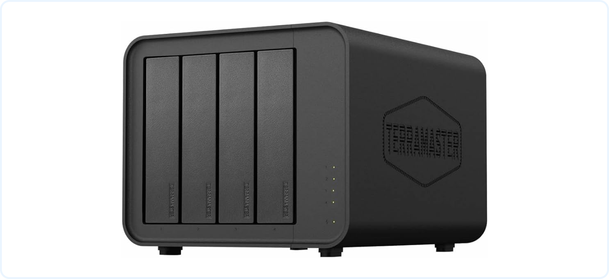Немного огорчившись из\-за цены, продолжил поиски. В какой\-то момент алгоритмы маркетплейсов поняли, что я ищу что\-то связанное с NAS, и предложили ЕГО. Это был корпус Jonsbo N2 с возможностью установки пяти 3,5\-дюймовых дисков и одного диска под 2,5\. 

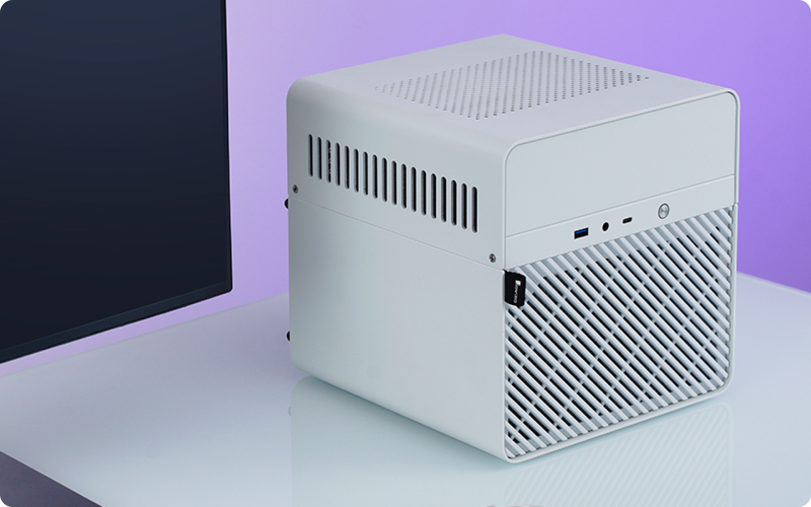

JONSBO N2 корпус ITX NAS сервер домашний офис хранилище 5 \+ 1 жесткий диск выдвижной ящик горячий разъем для ПК игры Алюминиевый Мини компьютер \| AliExpress

В этот момент у меня традиционно промелькнула мысль «А почему бы не собрать все самому»? Так начался поиск железа. 

Сразу хочу отметить, что изначально я хотел получить компактный NAS с более или менее современным железом, поэтому описанное далее — мой вариант сборки. При желании вы можете собрать что\-то подобное и на старом офисном железе.

### Выбор и примерная стоимость “конструктора”

Для основы я взял тот самый корпус от Jonsbo. Далее нужно было выбрать материнскую плату. При выборе для меня было приоритетом найти баланс между характеристиками железа и его стоимостью. Мой выбор пал на BKHD 1264 NAS с ориентировочной стоимостью в 12 тысяч (вот тут [ссылка на неё и её спецификацию на сайте производителя](https://www.bkipc.com/en/product/1264-NAS-MB.html)) и следующими характеристиками:

* Процессор Intel n100 — 4 ядра 4 потока.
* 6 SATA портов и 2 m2 разъёма.
* Слот PCI\-e, позволяющий добавить платы расширения по типу сетевых карт, а может, даже и видеокарт.
* 4 сетевых адаптера со скоростью 2,5 Gb/s.
* Возможность питания от 24 pin коннектора (по факту — от обычного БП).
* Формфактор: mITX, который подходит к корпусу.


Материнская плата SZBOX 1264\-NAS N100 4 \* I226 2,5G LAN DDR5 4800 МГц макс. поддержка 16G двойной дисплей M2 SSD NVME/NGFF PCIE1X \+ 6 \* SATA \| AliExpress

Заказав материнскую плату, начал искать блок питания. В Jonsbo N2 нужен SFX БП (маленького размера) с двумя MOLEX\-разъемами, что крайне важно, так как на плате в корпусе, куда вставляются HDD, 2 разъёма MOLEX для питания дисков.

Сама плата для дисков выглядит вот таким образом: 

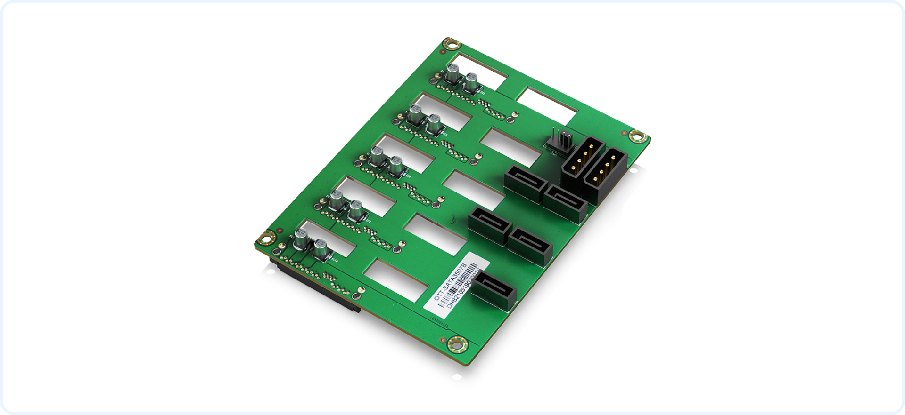Я выбрал 450\-ваттный (да, возможно, перебор, но на мой взгляд, это подходящий блок по соотношению цена — качество) блок питания от Chieftec (BFX\-450BS SFX), который как раз имел 2 MOLEX разъёма и сертификат 80 Bronze Plus.

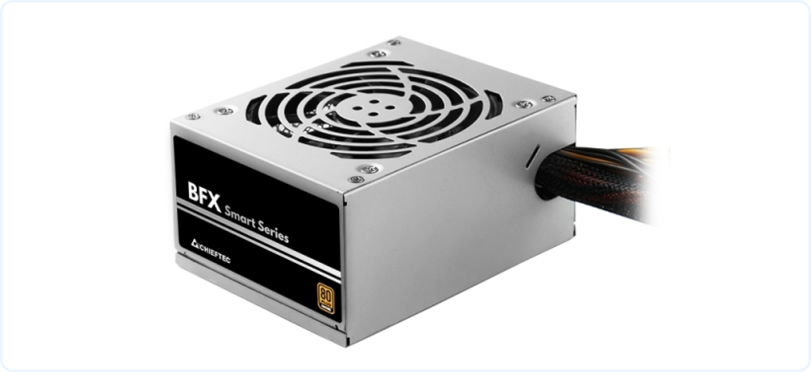По факту для первого запуска не хватает только оперативной памяти и накопителя. Оперативную память SO\-DIMM DDR5 я нашёл на Авито. 

«Почему Авито?» — спросите вы. Всё просто. Сейчас новые ноутбуки приходят в основном с 16 гигабайтами (2 планки по 8 гигов) DDR5 памяти. Если ноутбук на интегрированной графике, то в играх и рабочих задачах с упором на графику этой памяти ему становился мало, так как она делится ещё и на видеопамять. В итоге владельцы новых ноутбуков часто меняют комплект памяти на 32 гигабайта и более. Так что практически новые плашки по 8 гигабайт зачастую идут на Авито по цене «лишь бы забрали». Так, плашку 8 гигабайт SO\-DIMM DDR5 я приобрёл за смешные 1250 рублей.

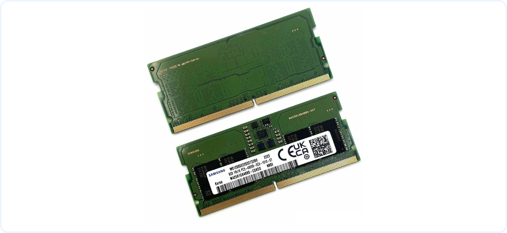Остаётся вопрос по накопителю. Во многих гайдах на сборку NAS используют флешку, на которой записан загрузчик и операционная система для NAS. Даже на моей материнской плате есть usb 2\.0 для таких целей. Но загрузка с флешки медленнее, к тому же такой вариант мне показался ненадежным. Так как в корпусе есть 5 слотов под HDD 3,5 дюйма и 1 под 2,5\-дюймовые SSD/HDD, а на плате 6 SATA портов, пришел к другому решению и приобрел SATA SSD Apacer на 120 гигабайт. SSD приобретался для быстрой загрузки, так как загрузка с USB флешки медленее, а сама цена за хорошую флешку сопоставима с ценой этого диска.

Итак, подведу промежуточный итог по стоимости железа для такой сборки без учёта HDD:

* Корпус Jonsbo n2\. 9861 рублей.
* Материнская плата ITX BKHD 1264 NAS. 11654 рубля.
* Блок питания Chieftec (BFX\-450BS SFX). 4667 рублей.
* Оперативная память Samsung SO\-DIMM DDR5 8 ГБ. 1250 рублей.
* SSD диск Apacer AS340X. 1450 рублей в DNS.

Итоговая сумма получилась 27 432 рубля — в 2 раза дешевле, чем тот же TerraMaster f\-424 (при схожих характеристиках) , при этом мой вариант не состоит из экзотического железа, любой компонент можно легко поменять.  

### Сборка и установка XPenology

Получив все компоненты, приступаем к сборке. В сборке нет ничего особенного и инструкцию можно найти на любом видеохостинге, указав название корпуса. На мой взгляд, очень хорошая инструкция у [зарубежного коллеги, который подробно собирает подобный NAS](https://www.youtube.com/watch?v=C6hf3ddtNCs).

Добавлю мои замечания по корпусу и сборке:

**Первый момент.** На той плате, что я приобрёл, нет портов под usb type\-C и usb 3\.0, а вот на фронтальной панели корпуса есть. И тут начинается выбор: либо бросить провода с фронтальной панели и не подключать их, используя порты с материнской платы, либо искать переходники с usb 2\.0 на usb\-C и usb 3\.0\. В итоге я приобрёл переходник с usb 2 на usb 3 за 272 рубля, который медленно, но задействует порт usb на фронтальной панели, оставив usb\-c нерабочим.

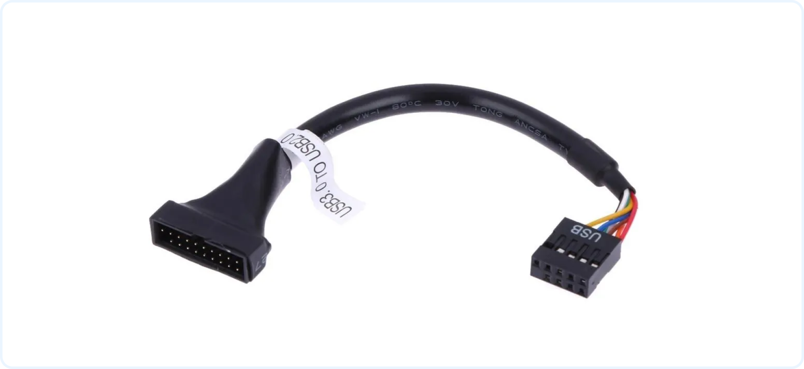**Второй момент.** К сожалению, комплектный 120 мм вентилятор, который охлаждает секцию с HDD, достаточно громкий. Я попытался заменить его на тихий ID\-Cooling TF\-12015\-W, но эксперимент был не очень успешным. Да, стало тише, но о том, чтобы поставить его рядом на рабочий стол, и речи быть не может. Происходит это потому, что вентилятор закрыт с двух сторон сеткой, проходящий через неё воздух издаёт шум. В результате заменил на крупные решётки для 120 мм вентиляторов. Из дополнительных решений, которые я находил в сети, была замена вентилятора на дорогой Noctua подходящих размеров. Но при стоимости конфигурации в 27к, мне показалось нелогичным отдавать 3\-4к за вентилятор. Дополню одним моментом. Вентилятор можно установить не вовнутрь корпуса, как было с завода, а повернуть его и прикрутить на штатные крепления снаружи. Будет чуток выпирать, но это не критично. Плюс под сам NAS можно подложить мягкий предмет для снижения шума от резонанса с поверхностью.

**Железо собрано, теперь будем устанавливать XPenology.**

XPenology — это операционная система от Synology NAS, установленная на обычное компьютерное железо. 

1. Скачиваем загрузчик XPenology, ARC loader. Идём на [GitHub и качаем файл, который заканчивается на \*.img.zip](https://github.com/AuxXxilium/arc/releases/tag/24.7.14).
2. Запоминаем этот код — он понадобится нам для разблокировки функционала загрузчика: 4ME3P7\. Этот код уникален и подходит только к версии загрузчика 24\.7\.14, ссылку на который я дал выше. Если вы качаете последнюю версию, то добро пожаловать в [Discord разработчика](https://discord.com/invite/auxxxilium), где, следуя инструкциям, вы можете получить свежий код разблокировки для последней версии загрузчика. На сколько я понял, на каждый новый релиз будет новый код разблокировки.
3. Распаковываем архив и записываем образ на SSD. Для этого будем использовать Rufus. В варианте с SSD на данном этапе вам понадобится переходник SATA\-USB для подключения SSD к ПК. Подключаем носитель, который выбрали к ПК, и запускаем Rufus. Выбираем распакованный файл загрузчика и запускаем запись образа на носитель.

У меня это выглядит вот так:

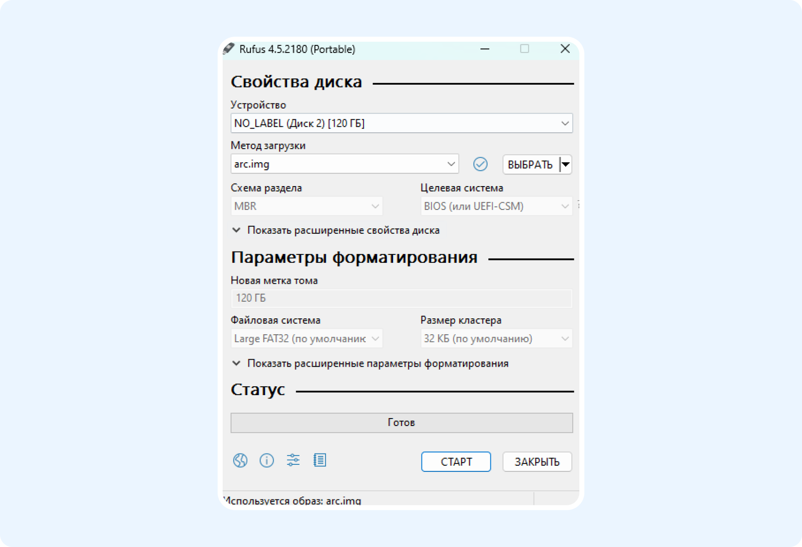4. Извлекаем и подключаем носитель к материнской плате. Я подключаю по SATA. При варианте с флешкой на самой плате в районе SATA портов есть usb 2\.0 порт — можно подключится туда.

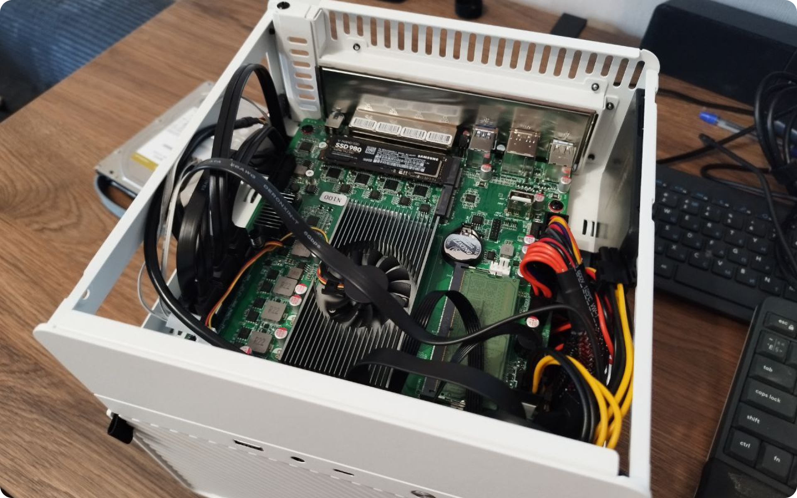Прикладываю фото перед закрытием крышки. M2 диск от Samsung пригодится далее. Хочу отметить, что из\-за малых размеров очень трудно красиво и практично уложить кабели, в итоге все равно получится неаккуратная лапша, как ни старайся.  

Среди требований ARC loader — наличие HDD диска в одном из слотов. Без этого не запускается операционка. У меня завалялся WD Black на 500 ГБ. На фото он уже в специальных демпферах от Jonsbo (комплектные с корпусом). 

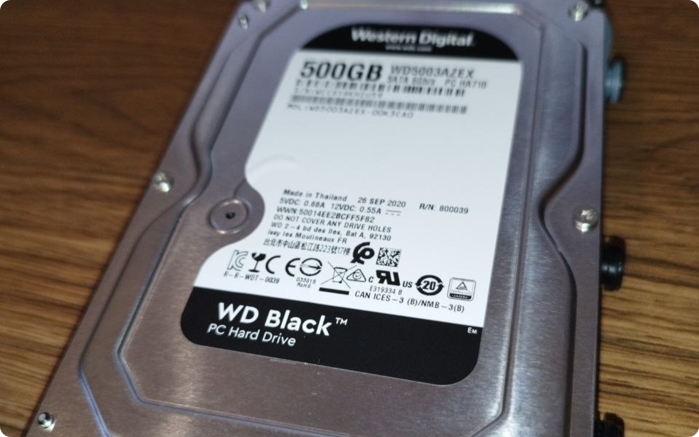Дополнительно я добавил старый HDD на 1ТБ от Seagate и SSD на 512 ГБ, которые были у меня в наличии. 

На фото видим проблему: 2,5\-дюймовый SSD по факту висит в SATA слоте. Из идей, как такое исправить — приобрести специальные салазки\-переходники с 2,5 на 3,5 дюйма. 

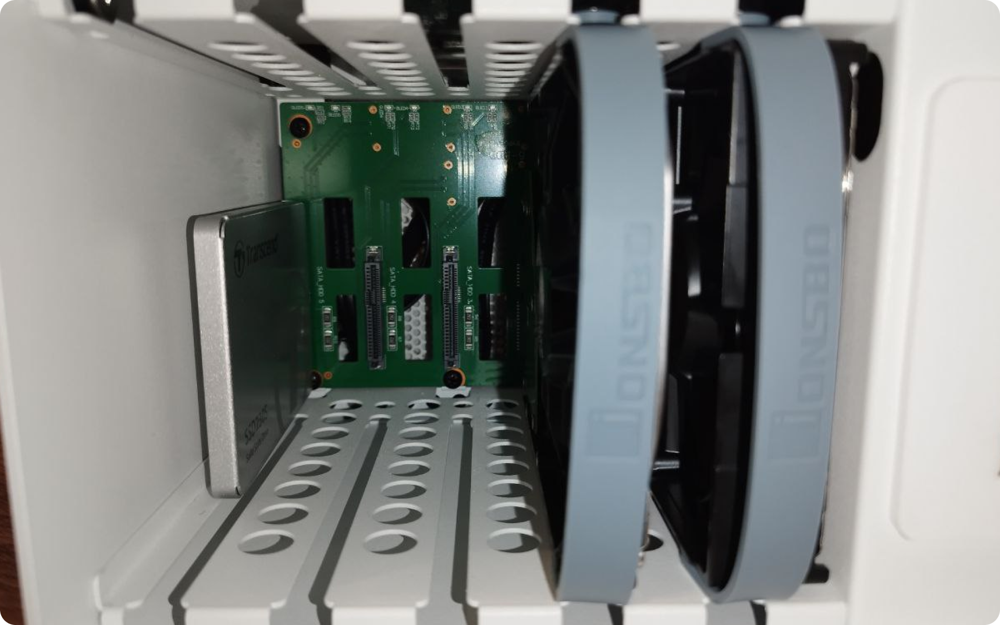Со временем нашёл салазки на Али, выглядят вот так: 

5. Подключаем питание и патч\-корд к нашему NAS и запускаем. На материнской плате стоит автоматическая загрузка с доступного загрузочного носителя, так что не обязательно заходить в bios. А ещё после старта загрузчика с носителя он запускает веб\-сервер и установку можно продолжать через браузер, что позволяет нам установить XPenology без подключения монитора.

Очень важно, чтобы ваше сетевое оборудование, куда подключён NAS, раздавало IP адрес по DHCP. Выданный адрес смотрите на вашем роутере. 

* Заходим по следующему адресу [http://IP:7681](http://ip:7681) (у меня, например, выдало адрес [http://192\.168\.0\.10:7681/](http://192.168.0.10:7681/)) и видим такой интерфейс:

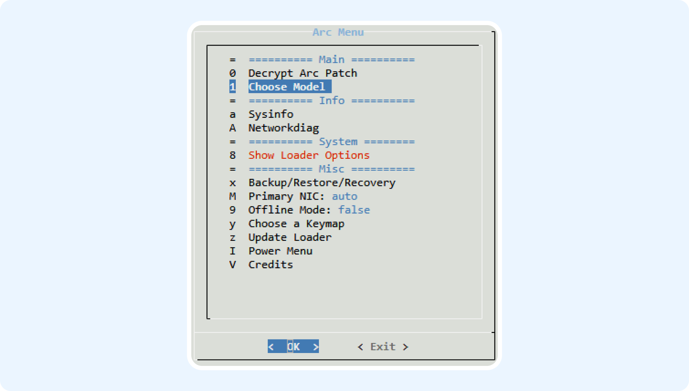* Здесь нас интересует пункт 0 Decrypt Arc Patch. Заходим и вводим ключ разблокировки патча: 4ME3P7\.

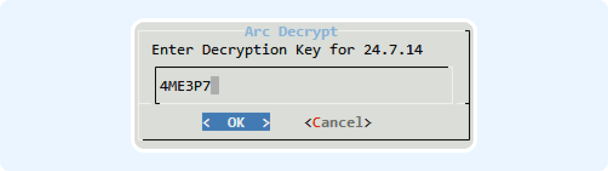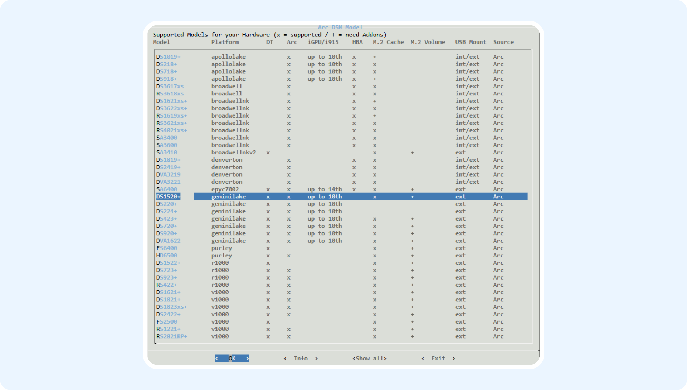* Далее мы снова попадаем в главное меню и выбираем пункт 1 Choose Model. Ищем подходящую модель Synology под наше железо. Я выбрал DS1520\+, так как она близка по характеристикам к нашему железу.

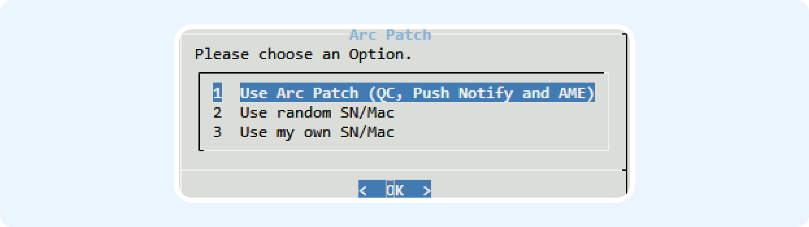* После выбора модели попадаем в меню выбора версии ОС для NAS. Я выбрал 7\.2 (самая последняя).
* В следующем меню у нас появляется выбор разблокировки функционала, ради чего мы вводили код ранее. Выбираем настройку, которая управляет частотой ЦПУ  


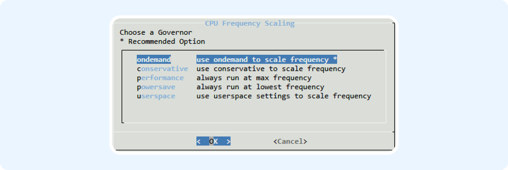
* И попадаем в меню аддонов. Для этой модели желательно выбрать следуюшие пункты (в дальнейшем можно загрузиться в ARC и добавить функционала из этого меню):

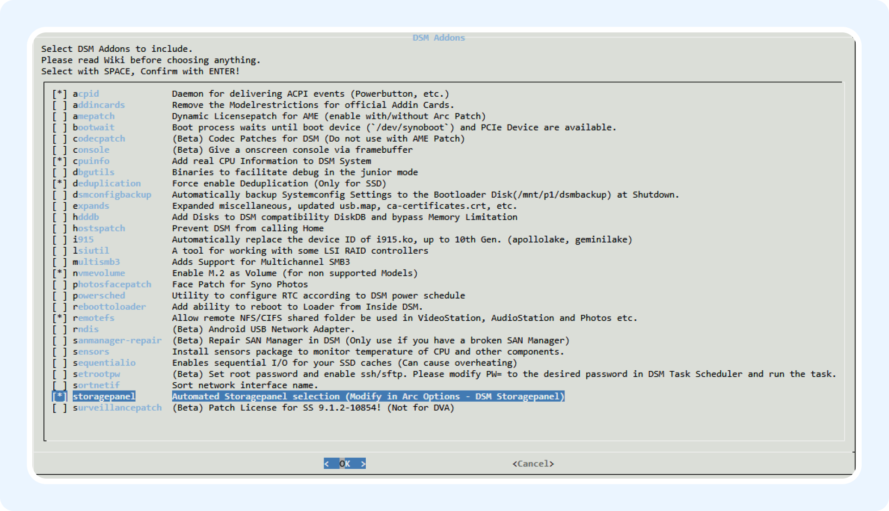Описание всех пунктов можно найти по [ссылке из Wiki](https://github.com/AuxXxilium/AuxXxilium/wiki). 

* В итоге загрузчик покажет информацию о выбранных аддонах и спросит о сборке. Я выбираю build now и попадаю в общую информацию о выбранных мною пунктах.

Окончательная сборка загрузчика на SSD заняла у меня буквально 10 секунд, после чего я получил вопрос о запуске системы и запустился. Чувствуется разница между флешкой и SSD диском: на диске я загрузился буквально за 30 секунд, а загрузка с флешки занимала 3ー4 минуты. 

Для поиска устройства в сети используем сайт [finds.synology.com](https://finds.synology.com/) — через некоторое время NAS будет найден в домашней сети.

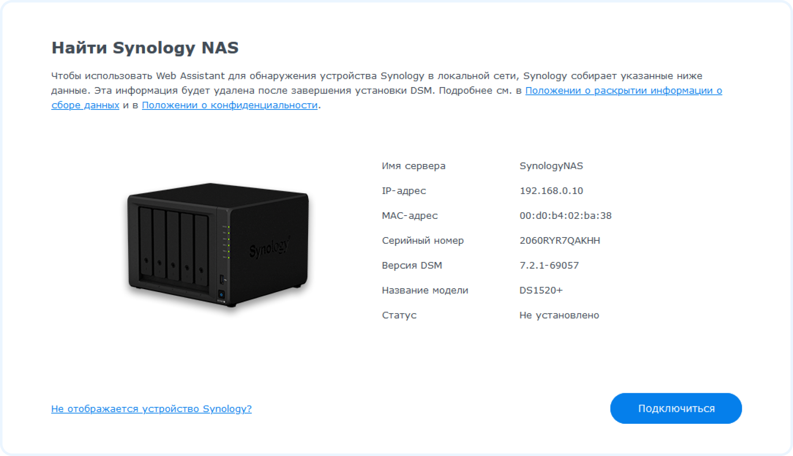* Далее идут вопросы про лицензионное соглашение и конфиденциальность (и, судя по всему, перезагрузка системы: сеть была недоступна примерно минуты две), после которых мы попадаем в меню настройки системы, где соглашаемся с загрузкой DSM (ОС для NAS) и форматированием установленных дисков. После этого видим кружочек с процентами установки, по окончании которой система перезагрузится.

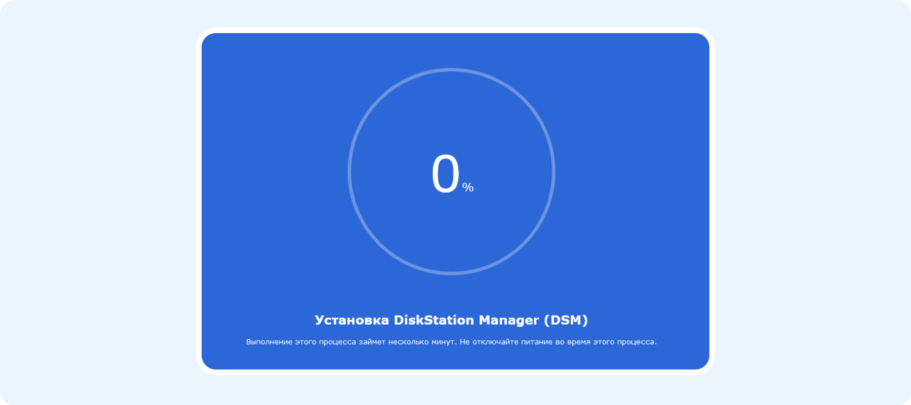* После перезагрузки мы дожидаемся запуска системы и видим меню первого запуска.

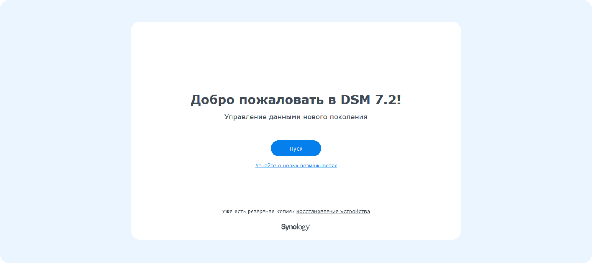* Задаём учётную запись, пароль и имя нашего устройства.

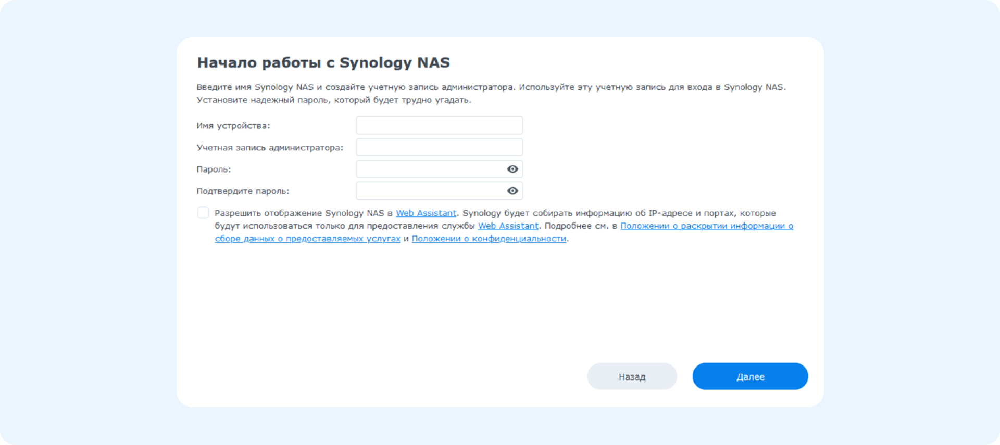Вспоминая последние инциденты с автоматическими обновлениям, я предпочёл только уведомлять меня об обновлениях, а не ставить их автоматически. У меня уже есть учетная запись Synology, так что я сразу захожу на этапе настройки. Если у вас ее нет — можете этот шаг пропустить. 

Создание QuickConnect тоже на ваше усмотрение. QuickConnect — это функционал доступа к вашему NAS из любой точки мира при условии наличия подключения устройства к интернету. 

После установки попадаем на рабочий стол нашего NAS. 

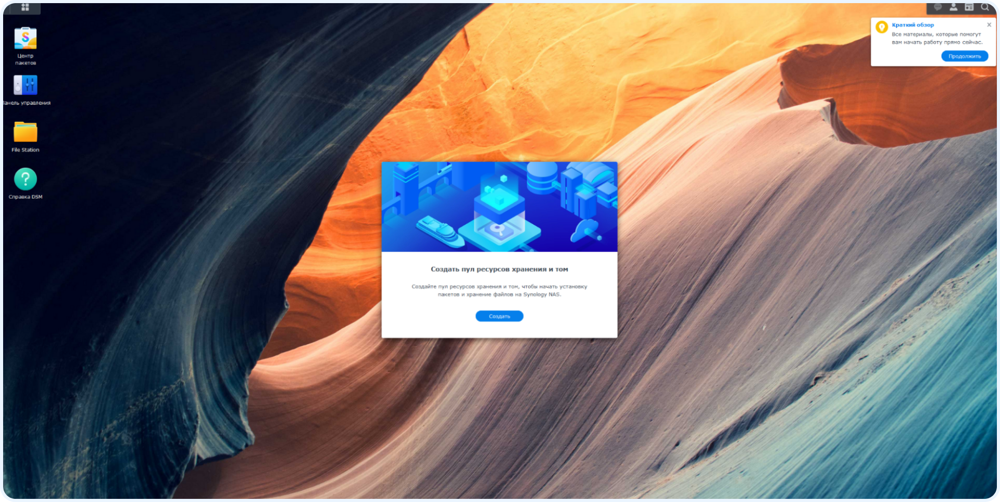Нам сразу предлагают установить базовый софт, а для этого нам нужно создать пул ресурсов. Поэтому соглашаемся и идём создавать первый массив. 

Так как у меня сейчас стоит 2 HDD разного объёма, я временно выберу RAID0\. 

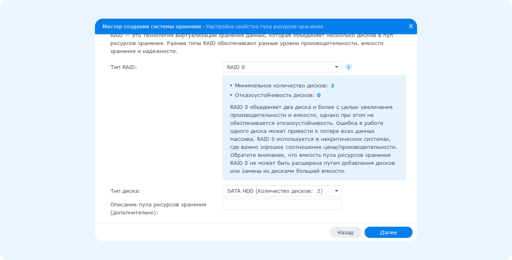Далее мы выбираем установленные HDD и ставим галочку «не проверять диски». Проверка может занимать достаточно долгое время и будет зависеть от объёма диска. А ОС сама пассивно проверяет состояние дисков и будет выдавать предупреждения о плохом состоянии. Выбираем максимальный объём, нам дают выбор файловой системы. Я выбрал «BTRFS по умолчанию» и «не шифровать диск». 

Завершаем создание пула ресурсов и видим следующее:

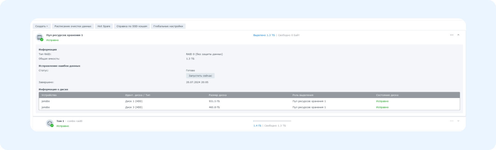Далее нас интересует Центр пакетов. На скриншоте ниже то, что у меня сейчас установлено.

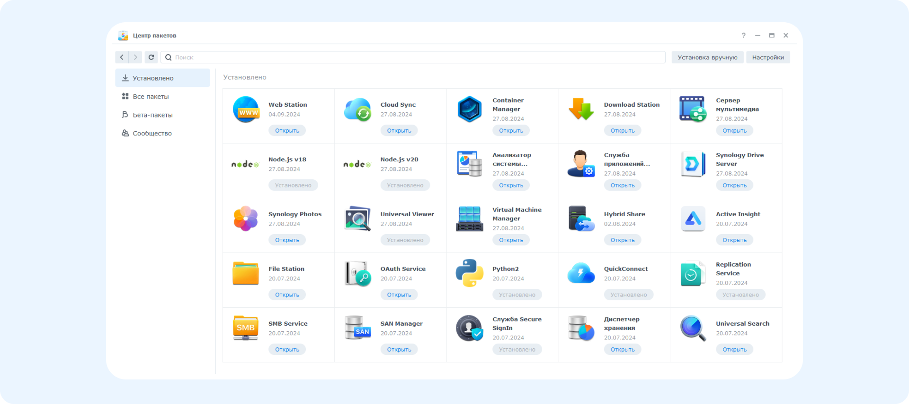За время опыта эксплуатации я выделил для себя следующие интересные пакеты:

* Container Manager. По факту, GUI для docker и docker\-compose. Очень полезная штука, чем\-то напоминает Portainer.
* Download Station — загрузчик файлов и torrent\-ов.
* Сервер мультимедиа — удобная вещь, которая позволяет проигрывать аудио/видеофайлы и просматривать фото по сети. Например, можно спокойно загрузить несколько сериалов через Download Station и просматривать их на Smart TV из самого NAS.
* Synology Photos и Synology Drive Server. Как раз те аналоги Google Фото и Google Drive. Есть клиенты на Android и Windows для синхронизации файлов.
* Cloud Sync. На момент написания статьи OneDrive и Google Drive ещё работают, а значит, можно подключиться к ним через приложение Cloud Sync. По факту Cloud Sync подключается к вашему облаку и закачивает в себя его бекап. При этом можно подключать несколько различных облаков по несколько аккаунтов с каждого (тут должна быть шутка про то, что бесплатные 15 гигабайт Google Drive при правильном менеджменте аккаунтов и папок можно расширить до пары терабайт через это приложение).

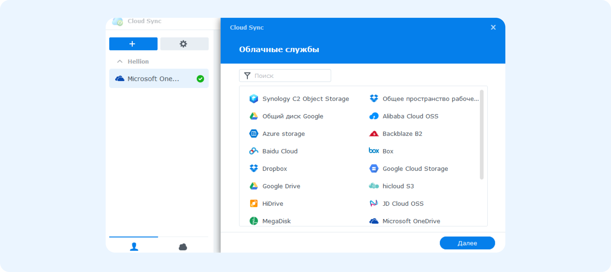**Траблшутинг проблем с пакетами Web Station и Virtual Machine Manage**

* Web Station. Почему\-то некорректно работал nginxproxymanager из docker\-compose (быстрый гайд по установке через Container Manager ниже). У меня получилось его запустить, получить SSL сертификат, но при проксировании на другие хосты в сети (в частности на хост Proxmox), меня постоянно выбрасывало на дефолтную страничку самого NAS. Вылечилось это просто удалением и установкой заново пакета Web Station.
* Virtual Machine Manager. В плане интерфейса пакет работает отлично, проблемы начинаются, когда запускаешь виртуальную машину. Виртуалка жутко тормозит и лагает, команда ls в alpine вводилась и отрабатывала около 5 секунд. В итоге я решил не мучать хранилку и запускать виртуалки в Proxmox с подключённым NFS диском. Возможно я неправильно выбрал дополнения в ARC Loader при установке. В целом, потеря не очень большая — Container Manager работает отлично.

За время тестирования я докупил ещё два WD Black на 500 гигабайт, что в целом позволило мне сделать RAID5 из Black\-ов. Диски были б/у, цена вопроса — 3 т. р. А терабайтный диск переехал под файлопомойку и обзавёлся SSD кешем в 256 гигабайт. В дальнейшем есть план приобрести парочку nvme дисков для кеша, так как тогда открывается возможность работы кеша на чтение и запись (сейчас идёт работа только на чтение). В итоге диски в диспетчере хранения выглядят вот так:

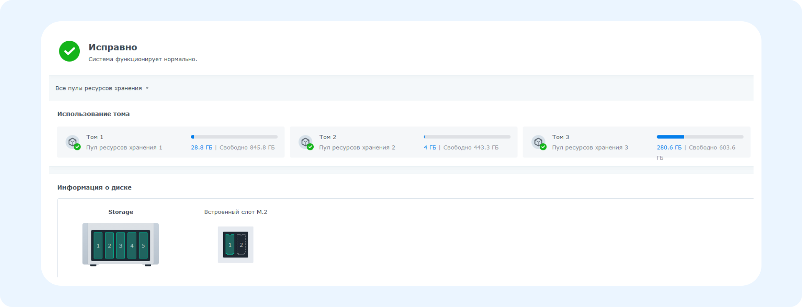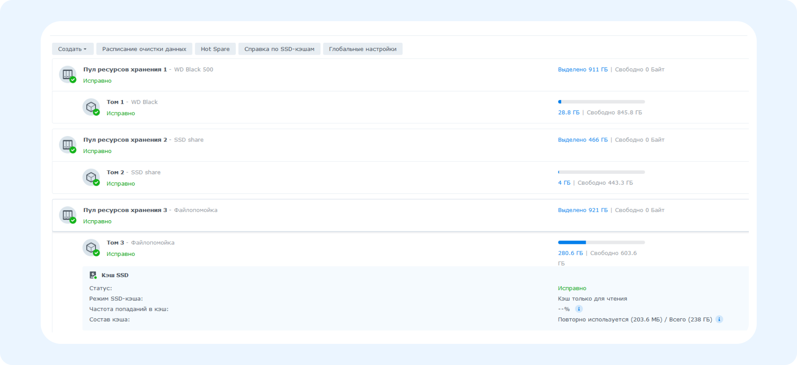Что в итоге получилось по дискам:

* Пул 1\. 3 диска WD Black по 500 гигабайт используются как RAID5 массив для личных файлов (семейные фото/видео, синхронизация важных файлов с ПК, синхронизация фото со смартфонов).
* Пул 2\. SATA SSD на 500 гигабайт для быстрой NFS шары к виртуалкам на Proxmox.
* Пул 3\. SATA Seagate с подключенным на 1 терабайт для NFS, торрентов и хранения неважных файлов. К этому пулу подключён nvme SSD для кеша на чтение, так как сервер мультимедиа постоянно вылетал на телевизоре. Установка кеша устранила частые вылеты.

### Связываем NAS с Proxmox

Итак, со сборкой, установкой, настройкой и использованием разобрались. Теперь свяжем наш NAS с Proxmox. 

* Для этого в NAS переходим Панель управления и создаём новую папку на одном из доступных томов, разрешаем чтение/запись вашему пользователю (для дома можно поставить галочки на чтение/запись и гостевому пользователю).

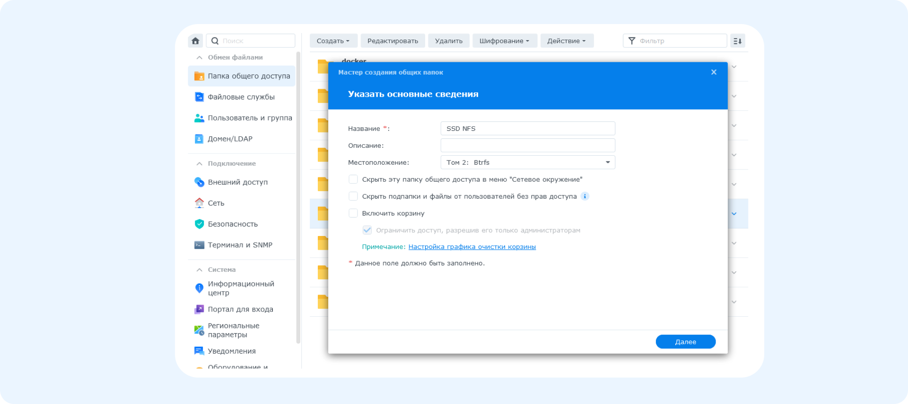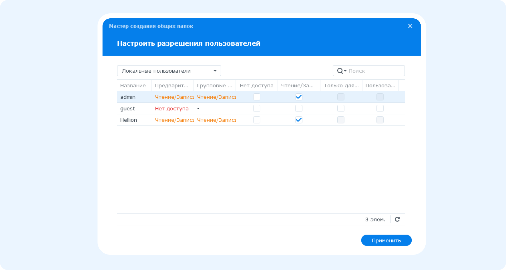* После создания папки редактируем её параметры, добавляя разрешения NFS (адрес 192\.168\.0\.100 это адрес моего Proxmox сервера).

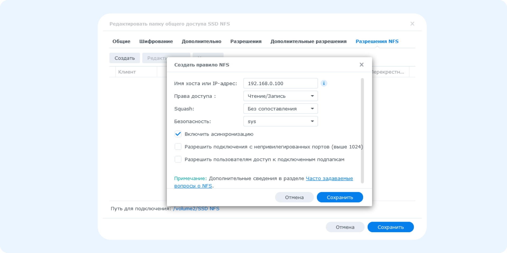* Далее переходим в Proxmox. В панели управления Proxmox выбираем Datacenter – Storage – Add – Add NFS.

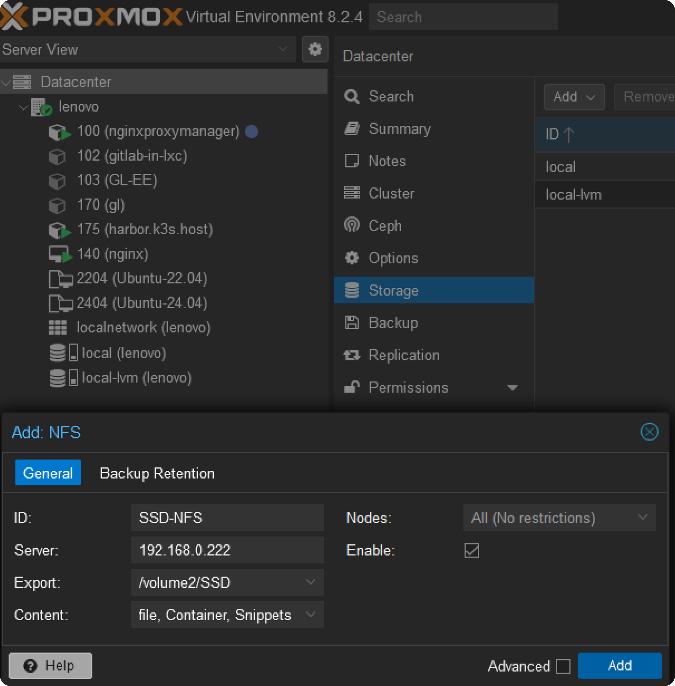(на скриншоте тестовые LXC контейнеры для будущих статей 🙂)

* В итоге NFS диск появится в списке дисков на ноде Proxmox.

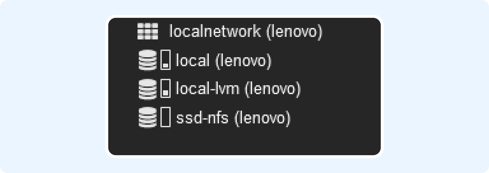В целом, это простенькая базовая настройка NFS дисков для Proxmox. В самом NAS можно ограничить размер NFS папок, добавить пользователей и разграничить права для них, добавить HDD NFS папки и тд тп.

**Бонус для тех, кто дочитал до конца**

Я выше упоминал про попытку запустить Nginx Proxy Manager в контейнере на XPenology. Так как у меня не получилось использовать NAS ещё и как гипервизор, то будем использовать его как платформу для запуска Docker контейнеров. 

Итак, быстрая инструкция по запуску NPM в XPenology:

* Нужно, чтобы Container Manager уже был установлен. Если нет — устанавливаем из центра пакетов.
* Нам нужно открыть 22\-й порт для SSH в панели управления. Делается это вот тут:

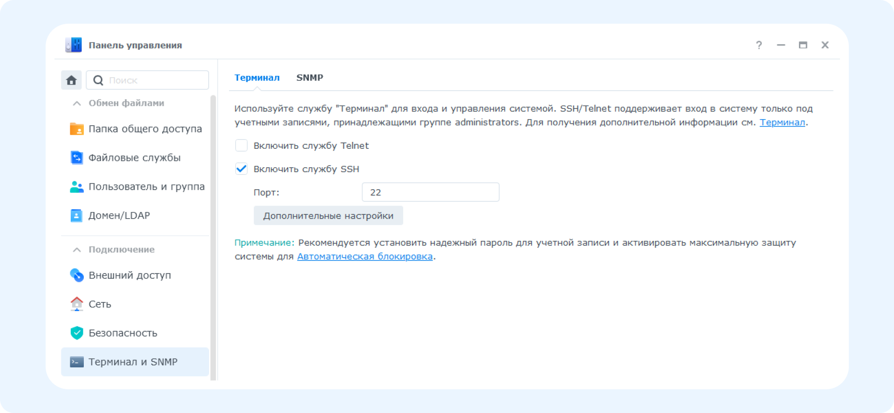* Заходим по SSH на наш NAS и вводим следующую команду:


```bash
sudo docker network create -d macvlan \

  --subnet=192.168.0.0/24 \

  --gateway=192.168.0.1 \

  -o parent=ovs_eth0 macvlan_network
```
Эта команда создаст macvlan сеть для подключения к вашей локальной сети напрямую. Подсеть и шлюз меняйте под свои. Рабочий сетевой интерфейс можно узнать через IP, но обычно это ovs\_eth0\. 

* Идём в File station и создаём вот такое дерево каталогов:

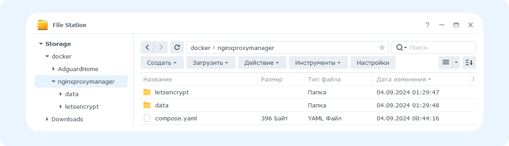* После переходим в Container Manager и нажимаем «Проект — Создать проект». 

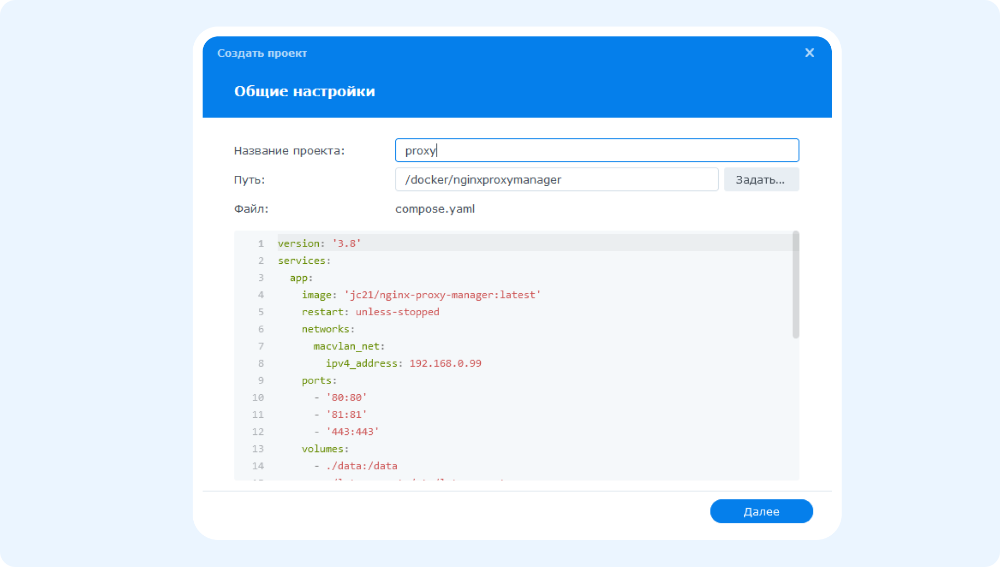

Вставляем следующий docker\-compose файл, в содержании которого, думаю, большинство разберется без дополнительных комментариев:


```yaml
version: '3.8'
services:
  app:
    image: 'jc21/nginx-proxy-manager:latest'
    restart: unless-stopped
    networks:
      macvlan_net:
        ipv4_address: 192.168.0.99
    ports:
      - '80:80'
      - '81:81'
      - '443:443'
    volumes:
      - ./data:/data
      - ./letsencrypt:/etc/letsencrypt

networks:
  macvlan_net:
    external: true
    name: macvlan_network
```
Пропускаем настройку Веб\-портала и создаём проект. 

Если у вас всё получилось, то портал NPM откроется по указанному IP в compose файле (у меня это 192\.168\.0\.99:81\). Про дальнейшее использование и настройку Nginx Proxy Manager можно почитать в моей предыдущей статье [«Домашний сервер на базе Proxmox»](https://habr.com/ru/companies/banki/articles/827760/)

Почему мы используем macvlan? На адресе нашего NAS уже работает Веб\-портал, он занимает 443 и 80 порты, которые нужны для NPM. Поэтому я пробросил контейнер на домашнюю сеть и получил рабочий вариант со свободными портами. 

Для подготовки этой статьи были использованы следующие ресурсы:

* [ARK Loader](https://auxxxilium.tech/redpill/) <https://auxxxilium.tech/redpill/>.
* <https://github.com/AuxXxilium/arc>.
* Видео с YouTканала NAScompares [«I Built the Jonsbo N2 NAS \- Better than Synology / QNAP?»](https://www.youtube.com/watch?v=C6hf3ddtNCs)
* Видео с канала WunderTech по установке NPM на Container Manager [«Use a Reverse Proxy Server for Local SSL Certificates on all Home Lab Services!»](https://www.youtube.com/watch?v=nmE28_BA83w)
* Различные маркетплейсы и магазины для закупки комплектующих для сборки.

