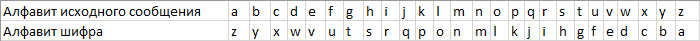
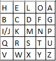
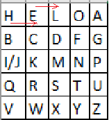
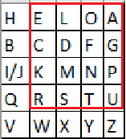
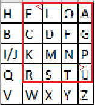

# Элементарные шифры на понятном языке
Привет, Хабр!  

  

Все мы довольно часто слышим такие слова и словосочетания, как «шифрование данных», «секретные шифры», «криптозащита», «шифрование», но далеко не все понимают, о чем конкретно идет речь. В этом посте разберемся, что из себя представляет шифрование и рассмотрим элементарные шифры с тем расчетом, чтобы даже далекие от IT люди поняли суть этого явления.  

  

Прежде всего, разберемся в терминологии.  

  

**Шифрование** – это такое преобразование исходного сообщения, которое не позволит всяким нехорошим людям прочитать данные, если они это сообщение перехватят. Делается это преобразование по специальным математическим и логическим алгоритмам, некоторые из которых мы рассмотрим ниже.   

  

**Исходное сообщение** – это, собственно, то, что мы хотим зашифровать. Классический пример — текст.  

  

**Шифрованное сообщение** – это сообщение, прошедшее процесс шифрования.   

  

**Шифр** — это сам алгоритм, по которому мы преобразовываем сообщение.  

  

**Ключ** — это компонент, на основе которого можно произвести шифрование или дешифрование.  

  

**Алфавит** – это перечень всех возможных символов в исходном и зашифрованном сообщении. Включая цифры, знаки препинания, пробелы, отдельно строчные и заглавные буквы и т.д.  

  

Теперь, когда мы говорим на более\-менее одном языке, разберем простые шифры.  

  

* ### Шифр Атбаша

  

Самый\-самый простой шифр. Его суть – переворот алфавита с ног на голову.  

  

Например, есть у нас алфавит, который полностью соответствует обычной латинице.  

  


```plaintext
a b c d e f g h i j k l m n o p q r s t u v w x y z
```
  

Для реализации шифра Атбаша просто инвертируем его. «А» станет «Z», «B» превратится в «Y» и наоборот. На выходе получим такую картину:  

  

  

  

И теперь пишем нужное сообшение на исходном алфавите и алфавите шифра  

  

Исходное сообщение: I love habr  

Зашифрованное: r olev szyi  

  

* ### Шифр Цезаря

  

Тут добавляется еще один параметр — примитивный ключ в виде числа от 1 до 25 (для латиницы). На практике, ключ будет от 4 до 10\.  

  

Опять же, для наглядности, возьмем латиницу  

  


```plaintext
a b c d e f g h i j k l m n o p q r s t u v w x y z
```
  

И теперь сместим вправо или влево каждую букву на ключевое число значений.  

  

Например, ключ у нас будет 4 и смещение вправо.  

  

Исходный алфавит: a b c d e f g h i j k l m n o p q r s t u v w x y z  

Зашифрованный: w x y z a b c d e f g h i j k l m n o p q r s t u v  

  

Пробуем написать сообщение:  

  


```plaintext
hello world
```
  

Шифруем его и получаем следующий несвязный текст:  

  


```plaintext
dahhk sknhz
```
  

* ### Шифр Вернама (XOR\-шифр)

  

Простейший шифр на основе бинарной логики, который обладает **абсолютной** криптографической стойкостью. Без знания ключа, расшифровать его невозможно (доказано Клодом Шенноном).  

  

Исходный алфавит — все та же латиница.  

  

Сообщение разбиваем на отдельные символы и каждый символ представляем в бинарном виде.  

Классики криптографии предлагают [пятизначный код бодо](https://ru.wikipedia.org/wiki/%D0%9A%D0%BE%D0%B4_%D0%91%D0%BE%D0%B4%D0%BE) для каждой буквы. Мы же попробуем изменить этот шифр для кодирования в 8 бит/символ на примере ASCII\-таблицы. Каждую букву представим в виде бинарного кода.  

  

  

  

Теперь вспомним курс электроники и элемент «Исключающее ИЛИ», также известный как XOR.  

  

XOR принимает сигналы (0 или 1 каждый), проводит над ними логическую операцию и выдает один сигнал, исходя из входных значений.   

  

Если все сигналы равны между собой (0\-0 или 1\-1 или 0\-0\-0 и т.д.), то на выходе получаем 0\.  

Если сигналы не равны (0\-1 или 1\-0 или 1\-0\-0 и т.д.), то на выходе получаем 1\.  

  

Теперь для шифровки сообщения, введем сам текст для шифровки и ключ такой же длины. Переведем каждую букву в ее бинарный код и выполним формулу *сообщение XOR ключ*  

  

Например:  

  

сообщение: LONDON  

ключ: SYSTEM  

  

Переведем их в бинарный код и выполним XOR:  

  


```plaintext
01001100 01001111 01001110 01000100 01001111 01001110
01010011 01011001 01010011 01010100 01000101 01001101
_______________________________________________________
00011111 00010110 00011101 00010000 00001010 00000011
```
  

В данном конкретном примере на месте результирующих символов мы увидим только пустое место, ведь все символы попали в первые 32 служебных символа. Однако, если перевести полученный результат в числа, то получим следующую картину:  

  


```plaintext
31 22 29 16 10 3. 
```
  

С виду — совершенно несвязный набор чисел, но мы\-то знаем.  

  

* ### Шифр кодового слова

  

Принцип шифрования примерно такой же, как у шифра цезаря. Только в этом случае мы сдвигаем алфавит не на определенное число позиций, а на кодовое слово.   

  

Например, возьмем для разнообразия, кириллический алфавит.  

  


```plaintext
абвгдеёжзийклмнопрстуфхцчшщъыьэюя
```
  

Придумаем кодовое слово. Например, «Лукоморье». Выдернем из него все повторяющиеся символы. На выходе получаем слово «Лукомрье».  

  

Теперь вписываем данное слово в начале алфавита, а остальные символы оставляем без изменений.  

  


```plaintext
абвгдеёжзийклмнопрстуфхцчшщъыьэюя
лукомрьеабвгдёжзийнпстфхцчшщъыэюя

```
  

И теперь запишем любое сообщение и зашифруем его.  

  


```plaintext
"Златая цепь на дубе том"
```
  

Получим в итоге следующий нечитаемый бред:  

  


```plaintext
"Адлпля хриы жл мсур пиё"
```
  

* ### Шифр Плейфера

  

Классический шифр Плейфера предполагает в основе матрицу 5х5, заполненную символами латинского алфавита (i и j пишутся в одну клетку), кодовое слово и дальнейшую манипуляцию над ними.   

  

Пусть кодовое слово у нас будет «HELLO».  

  

Сначала поступаем как с предыдущим шифром, т.е. уберем повторы и запишем слово в начале алфавита.  

  

  

  

Теперь возьмем любое сообщение. Например, «I LOVE HABR AND GITHUB».  

  

Разобьем его на биграммы, т.е. на пары символов, не учитывая пробелы.  

  


```plaintext
IL OV EH AB RA ND GI TH UB.
```
  

Если бы сообщение было из нечетного количества символов, или в биграмме были бы два одинаковых символа (LL, например), то на место недостающего или повторившегося символа ставится символ X.  

  

Шифрование выполняется по нескольким несложным правилам:  

  

1\) Если символы биграммы находятся в матрице на одной строке — смещаем их вправо на одну позицию. Если символ был крайним в ряду — он становится первым.  

  

Например, EH становится LE.  

  

  

  

2\) Если символы биграммы находятся в одном столбце, то они смещаются на одну позицию вниз. Если символ находился в самом низу столбца, то он принимает значение самого верхнего.  

  

Например, если бы у нас была биграмма LX, то она стала бы DL.   

  

3\) Если символы не находятся ни на одной строке, ни на одном столбце, то строим прямоугольник, где наши символы — края диагонали. И меняем углы местами.   

  

Например, биграмма RA.  

  

  

  

  

  

По этим правилам, шифруем все сообщение.  

  


```plaintext
IL OV EH AB RA ND GI TH UB.
KO HY LE HG EU MF BP QO QG
```
  

Если убрать пробелы, то получим следующее зашифрованное сообщение:  

  


```plaintext
KOHYLEHGEUMFBPQOQG
```
  

Поздравляю. После прочтения этой статьи вы хотя бы примерно понимаете, что такое шифрование и знаете как использовать некоторые примитивные шифры и можете приступать к изучению несколько более сложных образцов шифров, о которых мы поговорим позднее.  

  

Спасибо за внимание.